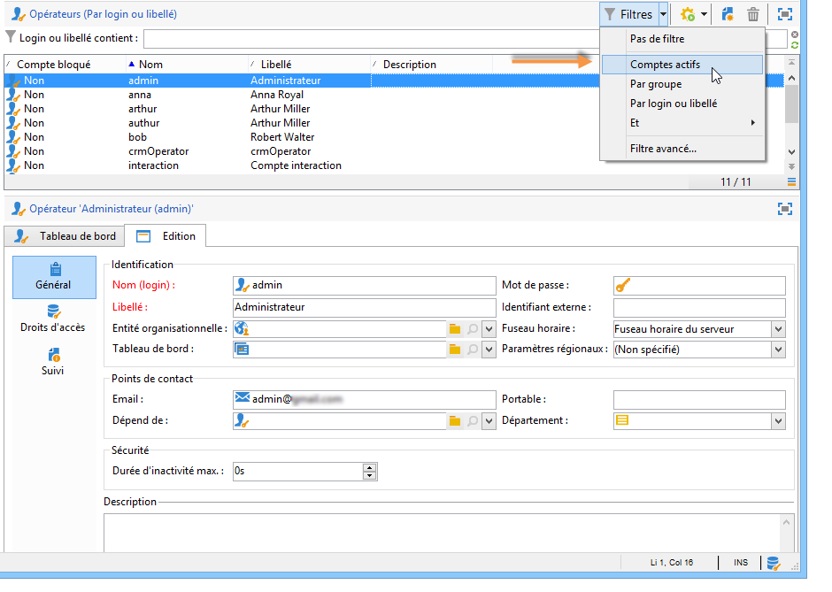
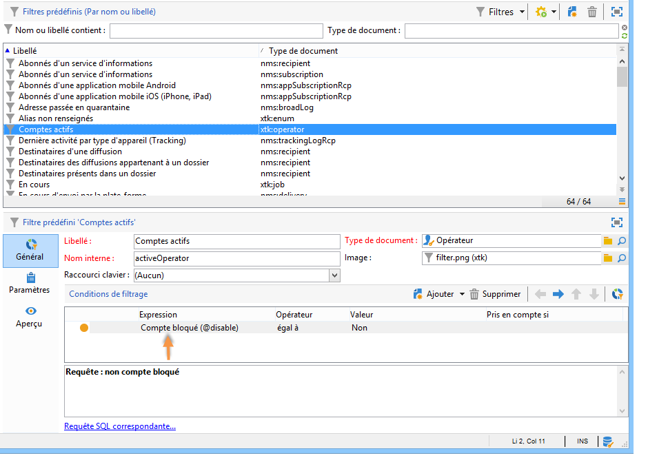
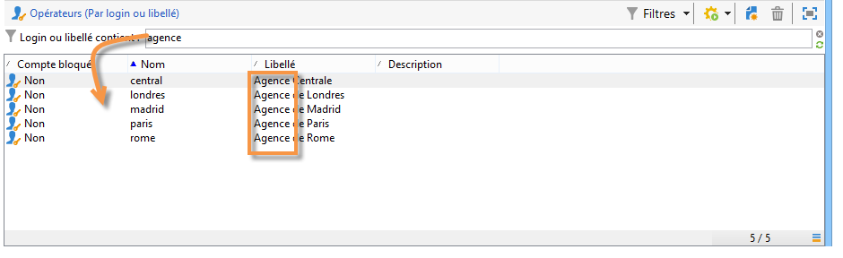
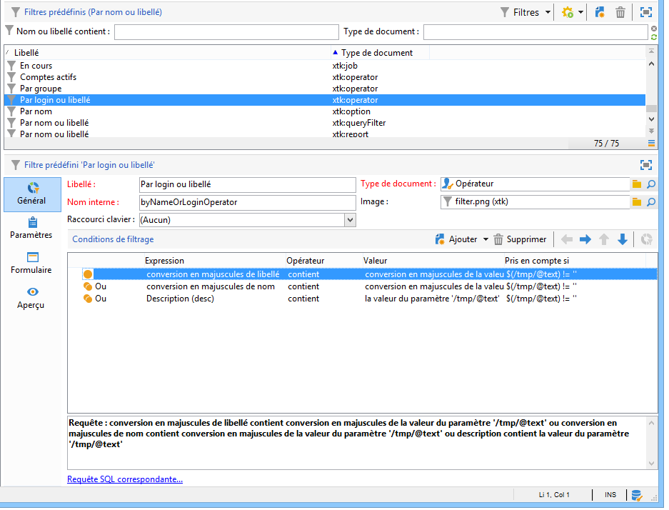
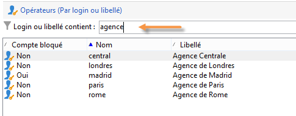

# Création d&#39;un filtre {#creating-a-filter}

Les filtres disponibles dans Adobe Campaign sont définis au travers de conditions de filtrage qui sont créées selon le même mode opératoire que les requêtes.

>[!NOTE]
>
>Pour plus d&#39;informations sur la création de filtres, consultez [cette section](../../platform/using/filtering-options.md).

Le **[!UICONTROL Administration > Configuration > Predefined filters]** noeud contient tous les filtres utilisés dans les listes et les aperçus.

For example, the list of operators can be filtered by **[!UICONTROL Active accounts]**:

The matching filter contains the query on the **[!UICONTROL Account disabled]** value of the **[!UICONTROL Operators]** schema:

For the same list, the **[!UICONTROL By login or label]** filter lets you filter the data on the list based on the value entered in the filter field:

Il est construit comme suit :

Pour correspondre aux critères de filtrage, le compte de l&#39;opérateur doit vérifier une des conditions suivantes :

* Son libellé contient les caractères renseignés dans le champ de saisie,
* Le nom de l&#39;opérateur contient les caractères renseignés dans le champ de saisie,
* Le contenu de la zone de description contient les caractères renseignés dans le champ de saisie.

>[!NOTE]
>
>La fonction **[!UICONTROL Upper]** permet de ne pas prendre en compte la casse des caractères (majuscules/minuscules).

La **[!UICONTROL Taken into account if]** colonne vous permet de définir les critères d’application de ces conditions de filtrage. Ici, les caractères **$(/tmp/@text)** représentent le contenu du champ de saisie lié au filtre :

Ici, **$(/tmp/@text)=&#39;agence&#39;**

L&#39;expression **$(/tmp/@text)!=&#39;&#39;** applique chaque condition lorsque le champ de saisie n&#39;est pas vide.
