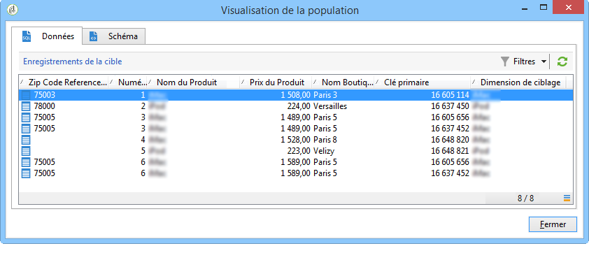

# Créer une liste récapitulative{#creating-a-summary-list}

Ce cas pratique détaille la création d&#39;un workflow permettant, à partir d&#39;une collecte de fichiers et suite à plusieurs enrichissements de données, de créer une liste récapitulative. L&#39;exemple est basé sur une liste de contacts ayant effectué des achats dans un magasin.


La structure de données suivante est utilisée :


Son objectif est le suivant :

* Utiliser les différentes options de l&#39;activité d&#39;enrichissement
* Mettre à jour des données en base suite à une réconciliation
* Créer une &quot;vue&quot; globale des données enrichies

Pour créer une liste récapitulative, vous devez procéder comme suit :

1. Collecter et charger un fichier &quot;Achats&quot; dans la table de travail du workflow
1. Enrichir les données importées en créant un lien vers une table de référence
1. Mettre à jour la table &quot;Achats&quot; avec les données enrichies
1. Enrichir les données &quot;Contacts&quot; avec un calcul d&#39;agrégat venant de la table &quot;Achats&quot;
1. Créer une liste récapitulative

## Etape 1: Chargement du fichier et réconciliation des données importées {#step-1--loading-the-file-and-reconciling-the-imported-data}

Les données à charger sont des données &quot;Achats&quot; de la forme suivante :

```
Product Name;Product price;Store
Computer;2000;London 3
Tablet;600;Cambridge
Computer;2000;London 5
Comptuer;2000;London 8
Tablet;600;Cambridge
Phone;500;London 5
```

Ces données sont contenues dans un fichier texte : &quot;Achats.txt&quot;.

1. Positionnez les activités **Collecteur de fichiers** et **Chargement(fichier)** dans le workflow.

   Le **Collecteur de fichiers** permet de collecter et d&#39;envoyer des fichiers sur le serveur Adobe Campaign.

   L&#39;activité **Chargement(fichier)** permet d&#39;alimenter la table de travail du workflow avec les données collectées.

   Pour plus d’informations sur cette activité, voir [Chargement de données à partir d’un fichier](../../workflow/using/importing-data.md#loading-data-from-a-file).

1. Configurez l&#39;activité **Collecteur de fichiers** pour collecter des fichiers de type texte (*.txt) dans le répertoire sélectionné.

   

   L’activité du collecteur **de** fichiers permet de gérer l’absence d’un fichier dans le répertoire source. Pour ce faire, cochez l’ **[!UICONTROL Process file nonexistence]** option. Dans ce processus, une activité **Attendre** a été ajoutée pour essayer une autre collection de fichiers si elle est absente du répertoire au moment de la collecte.

1. Paramétrez l&#39;activité **Chargement (fichier)** en vous basant sur un fichier exemple ayant le même format que les données à importer.

   

   Cliquez sur le **[!UICONTROL Click here to change the file format...]** lien pour renommer les colonnes à l’aide des noms et étiquettes internes du tableau &quot;Achats&quot;.

   

Une fois les données importées, l&#39;enrichissement est effectué en créant un lien vers une table de référence correspondant au schéma &quot;Magasins&quot;.

Positionnez l&#39;activité d&#39;enrichissement puis configurez-la comme suit :

1. Sélectionnez l&#39;ensemble principal qui est constitué des données venant de l&#39;activité **Chargement (fichier)**.

   

1. Cliquez sur **[!UICONTROL Add data]**, puis sélectionnez l’ **[!UICONTROL A link]** option.

   

1. Select the **[!UICONTROL Define a collection]** option.
1. Sélectionnez le schéma &quot;Magasins&quot; comme schéma cible.

   

Pour plus d’informations sur les différents types de liens, voir [Enrichissement et modification des données](../../workflow/using/targeting-data.md#enriching-and-modifying-data).

Dans la fenêtre suivante, vous devez créer une condition de jointure en sélectionnant le champ source (dans l&#39;ensemble principal) et le champ cible (appartenant au schéma &quot;Magasins&quot;) afin de créer une réconciliation entre les données.


Suite à la création du lien, nous allons ajouter une colonne supplémentaire à la table de travail du workflow provenant du schéma &quot;Magasins&quot; : le champ &quot;ZipCode Reference&quot;.

1. Ouvrez l&#39;activité d&#39;enrichissement.
1. Clics **[!UICONTROL Edit additional data]**.
1. Add the &quot;ZipCode Reference&quot; field to the **[!UICONTROL Output columns]**.


Les données de la table de travail du workflow après cet enrichissement sont les suivantes :



## Etape 2: Écriture des données enrichies dans la table &#39;Achats&#39;{#step-2--writing-enriched-data-to-the--purchases--table}

Cette étape consiste à écrire dans la table &quot;Achats&quot; les données importées et enrichies. Une activité **Mise à jour de données** est nécessaire pour réaliser cette action.

Une réconciliation entre les données de la table de travail du workflow et la dimension de ciblage **Achats** doit être effectuée avant la mise à jour des données dans la table **Achats**.

1. Click the **[!UICONTROL Reconciliation]** tab of the enrichment activity.
1. Sélectionnez la dimension de ciblage, dans notre cas le schéma &quot;Achats&quot;.
1. Sélectionnez une &quot;expression source&quot; pour les données de la table du workflow (ici le champ &quot;NomMag&quot;).
1. Sélectionnez une &quot;expression destination&quot; pour les données de la table &quot;Achats&quot; (ici le champ &quot;NomMag&quot;).
1. Cochez l’ **[!UICONTROL Keep unreconciled data coming from the work table]** option.


Dans l&#39;activité **Mise à jour de données**, la configuration suivante est nécessaire :

1. Select the **[!UICONTROL Insert or update]** option in the **[!UICONTROL Operation type]** field to avoid creating new records each time the file is collected.
1. Sélectionnez la **[!UICONTROL By directly using the targeting dimension]** valeur de l’ **[!UICONTROL Record identification]** option.
1. Select the &quot;Purchases&quot; schema as a **[!UICONTROL Document type]**.
1. Spécifiez la liste des champs à mettre à jour. La **[!UICONTROL Destination]** colonne vous permet de définir les champs du schéma &quot;Achats&quot;. La **[!UICONTROL Expression]** colonne vous permet de sélectionner les champs de la table de travail pour effectuer un mappage.
1. Cliquez sur l’ **[!UICONTROL Generate an outbound transition]** option.


## Etape 3: Enrichissement des données &#39;Contacts&#39;{#step-3--enriching--contact--data-}

Le schéma &quot;Contacts&quot; est relié par un lien physique au schéma &quot;Achats&quot;. Il est donc possible d&#39;utiliser une autre option de l&#39;activité &quot;Enrichissement&quot; : l&#39;ajout de données liées à la dimension de filtrage.

L&#39;objectif de ce deuxième enrichissement est de créer un agrégat sur le schéma des achats pour calculer le montant total des achats pour chaque contact identifié.

1. Positionnez une activité **Requête** permettant de récupérer l&#39;intégralité des **Contacts** stockés.
1. Positionnez une activité **Enrichissement** puis sélectionnez l&#39;ensemble principal résultant de la requête précédente.
1. Click add **[!UICONTROL Data]**.
1. Cliquez sur l’ **[!UICONTROL Data linked to the targeting dimension]** option.
1. Cliquez sur l’ **[!UICONTROL Data linked to the filtering dimension]** option dans la **[!UICONTROL Select fields to add]** fenêtre.
1. Sélectionnez le **[!UICONTROL Purchases]** noeud, puis cliquez sur **[!UICONTROL Next]**.

   

1. Modifiez le **[!UICONTROL Collected data]** champ en sélectionnant l’ **[!UICONTROL Aggregates]** option.

   

1. Clics **[!UICONTROL Next]**.
1. Ajoutez l&#39;expression suivante pour calculer la somme des achats pour chaque contact : &quot;Sum(@prixproduit)&quot;.

   

Pour préparer la liste récapitulative, il est nécessaire d&#39;ajouter des champs provenant du schéma &quot;Achats&quot; ainsi que du premier enrichissement : le champ &quot;ZipCode Reference&quot;.

1. Cliquez sur le **[!UICONTROL Edit additional data...]** lien dans l&#39;activité d&#39;enrichissement.
1. Ajoutez les champs &quot;Achats / Nom Boutique&quot; et &quot;Achats / Zip Code Reference&quot;.

   

1.  Cliquez sur l’ **[!UICONTROL Properties]** onglet.
1. Modifiez le deuxième lien pour ne créer qu&#39;une seule ligne.

   

## Etape 4: Créer et alimenter une liste récapitulative {#step-4--creating-and-adding-to-a-summary-list}

La dernière étape consiste à écrire toutes les données enrichies dans une liste.

1. Placez une activité **Mise à jour de liste** dans le workflow. Cette activité doit être reliée à la transition sortante de la deuxième activité d&#39;enrichissement.
1. Select the **[!UICONTROL Create the list if necessary (Calculated name)]** option.
1. Sélectionnez une valeur pour le nom calculé. Le libellé choisi pour la liste est la date courante : &lt;%= formatDate(new Date(), &quot;%2D/%2M/%2Y&quot;) %>.

Une fois le workflow exécuté, la liste contient :

* une liste des contacts,
* une colonne &quot;Somme des achats&quot;,
* une colonne &quot;Nom de boutique&quot;,
* une colonne &quot;Zip Code reference&quot; remplie pour les magasins connus dans le schéma de référence des magasins.


