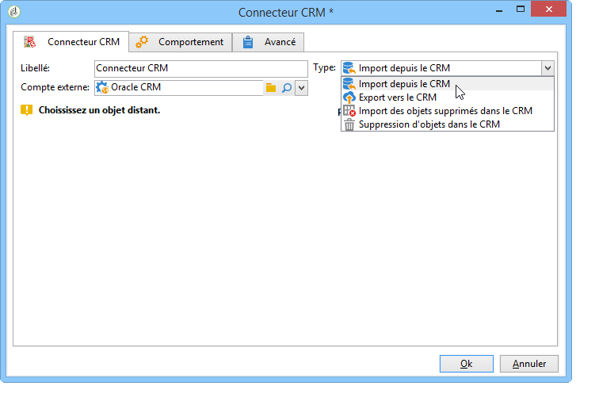
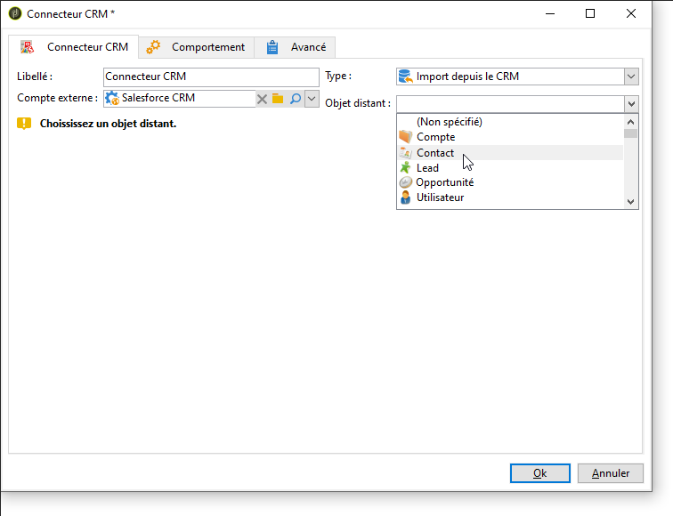

# Connecteur CRM{#crm-connector}

L&#39;activité **Connecteur CRM** permet de paramétrer la synchronisation des données entre Adobe Campaign et un système CRM.

Pour plus d&#39;informations sur les connecteurs CRM dans Adobe Campaign, consultez cette [section](../../platform/using/crm-connectors.md).

Avec cette activité, vous pouvez effectuer les actions suivantes :

* Import depuis le CRM
* Export vers le CRM
* Import d&#39;objets supprimés dans le CRM
* Suppression d&#39;objets dans le CRM

Sélectionnez le compte externe correspondant au CRM avec lequel vous souhaitez paramétrer une synchronisation puis choisissez l&#39;objet à synchroniser (comptes, opportunités, contacts, etc.).

La configuration de cette activité dépend ensuite du traitement à réaliser. Diverses configurations sont détaillées [dans cette page](../../platform/using/crm-data-sync.md).
