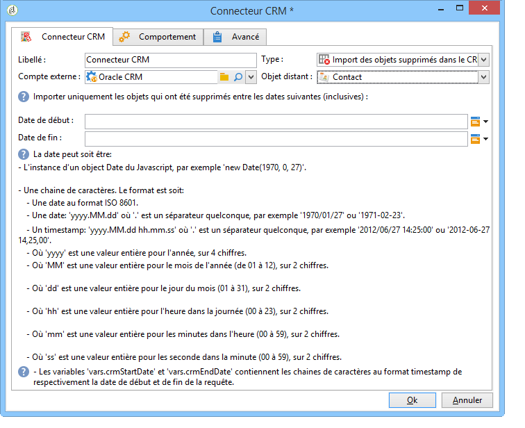

# Connecteur CRM{#crm-connector}

L&#39;activité **Connecteur CRM** permet de paramétrer la synchronisation des données entre Adobe Campaign et un CRM.

Pour plus d’informations sur les connecteurs CRM dans Adobe Campaign, consultez cette [section](../../platform/using/crm-connectors.md).

Vous pouvez ainsi :

* Importation à partir de la gestion de la relation client (voir [Importation à partir de la gestion de la relation client](#importing-from-the-crm)),
* Exportation vers CRM (voir [Exportation vers CRM](#exporting-to-the-crm)),
* Importer des objets supprimés dans la gestion de la relation client (voir [Importation d&#39;objets supprimés dans la gestion de la relation client](#importing-objects-deleted-in-the-crm)),
* Supprimez des objets dans la gestion de la relation client (voir [Suppression d’objets dans la gestion de la relation client](#deleting-objects-in-the-crm)).


Sélectionnez le compte externe correspondant au CRM avec lequel vous souhaitez paramétrer une synchronisation puis choisissez l&#39;objet à synchroniser (comptes, opportunités, contacts, etc.).


La configuration de cette activité dépend ensuite du traitement à réaliser. Les différents types de paramétrages sont présentés ci-après.

## Import depuis le CRM {#importing-from-the-crm}

Pour importer des données depuis le CRM dans Adobe Campaign, vous devez réaliser un workflow du type :


Pour un import, les étapes de paramétrage de l&#39;activité **Connecteur CRM** sont les suivantes :

1. Sélectionnez une **[!UICONTROL Import from the CRM]** opération.
1. Accédez à la liste **[!UICONTROL Remote object]** déroulante et sélectionnez l’objet concerné par le processus. Cet objet coïncide avec l’une des tables créées dans Adobe Campaign lors de la configuration du connecteur.
1. Go to the **[!UICONTROL Remote fields]** section and enter the fields to be imported.

   To add a field, click the **[!UICONTROL Add]** button in the toolbar, then click the **[!UICONTROL Edit expression]** icon.

   

   Si nécessaire, modifiez le format des données dans la liste déroulante des **[!UICONTROL Conversion]** colonnes. Les types de conversion possibles sont détaillés dans cette [page](../../platform/using/crm-connectors.md#data-format).

   >[!CAUTION]
   >
   >L&#39;identifiant de l&#39;enregistrement dans le CRM est obligatoire pour relier les objets côté CRM et côté Adobe Campaign. Il est automatiquement ajouté lors de la validation de l&#39;activité.
   > 
   >La date de la dernière modification côté CRM est également requise pour permettre l&#39;import incrémental des données.

1. Vous pouvez également filtrer les données à importer en fonction de vos besoins. To do this, click the **[!UICONTROL Edit the filter...]** link.

   Dans l&#39;exemple suivant, Adobe Campaign n&#39;importera que les contact ayant eu une activité après le 31 juillet 2012.

   

   The limitations linked to data filtering modes are detailed in [Filter on data](#filter-on-data) section.

1. The **[!UICONTROL Use automatic index]** option enables you to automatically manage incremental object synchronization between the CRM and Adobe Campaign, depending on the date and their last modification.

   For more on this, refer to [Variable management](#variable-management).

## Gestion des variables {#variable-management}

Enabling the **[!UICONTROL Automatic index]** option lets you collect only objects modified since the last import.


La date de la dernière synchronisation est stockée dans l&#39;option indiquée dans la fenêtre de paramétrage, par défaut :

```
LASTIMPORT_<%=instance.internalName%>_<%=activityName%>
```

Vous pouvez indiquer le champ CRM distant à prendre en compte pour identifier les modifications les plus récentes.

Par défaut, les champs suivants sont utilisés (dans l&#39;ordre indiqué) :

* Pour Microsoft Dynamics : **modifiedon**,
* Pour Oracle On Demand : **LastUpdated**, **ModifiedDate**, **LastLoggedIn**,
* Pour Salesforce.com : **LastModifiedDate**, **SystemModstamp**.

L’activation de l’ **[!UICONTROL Automatic index]** option génère trois variables qui peuvent être utilisées dans le processus de synchronisation par le biais d’une activité de **[!UICONTROL JavaScript code]** type. Ces activités sont les suivantes :

* **vars.crmOptionName** : représente le nom de l&#39;option contenant la date du dernier import.
* **vars.crmStartImport** : représente la date de début (incluse) de la dernière récupération des données.
* **vars.crmEndDate** : représente la date de fin (exclue) de la dernière récupération des données.

   Ces dates sont exprimées au format **yyyy/MM/dd hh:mm:ss**.

## Filtre sur les données {#filter-on-data}

Afin d&#39;assurer un bon fonctionnement avec les différents CRM, les filtres doivent être créés selon les règles suivantes :

* Chaque niveau de filtrage ne peut utiliser qu&#39;un seul type d&#39;opérateur logique.
* L&#39;opérateur SAUF (AND NOT) n&#39;est pas supporté.
* Les comparaisons peuvent uniquement concerner des valeurs nulles (type &quot;est vide&quot;/&quot;n’est pas vide&quot;) ou des nombres. Cela signifie qu’une fois la **[!UICONTROL Value]** colonne (colonne de droite) évaluée, le résultat de cette évaluation doit être un nombre.
* The data in the **[!UICONTROL Value]** column is assessed in JavaScript.
* Les comparaisons de type JOIN ne sont pas supportées.
* L&#39;expression indiquée dans la colonne de gauche doit nécessairement être un champ. Elle ne peut pas être une combinaison de plusieurs expressions, un nombre, etc.

Par exemple, la condition de filtrage illustrée ci-dessous ne sera PAS valide dans le cadre d&#39;un import CRM, car :

* l&#39;opérateur OU est placé au même niveau que les opérateurs ET
* des comparaisons portent sur des chaînes de texte.


## Ordre de tri {#order-by}

Sous Microsoft Dynamics et Salesforce.com, vous pouvez trier les champs distants à importer, par ordre descendant ou ascendant.

To do this, click the **[!UICONTROL Order by]** link and add the columns to the list.

L&#39;ordre des colonnes dans la liste indique l&#39;ordre de tri :


## Identification des enregistrements {#record-identification}

Plutôt que d&#39;importer directement des éléments contenus (et éventuellement filtrés) dans le CRM, vous pouvez utiliser une population calculée en amont dans le workflow.

Pour ce faire, sélectionnez l’ **[!UICONTROL Use the population calculated upstream]** option et spécifiez le champ contenant l’identifiant distant.

Sélectionnez ensuite les champs à importer depuis la population entrante, comme dans l&#39;exemple ci-dessous :


## Export vers le CRM {#exporting-to-the-crm}

L&#39;export de données Adobe Campaign dans le CRM permet de copier l&#39;intégralité d&#39;un contenu vers une base CRM.

Pour exporter des données vers le CRM, vous devez réaliser un workflow du type :


Pour un export, les étapes de paramétrage de l&#39;activité **Connecteur CRM** sont les suivantes :

1. Sélectionnez une **[!UICONTROL Export to CRM]** opération.
1. Accédez à la liste **[!UICONTROL Remote object]** déroulante et sélectionnez l’objet concerné par le processus. Cet objet coïncide avec l’une des tables créées dans Adobe Campaign lors de la configuration du connecteur.

   >[!CAUTION]
   >
   >La fonction d&#39;export de l&#39;activité **Connecteurs CRM** peut insérer ou mettre à jour les champs côté CRM. Pour permettre la mise à jour des champs dans le CRM, vous devez indiquer la clé primaire de la table distante. Si cette clé est absente, les données sont alors insérées (et non pas mises à jour).

1. In the **[!UICONTROL Mapping]** section, specify the fields to be exported and their mapping in the CRM.

   

   To add a field, click the **[!UICONTROL Add]** button in the toolbar, then click the **[!UICONTROL Edit expression]** icon.

   Pour un champ, si aucune correspondance n&#39;est définie côté CRM, alors les valeurs ne peuvent pas être mises à jour : elle seront directement insérées dans le CRM.

   Si nécessaire, modifiez le format des données dans la liste déroulante des **[!UICONTROL Conversion]** colonnes. Les types de conversion possibles sont détaillés dans cette [section](../../platform/using/crm-connectors.md#data-format).

   La liste des enregistrements à exporter et le résultat de l&#39;export sont conservés dans un fichier temporaire qui reste accessible tant que le workflow n&#39;est pas terminé ou redémarré, ce qui permet de reprendre le traitement en cas d&#39;erreur, sans risquer d&#39;exporter plusieurs fois le même enregistrement et sans perte de données.

## Format des données et traitement des erreurs {#data-format-and-error-processing}

Vous pouvez convertir à la volée le format des données lors de leur import depuis le CRM ou lors de leur export vers le CRM.

Pour cela, sélectionnez la conversion à appliquer dans la colonne correspondante.


Le **[!UICONTROL Default]** mode applique la conversion automatique des données, ce qui, dans la plupart des cas, équivaut à un copier/coller des données. Toutefois, la gestion des fuseaux horaires est appliquée.

Les autres conversions possibles sont les suivantes :

* **[!UICONTROL Date only]**: ce mode supprime les champs Date + Type d’heure.
* **[!UICONTROL Without time offset]**: ce mode annule la gestion des fuseaux horaires appliquée en mode par défaut.
* **[!UICONTROL Copy/Paste]**: ce mode utilise des données brutes telles que des chaînes (sans conversion).


Dans le cadre des importations ou des exportations de données, vous pouvez appliquer un processus spécifique aux erreurs et aux rejets. Pour ce faire, sélectionnez les options **[!UICONTROL Process rejects]** et **[!UICONTROL Process errors]** dans l’ **[!UICONTROL Behavior]** onglet.

Ces options positionnent les transitions sortantes correspondantes.


Positionnez ensuite les activités relatives aux traitements à appliquer.

Pour traiter les erreurs, vous pouvez par exemple positionner une activité d&#39;attente puis planifier des reprises du workflow.

Les rejets sont collectés avec leur code d&#39;erreur et le message correspondant, vous pouvez donc mettre en place un tracking des rejets afin d&#39;optimiser vos processus de synchronisation.

Even when the **[!UICONTROL Process rejects]** option isn&#39;t enabled, a warning is generated for each rejected column with an error code and message.

The **[!UICONTROL Reject]** outbound transition lets you access the output schema that contains the specific columns relevant to error messages and codes. Ces colonnes sont les suivantes :

* Pour Oracle On Demand : **errorLogFilename** (nom du fichier de log côté Oracle), **errorCode** (code erreur), **errorSymbol** (symbole erreur, différent du code erreur), **errorMessage** (description du contexte de l&#39;erreur).
* Pour Salesforce.com : **errorSymbol** (symbole erreur, différent du code erreur), **errorMessage** (description du contexte de l&#39;erreur).

## Import des objets supprimés dans le CRM {#importing-objects-deleted-in-the-crm}

Afin de permettre la mise en place d&#39;un processus exhaustif de synchronisation des données, vous pouvez importer dans Adobe Campaign les objets supprimés côté CRM.

Pour cela, les étapes sont les suivantes :

1. Sélectionnez une **[!UICONTROL Import objects deleted in the CRM]** opération.
1. Accédez à la liste **[!UICONTROL Remote object]** déroulante et sélectionnez l’objet concerné par le processus. Cet objet coïncide avec l’une des tables créées dans Adobe Campaign lors de la configuration du connecteur.
1. Spécifiez la période de suppression à prendre en compte dans les **[!UICONTROL Start date]** champs et les **[!UICONTROL End date]** champs. Ces dates seront incluses dans la période.

   

   >[!CAUTION]
   >
   >La période de suppression des éléments à récupérer doit correspondre aux limitations propres au CRM. Ainsi, par exemple, pour Salesforce.com, les éléments dont la suppression remonte à plus de 30 jours ne peuvent pas être récupérés.

## Suppression d&#39;objets dans le CRM {#deleting-objects-in-the-crm}

Pour supprimer des objets côté CRM, vous devez indiquer la clé primaire des éléments distants à effacer.


L’ **[!UICONTROL Behavior]** onglet permet d’activer le traitement des rejets. Cette option génère une seconde transition de sortie pour l’ **[!UICONTROL CRM connector]** activité. Voir à ce propos cette [section](../../platform/using/crm-connectors.md#error-processing).

Even when the **[!UICONTROL Process rejects]** option is disabled, a warning is generated for each rejected column.

## Exemple de paramétrage d&#39;import de contacts {#example-of-how-to-configure-a-contact-import}

Dans l&#39;exemple suivant, l&#39;activité est paramétrée pour réaliser un import de contacts depuis un CRM Oracle On Demand. Les champs du CRM devant être importés sont sélectionnées de manière à coïncider avec ceux existants dans la base Adobe Campaign.


