# Workflow de diffusion cross-canal{#cross-channel-delivery-workflow}

Ce cas pratique présente un exemple impliquant un workflow de diffusion cross-canal. Le concept général des diffusions cross-canal est présenté dans [cette section](../../workflow/using/cross-channel-deliveries.md).

L&#39;objectif est de segmenter une audience des destinataires de votre base de données en différents groupes dans le but d&#39;envoyer un email à un groupe et un SMS à un autre.

Les principales étapes d&#39;implémentation pour ce cas pratique sont les suivantes :

1. Creating a **[!UICONTROL Query]** activity to target your audience.
1. Creating an **[!UICONTROL Email delivery]** activity containing a link to an offer.
1. Using a **[!UICONTROL Split]** activity to:

   * envoyer un autre email aux destinataires n&#39;ayant pas ouvert le premier email ;
   * envoyer un SMS aux destinataires ayant ouvert l&#39;email, mais n&#39;ayant pas cliqué sur le lien vers l&#39;offre ;
   * ajouter à la base de données les destinataires ayant ouvert l&#39;email et cliqué sur le lien.

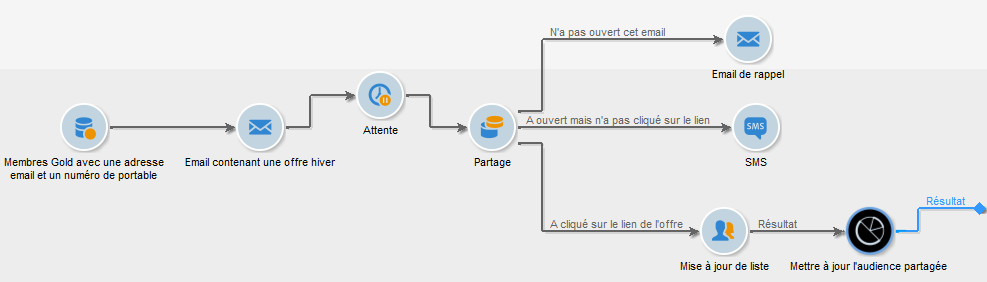

## Etape 1 : ciblage de l&#39;audience {#step-1--targeting-the-audience}

Pour définir votre cible, créez une requête afin d&#39;identifier les destinataires.

1. Créez une campagne. Voir à ce propos [cette section](../../campaign/using/setting-up-marketing-campaigns.md#creating-a-campaign).
1. In the **[!UICONTROL Targeting and workflows]** tab of your campaign, add a **Query** activity to your workflow. For more on using this activity, refer to [this section](../../workflow/using/query.md).
1. Définissez les destinataires qui recevront vos diffusions. Par exemple, sélectionnez les membres &quot;Gold&quot; en tant que dimension cible.
1. Ajoutez des conditions de filtrage à votre requête. Dans cet exemple, sélectionnez les destinataires disposant d&#39;une adresse email et d&#39;un numéro de téléphone portable.

   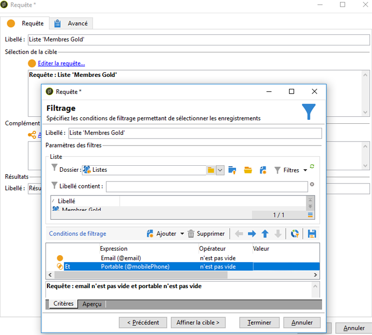

1. Enregistrez vos modifications.

## Etape 2 : création d&#39;un email comprenant une offre {#step-2--creating-an-email-including-an-offer}

1. Créez une **[!UICONTROL Email delivery]** activité et double-cliquez dessus dans votre flux de travail pour la modifier. For more on creating an email, refer to [this section](../../delivery/using/about-email-channel.md).
1. Concevez le message et insérez un lien comprenant une offre dans le contenu.

   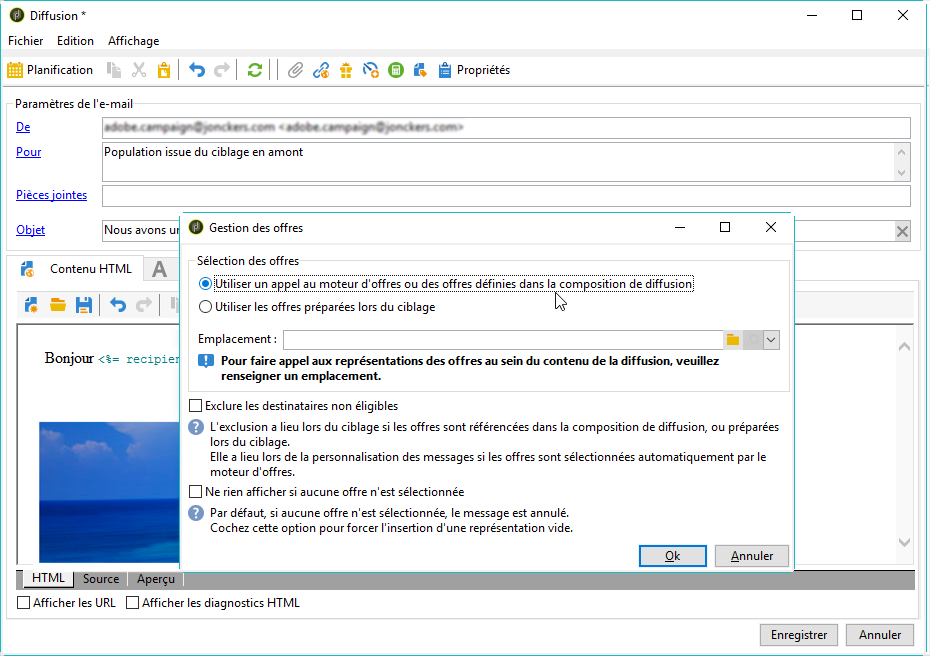

   Pour plus d&#39;informations sur l&#39;intégration d&#39;une offre dans le corps d&#39;un message, consultez [cette section](../../interaction/using/integrating-an-offer-via-the-wizard.md#delivering-with-a-call-to-the-offer-engine).

1. Enregistrez vos modifications.
1. Cliquez avec le bouton droit sur l’ **[!UICONTROL Email delivery]** activité pour l’ouvrir.
1. Sélectionnez l’ **[!UICONTROL Generate an outbound transition]** option pour récupérer la population et les journaux de suivi.

   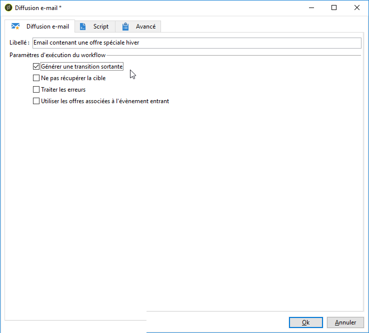

   Vous pourrez ainsi utiliser ces informations pour envoyer une autre diffusion en fonction du comportement des destinataires lors de la réception du premier email.

1. Add a **[!UICONTROL Wait]** activity to let a few days for the recipients to open the email.

   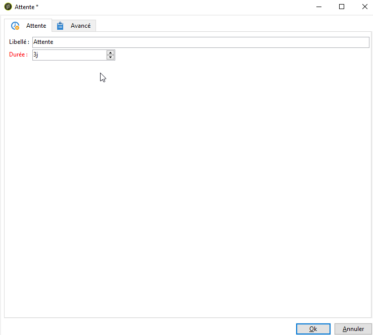

## Etape 3 : segmentation de l&#39;audience obtenue {#step-3--segmenting-the-resulting-audience}

Une fois votre cible identifiée et votre première diffusion créée, vous devez segmenter la cible en différentes populations à l&#39;aide de conditions de filtrage.

1. Ajoutez une activité **Partage** au workflow et ouvrez-la. Pour plus d&#39;informations sur l&#39;utilisation de cette activité, consultez [cette section](../../workflow/using/split.md).
1. Créez trois segments à partir de la population calculée en amont dans la requête.

   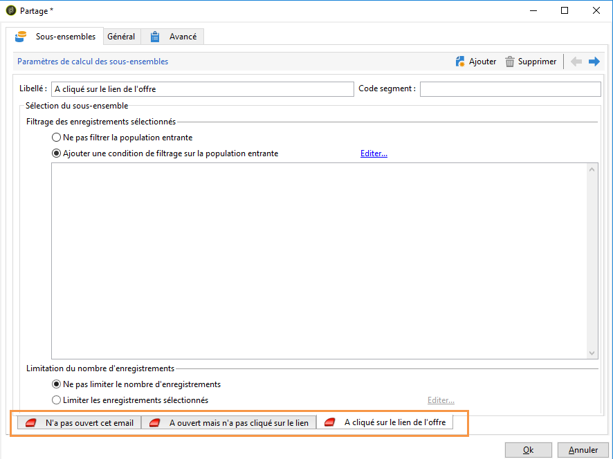

1. Pour le premier sous-ensemble, sélectionnez l’ **[!UICONTROL Add a filtering condition on the inbound population]** option et cliquez sur **[!UICONTROL Edit]**.

   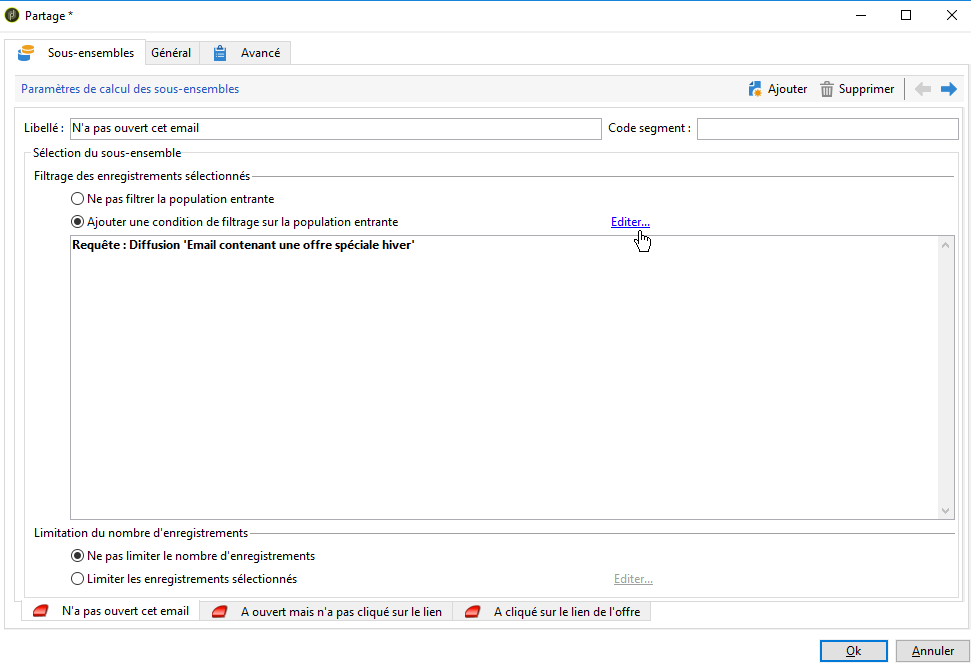

1. Sélectionnez **[!UICONTROL Recipients of a delivery]** le filtre de restriction et cliquez sur **[!UICONTROL Next]**.

   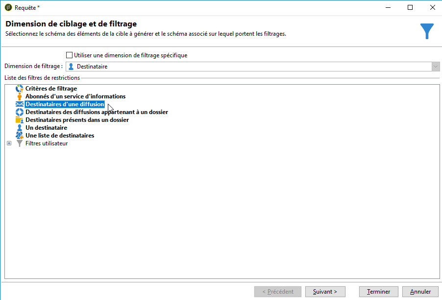

1. Dans les paramètres de filtre, sélectionnez **[!UICONTROL Recipients who have not opened or clicked (email)]** dans la liste **[!UICONTROL Behavior]** déroulante et sélectionnez le courrier électronique, y compris l’offre à envoyer, dans la liste de diffusion. Clics **[!UICONTROL Finish]**.

   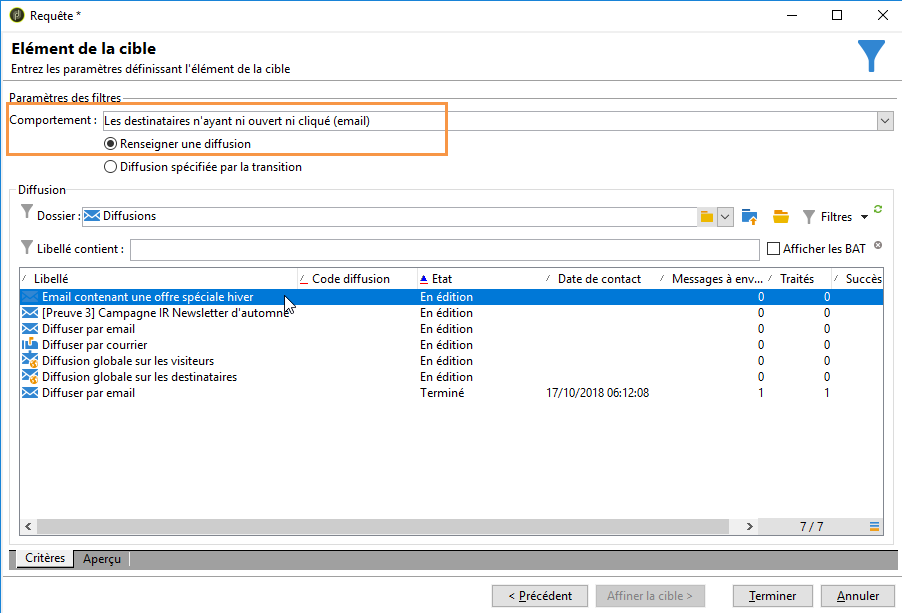

1. Procédez de la même manière pour le deuxième sous-ensemble et sélectionnez-le **[!UICONTROL Recipients who have not clicked (email)]** dans la **[!UICONTROL Behavior]** liste déroulante.

   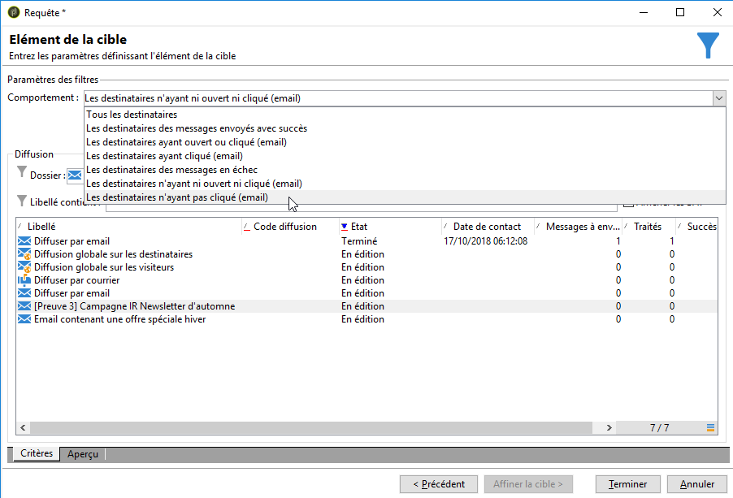

1. Pour le troisième sous-ensemble, sélectionnez l’ **[!UICONTROL Add a filtering condition on the inbound population]** option après avoir sélectionné le sous-ensemble **[!UICONTROL Edit]** et cliqué sur **[!UICONTROL Use a specific filtering dimension]** .
1. Sélectionnez **[!UICONTROL Recipient tracking log]** dans la liste **[!UICONTROL Filtering dimension]** déroulante, sélectionnez **[!UICONTROL Filtering conditions]** dans la **[!UICONTROL List of restriction filters]** liste, puis cliquez sur **[!UICONTROL Next]**.

   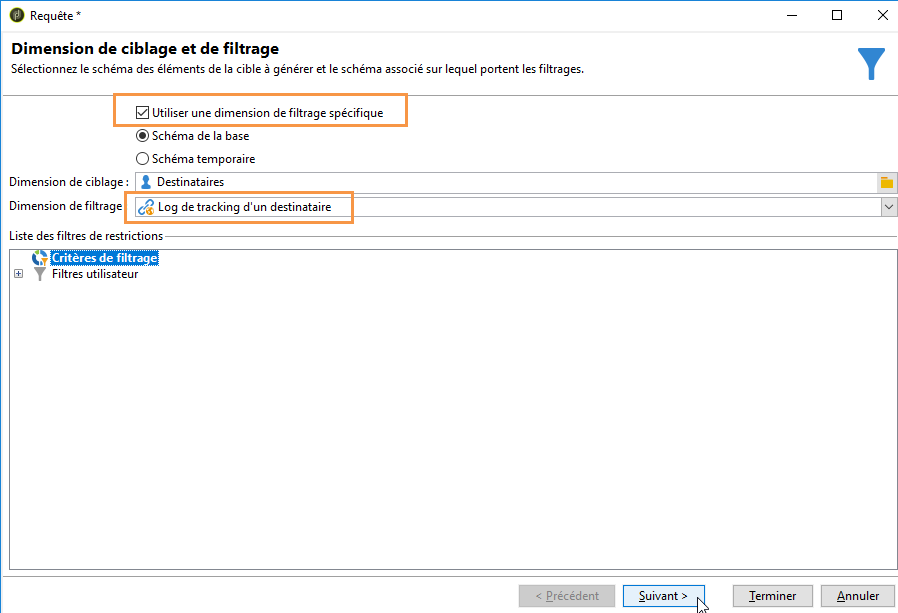

1. Sélectionnez les conditions de filtres suivants :

   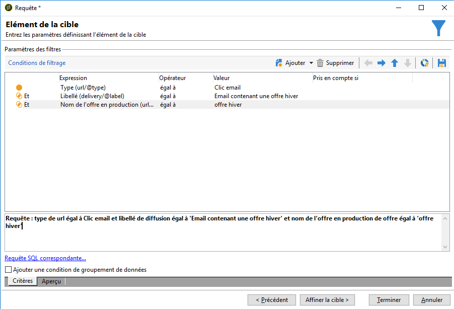

1. Click **[!UICONTROL Finish]** to save your changes.

## Etape 4 : finalisation du workflow {#step-4--finalizing-the-workflow}

1. Add the relevant activities to your workflow after the three subsets resulting from the **[!UICONTROL Split]** activity:

   * Add an **[!UICONTROL Email delivery]** activity to send a reminder email to the first subset.
   * Add a **[!UICONTROL Mobile delivery]** activity to send an SMS message to the second subset.
   * Add a **[!UICONTROL List update]** activity to add the corresponding recipients to the database.

1. Double-cliquez sur les activités de la diffusion dans votre workflow pour les éditer. Pour plus d&#39;informations sur la création d&#39;un email et d&#39;un SMS, consultez les sections [Canal Email](../../delivery/using/about-email-channel.md) et [Canal SMS](../../delivery/using/sms-channel.md).
1. Cliquez deux fois sur l’ **[!UICONTROL List update]** activité et sélectionnez l’ **[!UICONTROL Generate an outbound transition]** option.

   Vous pouvez ensuite exporter les destinataires résultants d’Adobe Campaign vers Adobe Experience Cloud. Par exemple, vous pouvez utiliser l’audience dans Adobe Target en ajoutant une **[!UICONTROL Update shared audience]** activité au flux de travail. For more on this, refer to [Exporting an audience](../../integrations/using/importing-and-exporting-audiences.md#exporting-an-audience).

1. Cliquez sur le bouton **Démarrer** de la barre d&#39;actions pour exécuter le workflow.

La population ciblée par l’activité **Requête** sera segmentée pour recevoir un courriel ou un SMS en fonction des comportements des destinataires. La population restante sera ajoutée à la base de données à l’aide de l’ **[!UICONTROL List update]** activité.
