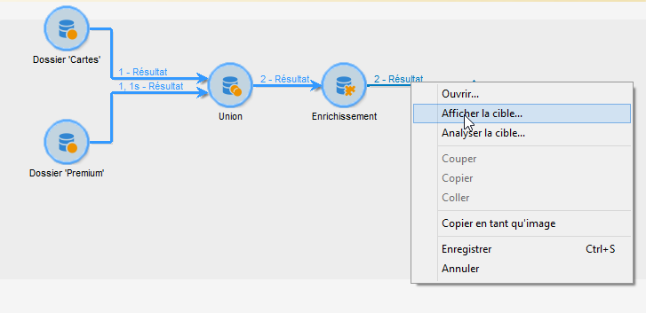
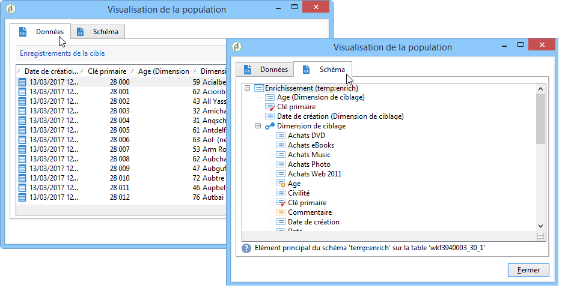
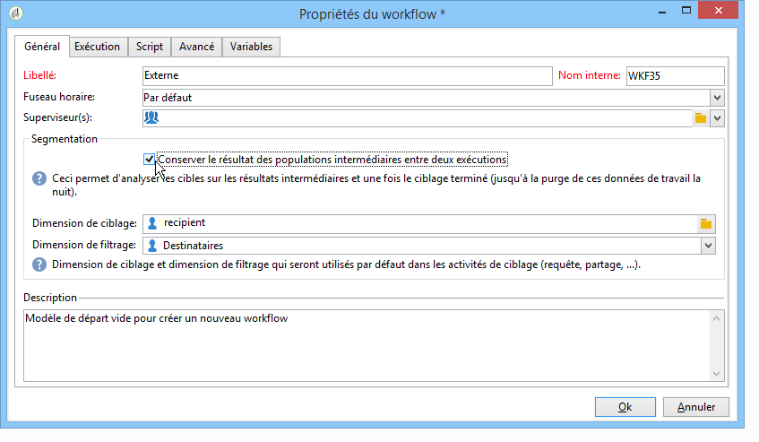
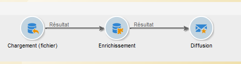
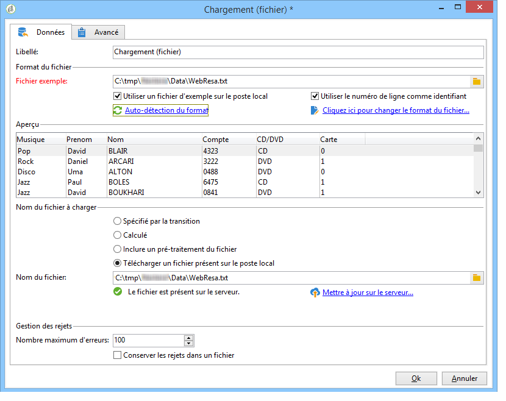
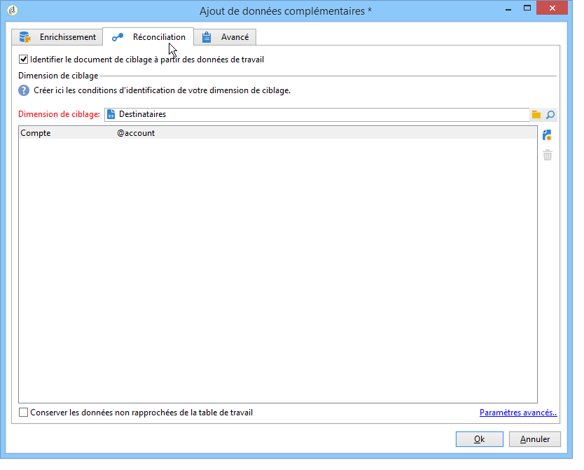
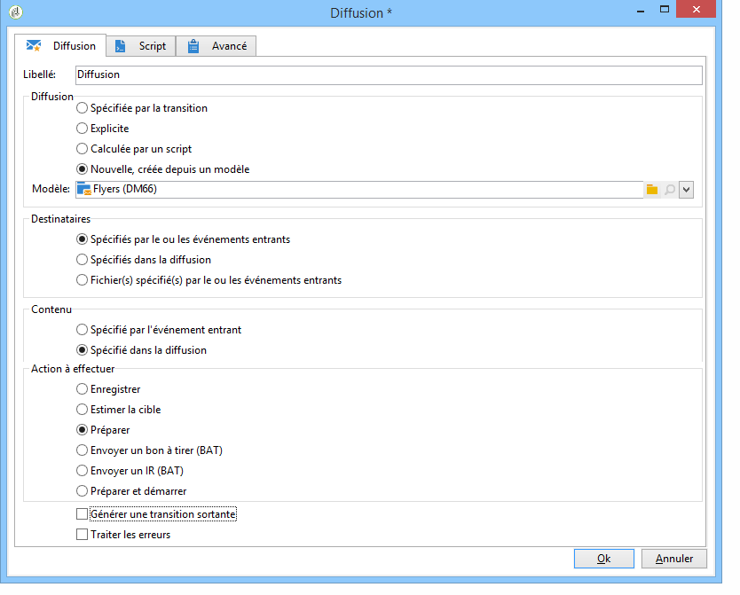
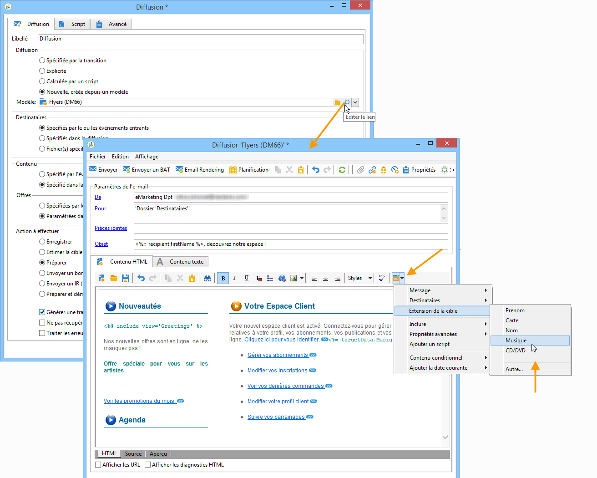
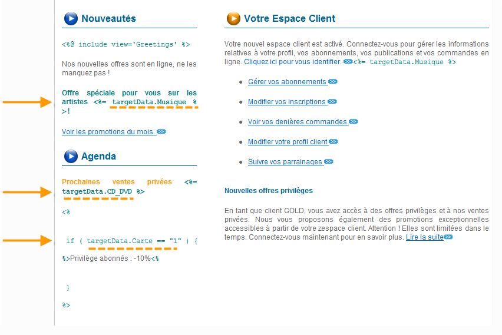
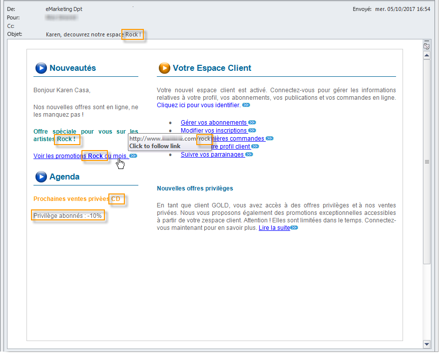

# Cycle de vie des données {#data-life-cycle}


## Table de travail {#work-table}

Dans un workflow, les données véhiculées d&#39;une activité à l&#39;autre sont stockées dans une table de travail temporaire.

Ces données peuvent être affichées et analysées à partir du bouton droit de la souris sur la transition visée.



Sélectionnez pour cela le menu correspondant :

* Afficher la cible

  Ce menu affiche les données relatives à la population de la cible ainsi que la structure de la table de travail (onglet **[!UICONTROL Schéma]**).

  

  Voir à ce sujet la section [Tables de travail et schémas des workflows](monitoring-workflow-execution.md#worktables-and-workflow-schema).

* Analyser la cible

  Ce menu permet d&#39;accéder à l&#39;assistant d&#39;analyse descriptive qui permet de produire des statistiques et des rapports sur les données de la transition.

  Voir à ce propos cette [section](../../reporting/using/using-the-descriptive-analysis-wizard.md).

Les données de la cible sont purgées au fur et à mesure de l&#39;exécution du workflow. Seule la dernière table de travail est accessible. Vous pouvez paramétrer le workflow pour que toutes les tables de travail restent accessibles. Pour cela, cochez l&#39;option **[!UICONTROL Conserver le résultat des populations intermédiaires entre deux exécutions]** dans les propriétés du workflow.

Toutefois, l&#39;activation de cette option est à éviter lorsque les données manipulées sont volumineuses.



## Données de la cible {#target-data}

Les données stockées dans la table de travail du workflow sont accessibles notamment dans les champs de personnalisation.

Vous pouvez ainsi utiliser dans une diffusion des données collectées via une liste ou à partir des réponses fournies à un questionnaire. Pour cela, utilisez la syntaxe suivante :

```
%= targetData.FIELD %
```

Les éléments de personnalisation de type **[!UICONTROL Extension de la cible]** (targetData) ne sont disponible que dans le cadre des workflows de ciblage. Ainsi, la cible de la diffusion doit être construite dans le workflow et spécifiée dans la transition entrante de la diffusion.

Si vous souhaitez créer des BAT pour les diffusions, la cible des BAT doit alors être construite selon le mode **[!UICONTROL Substitution des adresses]**, afin que les données de personnalisation puissent être renseignées. Pour plus d’informations à ce sujet, consultez cette [section](../../delivery/using/steps-defining-the-target-population.md#using-address-substitution-in-proof).

Dans l&#39;exemple suivant, nous allons collecter dans une liste des informations relatives à des clients qui seront utilisées dans un mail personnalisé.

Les étapes sont les suivantes :

1. Créez un workflow afin de collecter les informations, les réconcilier avec celles de la base puis lancer une diffusion.

   

   Dans notre exemple, le contenu du fichier est le suivant :

   ```
   Music,First name,Last name,Account,CD/DVD,Card
   Pop,David,BLAIR,4323,CD,0
   Rock,Daniel,ARCARI,3222,DVD,1
   Disco,Uma,ALTON,0488,DVD,0
   Jazz,Paul,BOLES,6475,CD,1
   Jazz,David,BOUKHARI,0841,DVD,1
   [...]
   ```

   L&#39;activité de chargement de fichier est paramétrée comme suit :

   

1. Paramétrez l&#39;activité de type **[!UICONTROL Enrichissement]** afin de réconcilier les données collectées avec celles de la base Adobe Campaign.

   Ici, la clé de réconciliation est le numéro de compte :

   

1. Configurez ensuite la **[!UICONTROL Diffusion]** : elle est créée depuis un modèle et les destinataires sont ceux spécifiés par la transition entrante.

   

   >[!CAUTION]
   >
   >Seules les données contenues dans la transition peuvent être utilisées pour personnaliser la diffusion. Les champs de personnalisation de type **targetData** ne sont disponibles que pour la population entrante de l’activité **[!UICONTROL Diffusion]**.

1. Dans le modèle de diffusion, utilisez les champs collectés dans le workflow.

   Pour cela, insérez des champs de personnalisation de type **[!UICONTROL Extension de la cible]**.

   

   Ici, nous allons insérer le genre musical favori du client, ainsi que le type de support privilégié (CD ou DVD), tels qu&#39;ils sont indiqués dans le fichier collecté via le workflow.

   En complément, nous ajouterons une promotion réservée aux porteurs de la carte de fidélité, soit ceux pour lesquels la valeur &#39;Carte&#39; est égale à 1.

   

   Les données de type **[!UICONTROL Extension de la cible]** (targetData) sont insérées dans les diffusions selon les mêmes caractéristiques que tous les champs de personnalisation. Elles peuvent ainsi par exemple être utilisées dans l&#39;objet du message, les libellés des liens ou les liens eux-mêmes, etc.

   Les messages adressés aux destinataires collectés contiendront donc les données suivantes :

   
