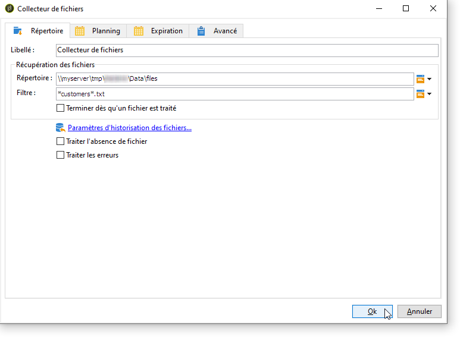
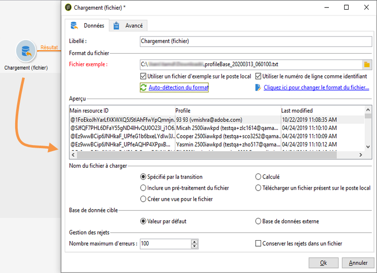

# Chargement (fichier){#data-loading-file}

## Utilisation {#use}

L’ **[!UICONTROL Load (File)]** activité vous permet d’accéder directement à une source de données externes et de l’utiliser dans Adobe Campaign. En effet, toutes les données requises pour les opérations de ciblage ne se trouvent pas toujours dans la base de données Adobe Campaign : il peut être rendu disponible dans des fichiers externes.

Le fichier à charger peut être spécifié par la transition ou calculé lors de l&#39;exécution de cette activité. Il peut s&#39;agir par exemple de la liste des 10 produits favoris d&#39;un client dont les actes d&#39;achats sont gérés dans une base externe.

La section supérieure de la fenêtre de configuration de cette activité permet de définir le format du fichier. Pour cela, utilisez un fichier d&#39;exemple au même format que celui à importer. Ce fichier peut être stocké en local ou sur le serveur.

>[!CAUTION]
>
>Seuls les fichiers à structure &quot;plate&quot; sont pris en charge (ex : CSV, TXT, etc.). L&#39;utilisation du format XML est déconseillée.

Vous pouvez définir un pré-traitement à exécuter lors de l&#39;import du fichier, par exemple pour ne pas avoir à décompresser le fichier sur le serveur (et donc réserver de la place pour le fichier décompressé), mais que la décompression soit incluse dans le traitement du fichier. Sélectionnez l’ **[!UICONTROL Pre-process the file]** option et choisissez l’une des 3 options suivantes : **[!UICONTROL None]**, **[!UICONTROL Decompression]** (zcat) ou **[!UICONTROL Decrypt]** (gpg).

## Définir le format du fichier {#defining-the-file-format}

Lorsque vous chargez un fichier, le format des colonnes est automatiquement détecté avec des paramètres par défaut pour chaque type de données. Vous pouvez modifier ces paramètres par défaut afin de spécifier des traitements particulier à appliquer à vos données, notamment en cas d&#39;erreur ou de valeur vide.

Pour ce faire, sélectionnez **[!UICONTROL Click here to change the file format...]** dans la fenêtre principale de l’ **[!UICONTROL Data loading (file)]** activité. La fenêtre des détails du format s’ouvre alors.

Vous pouvez alors modifier le formatage général du fichier ainsi que le formatage de chaque colonne.

Le formatage général du fichier permet de définir la manière dont seront reconnues les colonnes (encodage du fichier, séparateurs utilisés, etc.)

Le formatage des colonnes permet de définir le traitement des valeurs de chaque colonne :

* **[!UICONTROL Ignore column]**: ne traite pas cette colonne pendant le chargement des données.
* **[!UICONTROL Data type]**: spécifie le type de données attendu pour chaque colonne.
* **[!UICONTROL Allow NULLs]**: indique comment gérer les valeurs vides.

   * **[!UICONTROL Adobe Campaign default]**: génère une erreur pour les champs numériques uniquement, sinon insère une valeur NULL.
   * **[!UICONTROL Empty value allowed]**: autorise les valeurs vides. La valeur NULL est alors insérée.
   * **[!UICONTROL Always populated]**: génère une erreur si une valeur est vide.

* **[!UICONTROL Length]**: spécifie le nombre maximal de caractères pour le type de données de **chaîne** .
* **[!UICONTROL Format]** : permet de définir le format des heures et des dates.
* **[!UICONTROL Data transformation]**: définit si un processus de casse de caractères doit être appliqué sur une **chaîne**.

   * **[!UICONTROL None]**: la chaîne importée n’est pas modifiée.
   * **[!UICONTROL First letter in upper case]**: la première lettre de chaque mot de la chaîne commence par une majuscule.
   * **[!UICONTROL Upper case]**: tous les caractères de la chaîne sont en majuscules.
   * **[!UICONTROL Lower case]**: tous les caractères de la chaîne sont en minuscules.

* **[!UICONTROL White space management]**: indique si certains espaces doivent être ignorés dans une chaîne. La **[!UICONTROL Ignore spaces]** valeur ne permet d’ignorer que les espaces au début et à la fin d’une chaîne.
* **[!UICONTROL Error processings]**: définit le comportement en cas d’erreur.

   * **[!UICONTROL Ignore the value]**: la valeur est ignorée. Un avertissement est généré dans le journal d&#39;exécution du workflow.
   * **[!UICONTROL Reject line]**: la ligne entière n’est pas traitée.
   * **[!UICONTROL Use a default value in case of error]**: remplace la valeur à l’origine de l’erreur par une valeur par défaut, définie dans le **[!UICONTROL Default value]** champ.
   * **[!UICONTROL Reject the line when there is no remapping value]**: la ligne entière n’est pas traitée à moins qu’un mappage ait été défini pour la valeur erronée (voir l’ **[!UICONTROL Mapping]** option ci-dessous).
   * **[!UICONTROL Use a default value in case the value is not remapped]**: remplace la valeur à l’origine de l’erreur par une valeur par défaut, définie dans le **[!UICONTROL Default value]** champ, sauf si un mappage a été défini pour la valeur erronée (voir l’ **[!UICONTROL Mapping]** option ci-dessous).

* **[!UICONTROL Default value]**: spécifie la valeur par défaut en fonction du traitement de l’erreur choisi.
* **[!UICONTROL Mapping]**: ce champ n’est disponible que dans la configuration des détails de colonne (accessible par un double-clic ou via les options à droite de la liste des colonnes). Cette opération transforme certaines valeurs lors de leur importation. Par exemple, vous pouvez transformer &quot;trois&quot; en &quot;3&quot;.

## Exemple : collecter des données et les charger dans la base {#example--collecting-data-and-loading-it-in-the-database}

L&#39;exemple suivant permet de collecter tous les jours un fichier sur le serveur, en charger le contenu, puis mettre à jour les données de la base en fonction des informations qu&#39;il contient. Le fichier à collecter contient les informations relatives aux clients d&#39;un magasin qui peuvent avoir effectué des achats (inférieurs ou supérieurs à 3000 euros), demandé le remboursement d&#39;un achat, ou être venu en boutique sans effectuer d&#39;achat. Selon ces informations, les traitements appliqués à leur profil en base seront différents.

1. Le collecteur de fichier est utilisé pour récupérer les fichiers stockés dans un répertoire, selon la fréquence indiquée.

   L&#39; **[!UICONTROL Directory]** onglet contient des informations sur le ou les fichiers à récupérer. Dans notre exemple, tous les fichiers au format texte dont les noms contiennent le mot &quot;clients&quot; et qui sont stockés dans le répertoire tmp/Adobe/Data/files du serveur seront récupérés.

   L’utilisation de **[!UICONTROL File collector]** est détaillée dans la section Collecteur [de](../../workflow/using/file-collector.md) fichiers.

   

   The **[!UICONTROL Schedule]** tab lets you schedule the execution of the collector, i.e. to specify the frequency with which the presence of these files will be checked.

   Ici, nous choisirons de déclencher le collecteur tous les jours ouvrés à 21 heures.

   

   To do this, click the **[!UICONTROL Change...]** button located in the lower right-hand section of the editing tool and configure the schedule.

   For more on this, refer to [Scheduler](../../workflow/using/scheduler.md).

1. Paramétrez ensuite l&#39;activité de chargement de fichier afin d&#39;indiquer comment le ou les fichiers collectés doivent être lus. Sélectionnez pour cela un fichier exemple dont la structure est la même que les fichiers à charger.

   

   Ici, le fichier contient cinq colonnes :

   * la première colonne contient un code correspondant à l&#39;événement : achat (d&#39;un montant supérieur ou inférieur à 3000 euros), sans achat ou retour d&#39;un ou plusieurs articles.
   * les quatre colonnes suivantes contiennent le prénom, le nom, l&#39;email et le numéro de compte du client.
   Le paramétrage du format du fichier à charger correspond à celui défini lors d&#39;un import de données dans Adobe Campaign. Voir à ce sujet cette [section](../../platform/using/importing-data.md#step-2---source-file-selection).

1. Dans l&#39;activité de partage, indiquez les sous-ensembles à créer, en fonction de la valeur de la colonne **Evénement**.

   Le fonctionnement de l&#39;activité de partage est présenté dans cette section.

   

   Pour chaque sous-ensemble, indiquez une des valeurs de la colonne **Evénement**.

   

   The **[!UICONTROL Split]** activity will therefore contain the following information:

   

1. Indiquez ensuite les processus à effectuer pour chaque type de population. Dans notre exemple, nous allons **[!UICONTROL Update the data]** dans la base de données. Pour ce faire, placez une **[!UICONTROL Update data]** activité à la fin de chaque transition sortante à partir de l’activité fractionnée.

   L’ **[!UICONTROL Update data]** activité est détaillée dans la section [Mettre à jour les données](../../workflow/using/update-data.md) .

