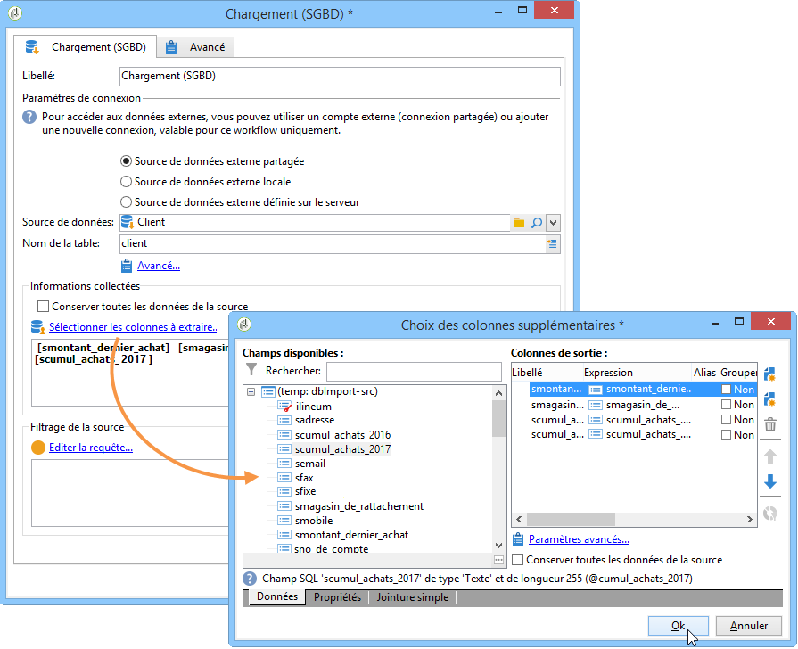

# Chargement (SGBD){#data-loading-rdbms}

The **[!UICONTROL Data loading (RDBMS)]** activity lets you access this external database directly and to collect only the data required for targeting.

Pour améliorer les performances, nous vous recommandons d’utiliser l’activité de requête (où les données d’une base de données externe peuvent être utilisées). For more on this, refer to [Accessing an external database (FDA)](../../workflow/using/accessing-an-external-database--fda-.md).

Le principe de fonctionnement est le suivant :

1. Sélectionnez la source de données dans la liste et saisissez le nom de la table contenant les données à extraire.

   

   The name of the table entered in the corresponding field is used as a template for collecting data in the external database. The name of the table processed by the workflow can be computed or conveyed by the inbound transition of the data loading activity. To select the table to be used, click the **[!UICONTROL Advanced..]**. et sélectionnez l’ **[!UICONTROL Specified in the transition]** option ou **[!UICONTROL Explicit]** .

   

1. Cliquez sur le **[!UICONTROL Select the columns to extract...]** lien pour choisir les données à collecter dans la base de données.

   

1. Vous pouvez définir un filtre sur ces données. To do this, click the **[!UICONTROL Edit query....]** link.

   Les données ainsi collectées peuvent être utilisées tout au long du cycle de vie du workflow.

