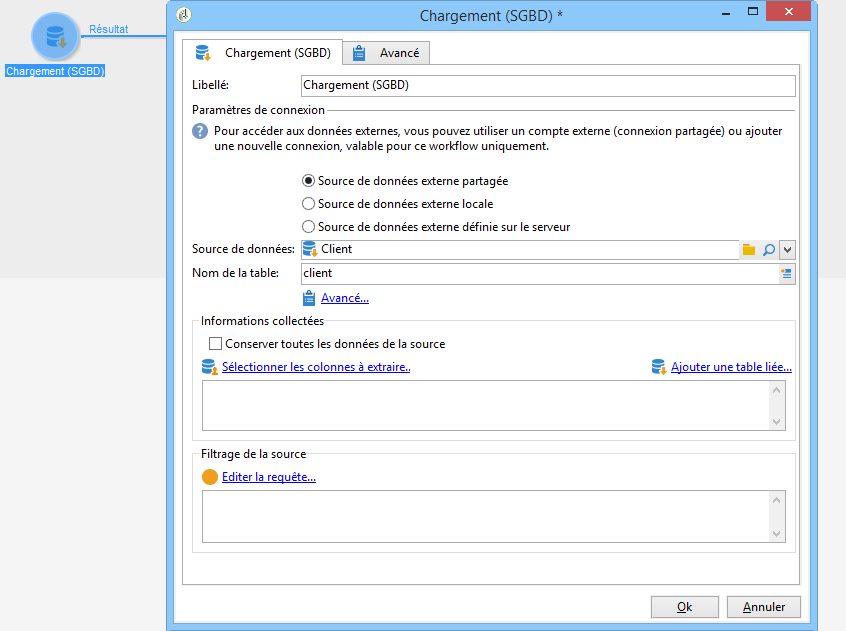

# Chargement (SGBD){#data-loading-rdbms}

L&#39;activité **[!UICONTROL Chargement (SGBD)]** permet d&#39;accéder directement une base externe et de n&#39;en collecter que les données nécessaires au ciblage.

Pour améliorer les performances, nous vous recommandons d’utiliser l’activité de requête (où les données d’une base de données externe peuvent être utilisées). For more on this, refer to [Accessing an external database (FDA)](../../workflow/using/accessing-an-external-database--fda-.md).

Le principe de fonctionnement est le suivant :

1. Sélectionnez la source de données dans la liste et saisissez le nom de la table contenant les données à extraire.

   

   The name of the table entered in the corresponding field is used as a template for collecting data in the external database. The name of the table processed by the workflow can be computed or conveyed by the inbound transition of the data loading activity. To select the table to be used, click the **[!UICONTROL Advanced..]**. et sélectionnez l’option **[!UICONTROL Spécifiée dans la transition]** ou **[!UICONTROL explicite]** .

   

1. Cliquez sur le lien **[!UICONTROL Sélectionner les colonnes à extraire...]** afin de choisir les données qui doivent être collectées dans la base.

   

1. Vous pouvez définir un filtre sur ces données. Pour cela, cliquez sur le lien **[!UICONTROL Editer la requête....]**.

   Les données ainsi collectées peuvent être utilisées tout au long du cycle de vie du workflow.

