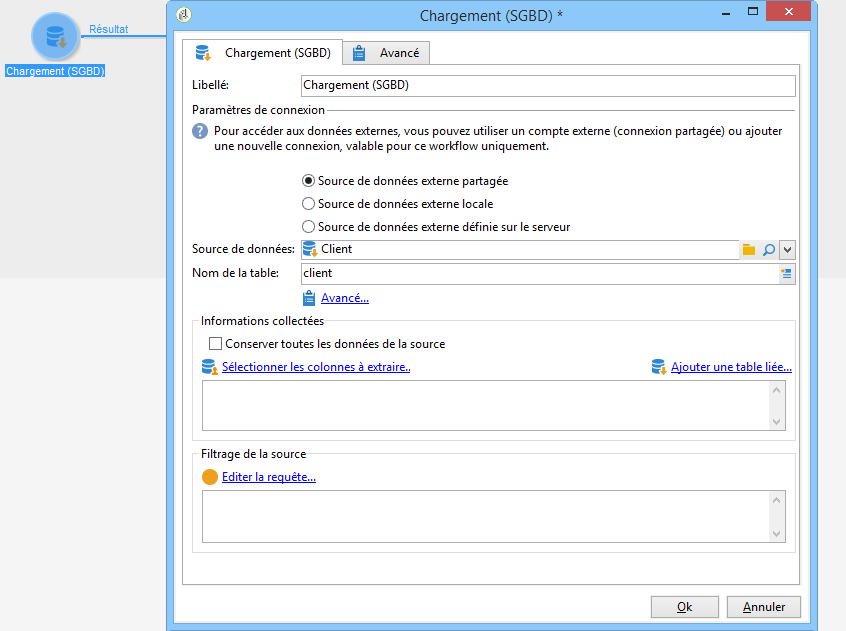
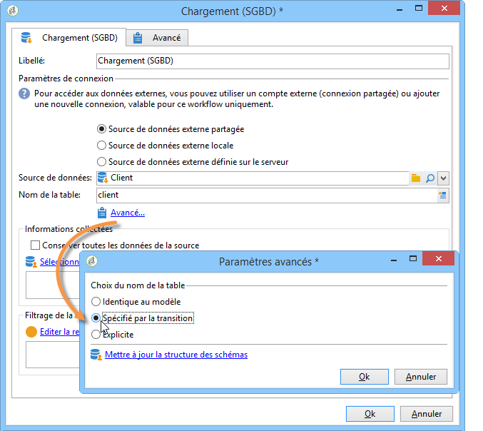
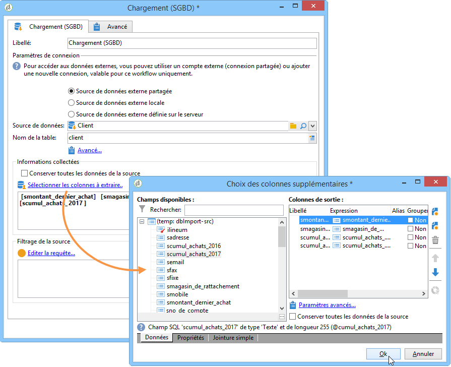

# Chargement (SGBD){#data-loading-rdbms}

L&#39;activité **[!UICONTROL Chargement (SGBD)]** permet d&#39;accéder directement une base externe et de n&#39;en collecter que les données nécessaires au ciblage.

Pour améliorer les performances, il est recommandé de préférer l&#39;utilisation de l&#39;activité de requête (où peuvent être utilisées des données d&#39;une base externe). Voir à ce sujet la section [Accès à une base externe (FDA)](accessing-an-external-database-fda.md);

Le principe de fonctionnement est le suivant :

1. Sélectionnez la source de données dans la liste et saisissez le nom de la table contenant les données à extraire.

   

   Le nom de la table renseignée dans le champ correspondant sert de modèle pour collecter les données dans la base externe. Le nom de la table traitée par le workflow peut être calculé ou véhiculé par la transition entrante de l&#39;activité de chargement de données. Pour sélectionner le tableau à utiliser, cliquez sur le bouton **[!UICONTROL Avancé..]**. et sélectionnez l’option **[!UICONTROL Spécifié par la transition]** ou **[!UICONTROL Explicite]**.

   

1. Cliquez sur le lien **[!UICONTROL Sélectionner les colonnes à extraire...]** afin de choisir les données qui doivent être collectées dans la base.

   

1. Vous pouvez définir un filtre sur ces données. Pour ce faire, cliquez sur le bouton **[!UICONTROL Modifier la requête....]** lien.

   Les données ainsi collectées peuvent être utilisées tout au long du cycle de vie du workflow.
