# Déduplication{#deduplication}

La déduplication supprime les doublons dans le ou les résultats des activités entrantes. La déduplication peut être effectuée en fonction de l&#39;adresse email, du numéro de téléphone ou d&#39;un autre champ.

## Bonnes pratiques {#best-practices}

Lors d&#39;une déduplication, les flux entrants sont traités séparément. Si par exemple, un destinataire &#39;A&#39; est présent dans le résultat de la requête 1 et également dans le résultat de la requête 2, il ne sera pas dédupliqué.

Ce cas de figure doit s&#39;aborder de cette manière :

* Créer une activité **Union** pour unifier chaque flux entrant.
* Créer une activité **Déduplication** positionnée après l&#39;activité **Union**.

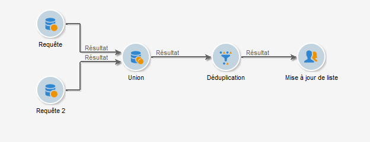

## Configuration {#configuration}

Pour paramétrer une déduplication, vous devez renseigner son libellé, la méthode et les critères de déduplication et les options relatives au résultat.

Cliquez sur le lien **[!UICONTROL Editer la configuration...]** pour définir le mode de déduplication.

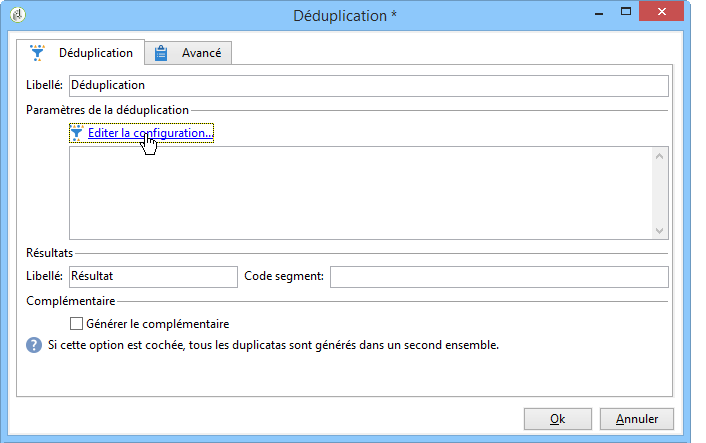

1. Choix de la cible

   Sélectionnez le type de cible de cette activité (par défaut, la déduplication porte sur les destinataires) et le critère à utiliser, c&#39;est-à-dire le champ pour lequel des valeurs identiques permettent d&#39;identifier les doublons : l&#39;adresse email, le numéro de mobile ou de téléphone, le fax ou l&#39;adresse postale.

   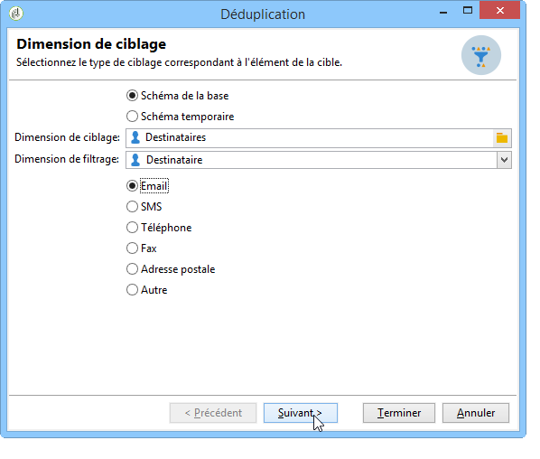

   L&#39;option **[!UICONTROL Autre]** permet, à l&#39;étape suivante, de sélectionner le ou les critères à utiliser :

   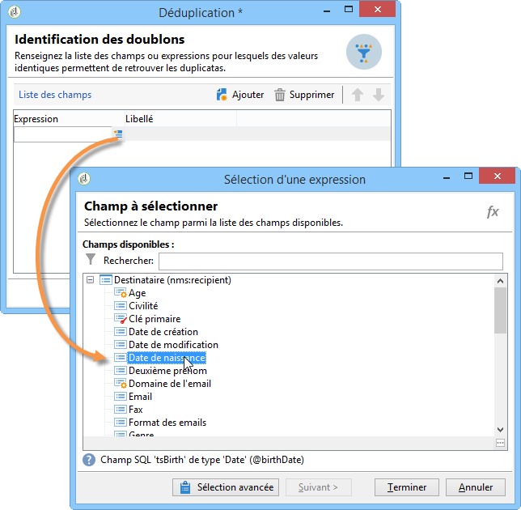

1. Méthodes de déduplication

   Sélectionnez dans la liste déroulante la méthode de déduplication à utiliser et indiquez le nombre de doublons à conserver.

   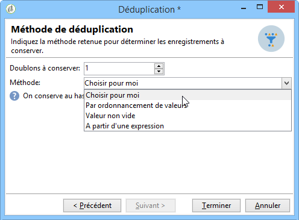

   Les méthodes disponibles sont les suivantes :

   * **[!UICONTROL Choisir pour moi]** : sélectionne au hasard parmi les doublons l&#39;enregistrement à conserver.
   * **[!UICONTROL Par ordonnancement de valeurs]** : permet de définir un ordre de priorité des valeurs pour un ou plusieurs champs. Pour définir les valeurs, sélectionnez un champ ou créez une expression puis ajoutez la ou les valeurs dans le tableau correspondant. Cliquez sur le bouton **[!UICONTROL Ajouter]** situé au-dessus de la liste des valeurs pour définir un nouveau champ.

      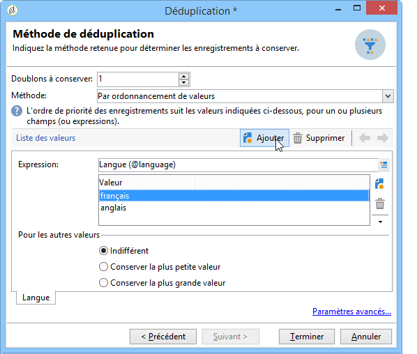

   * **[!UICONTROL Valeur non vide]** : permet de conserver en priorité les enregistrements pour lesquels la valeur de l&#39;expression sélectionnée n&#39;est pas vide.

      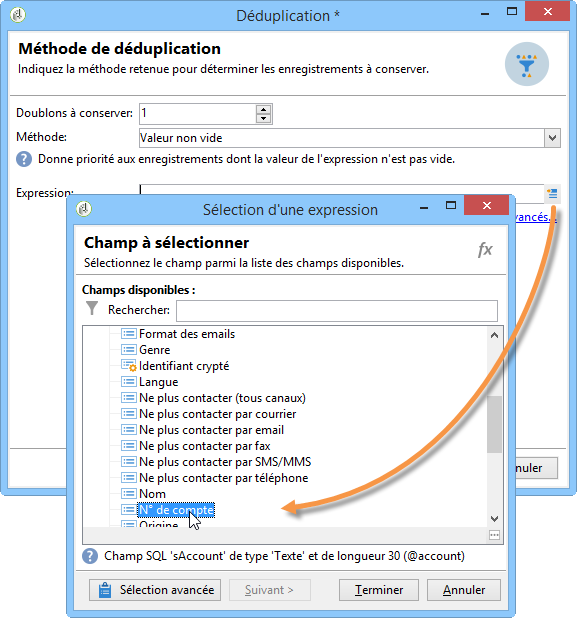

   * **[!UICONTROL A partir d&#39;une expression]** : permet de conserver les enregistrements dont la valeur de l&#39;expression renseignée est la plus petite (ou la plus grande).

      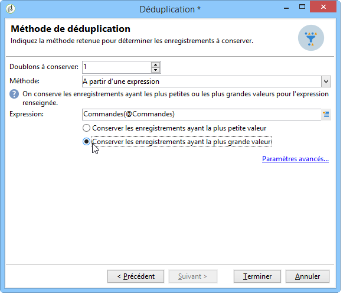
   Cliquez sur **[!UICONTROL Terminer]** pour valider la méthode de déduplication sélectionnée.

   La section centrale de la fenêtre résume le paramétrage défini.

   Dans la section inférieure de la fenêtre d&#39;édition de l&#39;activité, vous pouvez modifier le libellé de la transition sortante de l&#39;objet graphique et saisir un code segment qui sera associé au résultat de l&#39;activité. Ce code pourra être utilisé ultérieurement comme critère de ciblage.

   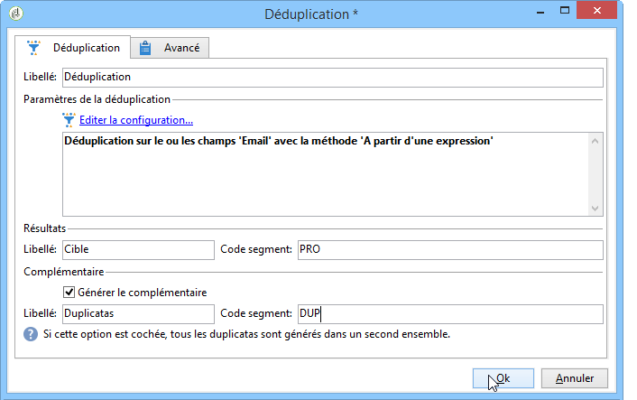

   Cochez l&#39;option **[!UICONTROL Générer le complémentaire]** si vous souhaitez exploiter la population restante. Le complémentaire est constitué de tous les doublons. Une transition supplémentaire sera alors ajoutée à l&#39;activité, comme suit :

   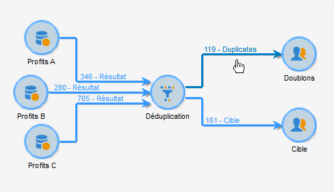

## Exemple : identifier des doublons avant une diffusion {#example--identify-the-duplicates-before-a-delivery}

Dans l&#39;exemple suivant, la déduplication porte sur l&#39;union de trois requêtes.

Le workflow a pour but de définir la cible d&#39;une diffusion en excluant les doublons afin d&#39;éviter d&#39;envoyer cette dernière plusieurs fois à un même destinataire.

Les doublons identifiés seront également intégrés à une liste constituée exclusivement de doublons qui pourra être réutilisée en cas de besoin ultérieur.

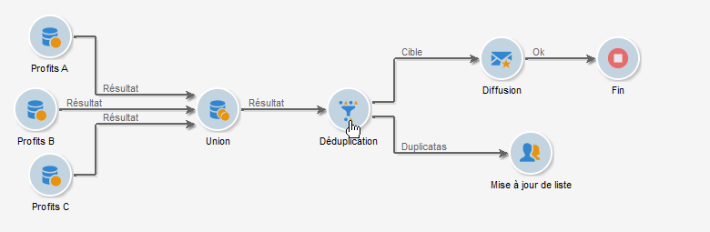

1. Placez et reliez les différentes activités nécessaires au déroulement du workflow comme indiqué dans l&#39;illustration ci-dessus.

   L’activité syndicale est utilisée ici pour &quot;unifier&quot; les trois requêtes en une seule transition. Ainsi, la déduplication ne fonctionne pas pour chaque requête individuellement mais pour l&#39;ensemble de la requête. Pour en savoir plus sur ce sujet, consultez la section [Meilleures pratiques](#best-practices).

1. Ouvrez l&#39;activité de déduplication puis cliquez sur le lien **[!UICONTROL Editer la configuration...]** afin de pouvoir définir le mode de déduplication.
1. Dans la fenêtre qui s&#39;ouvre, sélectionnez **[!UICONTROL Schéma de la base]**.
1. Sélectionnez **Destinataires** en tant que dimensions de ciblage et de filtrage.
1. Sélectionnez le champ d&#39;identification des doublons **[!UICONTROL Email]** afin de n&#39;envoyer la diffusion qu&#39;une seule fois par adresse mail, puis cliquez sur **[!UICONTROL Suivant]**.

   Si vous souhaitez baser l&#39;identification des doublons sur un champ précis, sélectionnez **[!UICONTROL Autre]** afin d&#39;accéder à la liste des champs disponibles.

1. Choisissez de ne conserver qu&#39;une seule entrée lorsque la même adresse e-mail est identifiée pour plusieurs destinataires.
1. Sélectionnez le mode de déduplication **[!UICONTROL Choisir pour moi]** afin que l&#39;enregistrement conservé en cas de doublons identifiés soit choisi au hasard, puis cliquez sur **[!UICONTROL Terminer]**.

Lors de l&#39;exécution du workflow, les destinataires identifiés comme étant des doublons seront exclus du résultat (et donc de la diffusion) et ajoutés à la liste des doublons. Cette liste pourra être réutilisée afin de ne pas avoir à identifier de nouveau les doublons.

## Paramètres d&#39;entrée {#input-parameters}

* tableName
* schema

Chacun des événements entrants doit spécifier une cible définie par ces paramètres.

## Paramètres de sortie {#output-parameters}

* tableName
* schema
* recCount

Ce triplet de valeurs identifie la cible résultant de la déduplication. **[!UICONTROL tableName]** est le nom de la table qui mémorise les identifiants de la cible, **[!UICONTROL schema]** est le schéma de la population (habituellement nms:recipient) et **[!UICONTROL recCount]** est le nombre d&#39;éléments dans la table.

La transition associée au complémentaire possède les mêmes paramètres.
