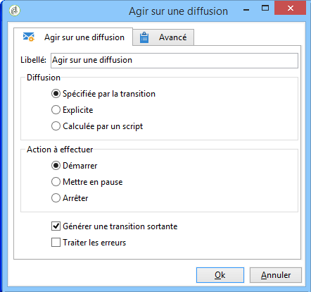

# Agir sur une diffusion{#delivery-control}

Une activité de type **Agir sur une diffusion** permet de démarrer, mettre en pause ou arrêter une diffusion.

Il peut s’agir de la remise spécifiée dans la transition, d’une remise sélectionnée explicitement ou d’une remise calculée par un script. For more on this, refer to [Delivery](../../workflow/using/delivery.md).

Si vous sélectionnez **[!UICONTROL Démarrer]**, l’activité effectue toutes les étapes requises pour démarrer la diffusion (calcul de la cible, préparation du contenu, diffusion). Si certaines de ces étapes ont déjà été effectuées par une activité de flux de travail précédente, elles ne seront plus exécutées. Par exemple, si l’estimation de la cible a déjà été effectuée par une activité de type **[!UICONTROL Livraison]** (voir [Livraison](../../workflow/using/delivery.md)), la **[!UICONTROL loi sur l’activité de livraison]** lancera les étapes restantes (préparation et diffusion du contenu).

Les options disponibles sont les suivantes :

* **[!UICONTROL Générer une transition sortante]**

   Crée une transition sortante qui sera activée à la fin de l&#39;exécution. Vous pouvez choisir de récupérer la cible de l&#39;action de diffusion en sortie, ou non.

* **[!UICONTROL Traiter les erreurs]**

   Reportez-vous à la section Erreurs [de](../../workflow/using/monitoring-workflow-execution.md#processing-errors)traitement.

## Paramètres d&#39;entrée {#input-parameters}

* deliveryId

Identifiant de la diffusion, si l&#39;action sélectionnée est **[!UICONTROL Spécifiée par la transition]**.
