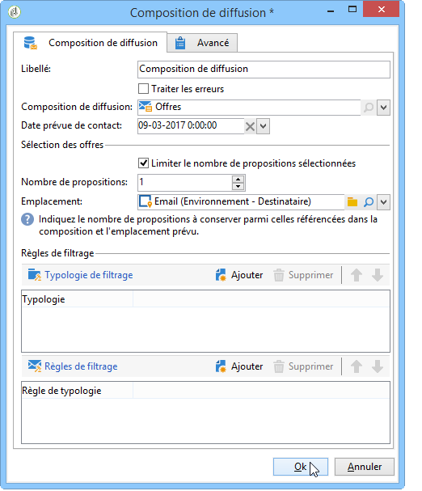

# Composition de diffusion{#delivery-outline}

The **delivery outline** lets you use an outline in a campaign workflow. The outline must have been created in the campaign beforehand.

Pour plus d&#39;informations sur les compositions de diffusion dans Adobe Campaign, consultez cette [section](../../campaign/using/marketing-campaign-deliveries.md#associating-and-structuring-resources-linked-via-a-delivery-outline).

Pour paramétrer l&#39;activité, vous devez simplement sélectionner la composition de votre choix ainsi que la date prévue de contact. Vous pouvez ajouter des règles de filtrages en ajoutant des typologies ou des règles de typologie.

## Exemple : Insérer une offre via une composition de diffusion {#example--inserting-an-offer-via-a-delivery-outline}

The **delivery outline** activity, available in the campaign workflows, lets you present offers that are referenced in a delivery outline from the current campaign in progress.

>[!NOTE]
>
>Le package **Interaction** doit être installé.

1. Dans un workflow, placez une activité de composition de diffusion avant une activité de diffusion.
1. Dans l&#39;activité de composition, définissez la composition que vous souhaitez utiliser.

   Pour plus d&#39;informations sur la définition des compositions de diffusion, consultez [cette section](../../campaign/using/marketing-campaign-deliveries.md#associating-and-structuring-resources-linked-via-a-delivery-outline).

1. Complétez les champs disponibles en fonction de votre diffusion.
1. Deux cas se présentent :

   * Si vous souhaitez appeler le moteur d&#39;offres, cochez la case **[!UICONTROL Limiter le nombre de propositions sélectionnées]**. Définissez l&#39;emplacement et le nombre d&#39;offres qui seront présentées dans la diffusion.

      Les poids et règles d&#39;éligibilité des offres seront pris en compte par le moteur d&#39;offres.

   * Si vous ne cochez pas la case, toutes les offres de la composition de diffusion seront présentées, sans appel au moteur d&#39;offres.

   La prévisualisation prend en compte le nombre d&#39;offres défini dans la diffusion. Lors de l&#39;exécution du workflow, c&#39;est le nombre défini dans la composition de diffusion qui est pris en compte.

   

