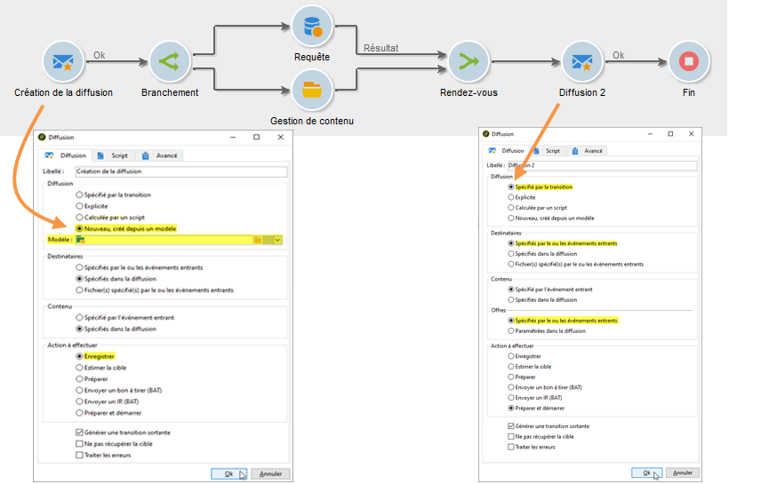
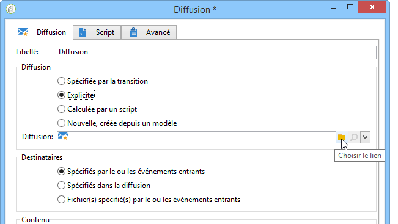
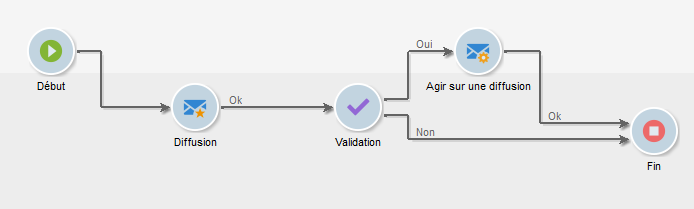
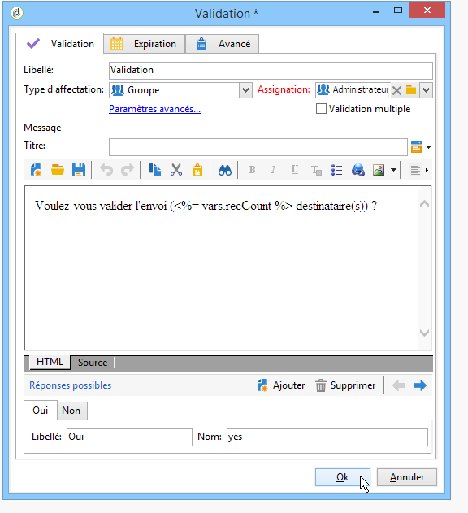

# Diffusion{#delivery}

Une activité de type **Diffusion** permet de créer une action de diffusion. Elle peut être construite à partir des éléments entrants.

Pour la paramétrer, éditez l&#39;activité et renseignez les options de la diffusion.


1. **Diffusion**

   Vous pouvez ainsi :

   * Agissez sur la livraison spécifiée dans la transition entrante. Pour ce faire, sélectionnez la première option de la **[!UICONTROL Delivery]** section de la fenêtre.

      Cette option peut être utilisée lorsqu&#39;une activité précédente du workflow a déjà créé ou spécifié la diffusion. Cela peut avoir été effectué, comme dans l&#39;exemple ci-dessous, par une activité du même type ayant généré une transition sortante.

      Dans l&#39;exemple suivant, la diffusion est créée dans un premier temps. La population et le contenu sont définis ensuite. Enfin, les informations de ces trois éléments sont reprises dans une nouvelle activité de diffusion via la transition entrante, afin que cette dernière puisse être envoyée.

      

   * Sélectionnez directement la livraison concernée. Pour ce faire, sélectionnez l’ **[!UICONTROL Explicit]** option et sélectionnez la diffusion dans la liste déroulante du **[!UICONTROL Delivery]** champ.

      La liste affiche les livraisons inachevées contenues dans le dossier **Livraisons** par défaut. Pour accéder à d&#39;autres campagnes, cliquez sur l&#39; **[!UICONTROL Select link]** icône .

      

      Select the campaign from the drop-down list of the **[!UICONTROL Folder]** field, or click **[!UICONTROL Display sub-levels]** to display all of the deliveries contained in sub-folders:

      

      After selecting the delivery action, you can display the content by clicking the **[!UICONTROL Edit link]** icon.

   * Créez un script pour calculer la diffusion. Pour ce faire, sélectionnez l’ **[!UICONTROL Calculated by a script]** option et saisissez le script. Vous pouvez ouvrir une fenêtre d’entrée en cliquant sur l’ **[!UICONTROL Edit...]** option. L’exemple suivant récupère l’identifiant de la remise :

      

   * Créez une remise. Pour ce faire, sélectionnez l’ **[!UICONTROL New, created from a template]** option et sélectionnez le modèle de remise sur lequel la remise sera basée.

      

      Click the **[!UICONTROL Select link]** icon to browse the folders, and click the **[!UICONTROL Edit link]** icon if you wish to view the content of the selected template.

1. **Destinataires**

   Les destinataires peuvent être spécifiés par les événements entrants, par exemple suite à un import de fichier, ou spécifiés dans l&#39;action de diffusion. Ils peuvent également être stockés dans un ou plusieurs fichiers.

   

1. **Content**

   Le contenu du message peut être défini dans la diffusion ou dans l&#39;événement entrant.

   

1. **Action à effectuer**

   Vous pouvez créer la diffusion, la préparer, la démarrer, estimer la cible ou envoyer un bon à tirer.

   

   Sélectionnez le type d&#39;action à effectuer parmi les options disponibles :

   * **[!UICONTROL Save]**: cette option vous permet de créer la diffusion et de l’enregistrer. Il ne l&#39;analysera ni ne le livrera.
   * **[!UICONTROL Estimate the target]**: cette option vous permet de calculer la cible de livraison afin d’évaluer son potentiel (première phase d’analyse). Cette action équivaut à sélectionner l’ **[!UICONTROL Estimate the population to be targeted]** option et à cliquer **[!UICONTROL Analyze]** lors de l’envoi d’une remise à la cible principale via **Livraison**.
   * **[!UICONTROL Prepare]**: cette option vous permet d’exécuter le processus d’analyse complet (calcul de la cible et préparation du contenu). La livraison n&#39;est pas envoyée. Cette action équivaut à sélectionner l’ **[!UICONTROL Deliver as soon as possible]** option et à cliquer **[!UICONTROL Analyze]** lors de l’envoi d’une remise à la cible principale avec **Livraison**.
   * **[!UICONTROL Send a proof]**: cette option vous permet d’envoyer une preuve de livraison. Cette action équivaut à cliquer sur le **[!UICONTROL Send a proof]** bouton dans la barre d’outils d’une remise avec **livraison**
   * **[!UICONTROL Prepare and start]**: cette option lance le processus d’analyse complet (calcul de la cible et préparation du contenu) et envoie la diffusion. Cette action équivaut à cliquer sur **[!UICONTROL Deliver as soon as possible]**, **[!UICONTROL Analyze]** et **[!UICONTROL Confirm delivery]** à l’option lors de l’envoi d’une remise à la cible principale avec **Livraison**.
   L’ **[!UICONTROL Act on a delivery]** activité utilisée plus loin dans le processus vous permet de lancer toutes les étapes restantes requises pour commencer la diffusion (calcul de la cible, préparation du contenu, diffusion). For more on this, refer to [Delivery control](../../workflow/using/delivery-control.md).

   Les options suivantes sont également disponibles :

   * **[!UICONTROL Generate an outbound transition]**

      Crée une transition sortante qui sera activée à la fin de l&#39;exécution. Vous pouvez choisir de récupérer la cible de l&#39;action de diffusion en sortie, ou non.

   * **[!UICONTROL Do not recover target]**

      Ne récupère pas la cible de l&#39;action de diffusion en sortie.

   * **[!UICONTROL Processing errors]**

      Reportez-vous à la section Contrôle [](../../workflow/using/delivery-control.md)de la diffusion.
   L&#39;onglet **Script** permet de modifier les paramètres de la diffusion.

   

## Exemple : workflow de diffusion {#example--delivery-workflow}

Créez un nouveau workflow et ajoutez des activités comme dans l&#39;exemple ci-dessous :



Ouvrez l&#39;activité **Diffusion** et définissez ses propriétés comme suit :

* Dans la **[!UICONTROL Delivery]** section, sélectionnez **[!UICONTROL New, created from a template]** et sélectionnez un modèle de remise.
* Dans la **[!UICONTROL Recipients]** section, sélectionnez **[!UICONTROL Specified in the delivery]**.
* Dans la **[!UICONTROL Action to execute]** section, conservez l’ **[!UICONTROL Prepare]** option.


Cliquez sur **[!UICONTROL OK]** pour fermer la fenêtre de propriétés. Vous venez de configurer une activité qui consiste à créer et à préparer une nouvelle diffusion en fonction d’un modèle de diffusion dont la cible sera spécifiée dans celui-ci.

Ouvrez l&#39;activité **Validation** et définissez ses propriétés comme suit :

1. Dans le **[!UICONTROL Assignment type]** champ, sélectionnez un groupe dans lequel vous êtes enregistré. Si vous êtes connecté à l’aide du compte &quot;admin&quot;, sélectionnez le groupe Administration.
1. Saisissez ensuite un titre et insérez le texte suivant dans le corps du message :

   ```
   Do you wish to approve delivery (<%= vars.recCount %> recipient(s))?
   ```

   Il s’agit d’un message qui comprend une expression écrite en JavaScript : **[!UICONTROL vars.recCount]** représente le nombre de destinataires ciblés par la remise de la tâche précédente. Pour plus d’informations sur les expressions JavaScript, voir Scripts [JavaScript et modèles](../../workflow/using/javascript-scripts-and-templates.md).

   

   The Approval task is detailed in [Approval](../../workflow/using/approval.md).

## Paramètres d&#39;entrée {#input-parameters}

Identifiant de remise, si l’ **[!UICONTROL Specified in the transition]** option est sélectionnée dans la **[!UICONTROL Delivery]** section.

* deliveryId
* tableName
* schema

Chacun des événements entrants doit spécifier une cible définie par ces paramètres.

>[!NOTE]
>
>Ce paramètre n’apparaît que si l’ **[!UICONTROL Specified by inbound event(s)]** option est sélectionnée dans la **[!UICONTROL Recipients]** section.

* filename

   Nom complet du fichier généré si l’ **[!UICONTROL File(s) specified by inbound event(s)]** option est sélectionnée dans la **[!UICONTROL Recipients]** section.

* contentId

   Identifiant du contenu si l’ **[!UICONTROL Specified by inbound events]** option est sélectionnée dans la **[!UICONTROL Content]** section.

## Paramètres de sortie {#output-parameters}

* tableName
* schema
* recCount

Cet ensemble de trois valeurs identifie la cible résultant de la diffusion. **[!UICONTROL tableName]** est le nom de la table qui mémorise les identificateurs de la cible, **[!UICONTROL schema]** est le schéma de la population (généralement nms:destinataire) et **[!UICONTROL recCount]** est le nombre d&#39;éléments dans la table.

La transition associée au complémentaire possède les mêmes paramètres.

>[!NOTE]
>
>Il n’existe aucun paramètre de sortie lorsque l’ **[!UICONTROL Do not recover target]** option est sélectionnée.

