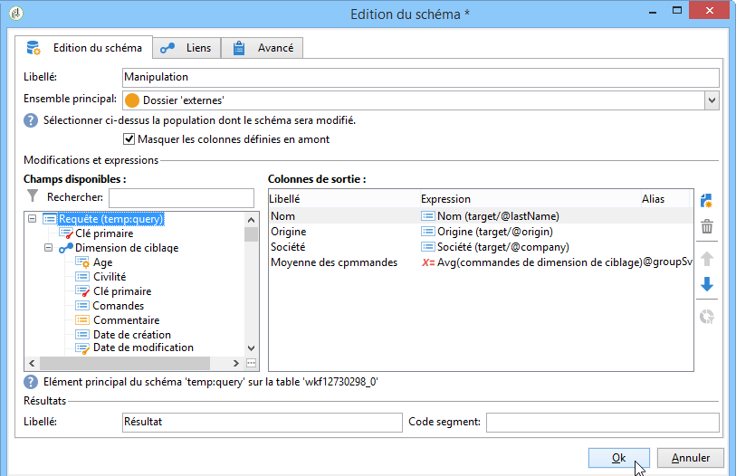
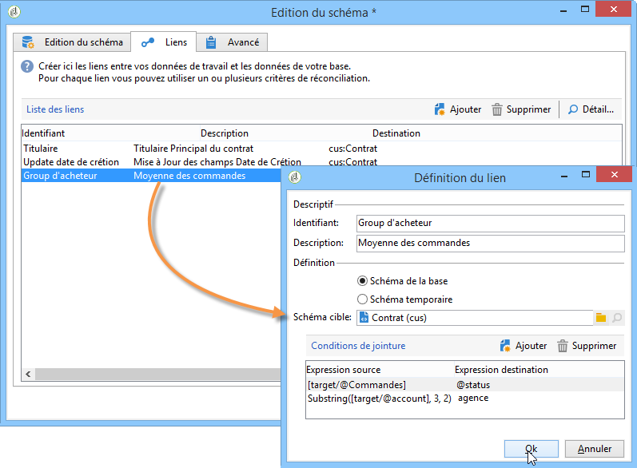

# Modification du schéma{#edit-schema}

Les données peuvent être transformées, normalisées et, au besoin, enrichies dans le workflow en utilisant l&#39;activité **[!UICONTROL Edition du schéma]**. Elle est généralement utilisée pour normaliser la structure des données : vous pouvez renommer les colonnes de sortie ou modifier leur contenu, par exemple en calculant la moyenne des valeurs d&#39;un champ ou un agrégat.

Cette activité ne modifie en rien les données de la table de travail, mais uniquement le schéma de cette dernière, c&#39;est-à-dire la vision logique des données.

Vous pouvez également créer des jointures avec d&#39;autres tables de travail, à partir de l&#39;onglet **[!UICONTROL Liens]**.

La section inférieure permet de paramétrer la liste des conditions de jointure, c&#39;est-à-dire des critères utilisés pour réconcilier les données des deux tables.
