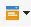

# Enrichissement des emails avec des champs de date personnalisés{#email-enrichment-with-custom-date-fields}

Dans cet exemple, nous souhaitons envoyer un email avec des champs de données personnalisés aux destinataires qui célèbrent leur anniversaire ce mois-ci. Cet email inclura un coupon valide une semaine avant et après leur anniversaire.

Nous devons cibler les destinataires d&#39;une liste qui célébreront leur anniversaire ce mois-ci avec une **[!UICONTROL Split]** activité. Ensuite, à l’aide de l’ **[!UICONTROL Enrichment]** activité, le champ de données personnalisées agira comme des dates de validité dans le courrier électronique pour l’offre spéciale du client.


Pour réaliser cet exemple, les étapes sont les suivantes :

1. In the **[!UICONTROL Targeting and workflows]** tab of your campaign, drag and drop a **[!UICONTROL Read list]** activity to target your list of recipients.
1. La liste à traiter peut être spécifiée explicitement, calculée par un script ou localisée dynamiquement, selon les options sélectionnées et les paramètres définis ici.

   

1. Add a **[!UICONTROL Split]** activity to differentiate recipients who will celebrate their birthdays this month from other recipients.
1. Pour fractionner votre liste, dans la **[!UICONTROL Filtering of selected records]** catégorie, sélectionnez **[!UICONTROL Add a filtering condition on the inbound population]**. Cliquez ensuite sur **[!UICONTROL Edit]**.

   

1. Select **[!UICONTROL Filtering conditions]** then click the **[!UICONTROL Edit expression]** button to filter the month of the recipient&#39;s birthday.

   

1. Cliquez **[!UICONTROL Advanced Selection]** puis **[!UICONTROL Edit the formula using an expression]** et ajoutez l’expression suivante : Mois(@bornDate).
1. Dans la **[!UICONTROL Operator]** colonne, sélectionnez le **[!UICONTROL equal to]**.
1. Further filter your condition, by adding the **[!UICONTROL Value]** month of the current date: Month(GetDate()).

   Cela interrogera les destinataires dont le mois d&#39;anniversaire correspond au mois actuel.

   

1. Clics **[!UICONTROL Finish]**. Ensuite, dans l’ **[!UICONTROL General]** onglet de votre **[!UICONTROL Split]** activité, cliquez sur **[!UICONTROL Generate complement]** dans la **[!UICONTROL Results]** catégorie.

   Vous pouvez **[!UICONTROL Complement]** ainsi ajouter une activité de remise ou mettre à jour une liste. Ici, nous venons d&#39;ajouter une **[!UICONTROL End]** activité.

   

You now need to configure your **[!UICONTROL Enrichment]** activity:

1. Add an **[!UICONTROL Enrichment]** activity after your subset to add your custom date fields.

   

1. Ouvrez votre **[!UICONTROL Enrichment]** activité. Dans la **[!UICONTROL Complementary information]** catégorie, cliquez sur **[!UICONTROL Add data]**.

   

1. Sélectionnez **[!UICONTROL Data linked to the filtering dimension]** alors **[!UICONTROL Data of the filtering dimension]**.
1. Cliquez sur le **[!UICONTROL Add]** bouton.

   

1. Add a **[!UICONTROL Label]**. Dans la **[!UICONTROL Expression]** colonne, cliquez ensuite sur **[!UICONTROL Edit expression]**.

   

1. First, we need to target the week before the birthdate as the **Validity start date** with the following **[!UICONTROL Expression]**: `SubDays([target/@birthDate], 7)`.

   

1. Then, to create the custom date field **Validity end date** which will target the week after the birthdate, you need to add the **[!UICONTROL Expression]**: `AddDays([target/@birthDate], 7)`.

   Vous pouvez ajouter un libellé à votre expression.

   

1. Cliquez sur **[!UICONTROL Ok]**. Votre enrichissement est maintenant prêt.

Après votre **[!UICONTROL Enrichment]** activité, vous pouvez ajouter une diffusion. Dans ce cas, nous avons ajouté une remise par courrier électronique pour envoyer aux destinataires une offre spéciale avec des dates de validité aux clients qui célèbrent leur anniversaire ce mois-ci.

1. Faites glisser une **[!UICONTROL Email delivery]** activité après votre **[!UICONTROL Enrichment]** activité.

   

1. Double-click your **[!UICONTROL Email delivery]** activity to start personalizing your delivery.
1. Add a **[!UICONTROL Label]** to your delivery and click **[!UICONTROL Continue]**.
1. Click **[!UICONTROL Save]** to create your email delivery.
1. Vérifiez dans l’ **[!UICONTROL Approval]** onglet de la remise du courrier électronique **[!UICONTROL Properties]** que le **[!UICONTROL Confirm delivery before sending option]** message est coché.

   Ensuite, démarrez votre workflow pour enrichir votre transition sortante avec les informations ciblées.

   

You can now start designing your email delivery with the custom date fields created in the **[!UICONTROL Enrichment]** activity.

1. Cliquez deux fois sur votre **[!UICONTROL Email delivery]** activité.
1. Ajoutez vos extensions cibles à votre email. Il devrait se trouver à l&#39;intérieur de l&#39;expression suivante afin de paramétrer le format de vos dates de validité :

   ```
   <%=
           formatDate(targetData.alias of your expression,"%2D.%2M")  %>
   ```

1. Clics  . Select **[!UICONTROL Target extension]** then the previously created custom validity dates with the **[!UICONTROL Enrichment]** activity to add your extension to the formatDate expression.

   

1. Paramétrez votre contenu d&#39;email selon vos besoins.

   

1. Prévisualisez votre email pour vérifier si vos champs de date personnalisés ont été correctement paramétrés.

   

Votre courriel est maintenant prêt. Vous pouvez commencer à envoyer vos preuves et confirmer votre livraison pour envoyer vos courriels d&#39;anniversaire.
