# Enrichir des données{#enriching-data}

## A propos de l&#39;enrichissement des données {#about-enriching-data}

Ce cas d’utilisation décrit les utilisations possibles de l’ **[!UICONTROL Enrichment]** activité dans un flux de travail de ciblage. Pour plus d’informations sur l’utilisation de l’ **[!UICONTROL Enrichment]** activité, voir : [Enrichissement](../../workflow/using/enrichment.md).

Les contacts de la base de données marketing reçoivent une invitation à participer à un concours via une application Web. Les résultats du concours sont récupérés dans le **[!UICONTROL Competition results]** tableau. Ce tableau est lié à la table de contact (**[!UICONTROL Recipients]**). Le **[!UICONTROL Competition results]** tableau contient les champs suivants :

* Nom du jeu (@game)
* Numéro de l&#39;essai (@trial)
* Score (@score)

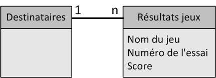

Un contact trouvé dans le **[!UICONTROL Recipients]** tableau peut être lié à plusieurs lignes du **[!UICONTROL Competition results]** tableau. La relation entre ces deux tableaux est de type 1-n. Voici un exemple des journaux de résultats pour un destinataire :

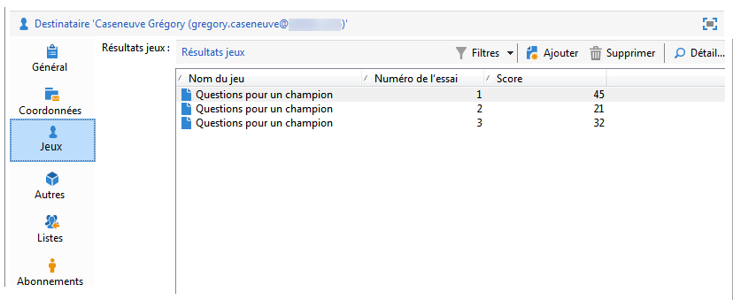

L&#39;objectif de ce cas d&#39;utilisation est d&#39;envoyer des diffusions personnalisées aux participants du dernier jeu concours en fonction du meilleur score qu&#39;ils ont obtenu au cours de leurs différents essais. Le participant qui a obtenu le meilleur score se voit offrir le 1er prix, celui qui a obtenu le second score reçoit un lot de consolation, et tous les autres reçoivent un message leur proposant de retenter leur chance lors du prochain jeu.

Pour réaliser ce cas d&#39;utilisation, nous avons créé le workflow de ciblage suivant :

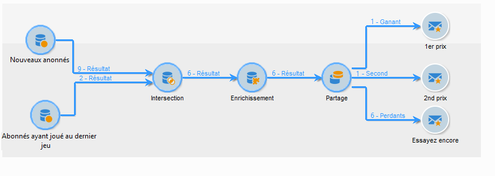

Les étapes principales de création du workflow sont les suivantes :

1. Two **[!UICONTROL Query]** activities and one **[!UICONTROL Intersection]** activity are added to target new subscribers who entered last the competition.
1. L’ **[!UICONTROL Enrichment]** activité nous permet d’ajouter des données stockées dans le **[!UICONTROL Competition results]** tableau. Le **[!UICONTROL Score]** champ sur lequel notre personnalisation de remise aura lieu est ajouté à la table de travail du flux de travaux.
1. The **[!UICONTROL Split]** type activity enables us to create recipient subsets based on scores.
1. For each subset, a **[!UICONTROL Delivery]** type activity is added.

## Etape 1 : Ciblage {#step-1--targeting}

La première requête permet de cibler les destinataires qui ont été ajoutés dans la base au cours des six derniers mois.

La seconde requête permet de cibler les destinataires ayant participé au dernier jeu.

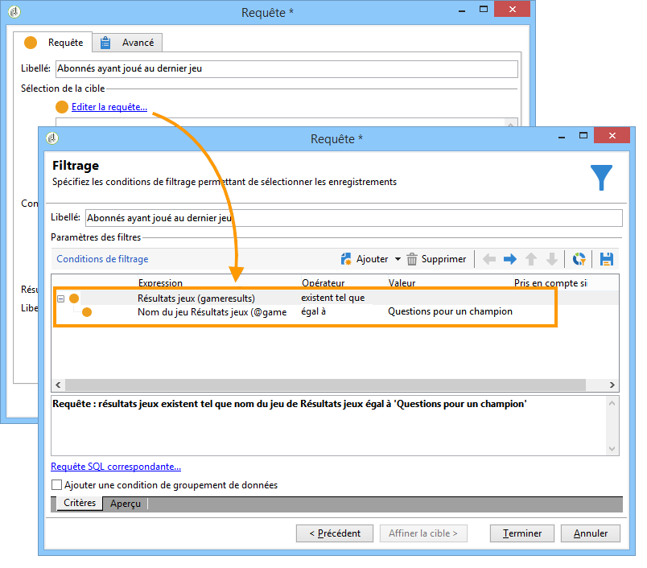

Une activité de type **[!UICONTROL Intersection]** est ensuite ajoutée pour cibler les destinataires qui ont été ajoutés dans la base au cours des six derniers mois et qui ont participé au dernier jeu.

## Etape 2 : Enrichissement {#step-2--enrichment}

Dans cet exemple, nous souhaitons personnaliser les livraisons en fonction du **[!UICONTROL Score]** champ stocké dans le **[!UICONTROL Competition results]** tableau. Ce tableau a une relation de type 1-n avec le tableau des destinataires. L’ **[!UICONTROL Enrichment]** activité nous permet d’ajouter des données d’un tableau lié à la dimension de filtrage à la table de travail du processus.

1. Dans l’écran de modification de l’activité d’enrichissement, sélectionnez **[!UICONTROL Add data]**, puis **[!UICONTROL Data linked to the filtering dimension]** cliquez sur **[!UICONTROL Next]**.

   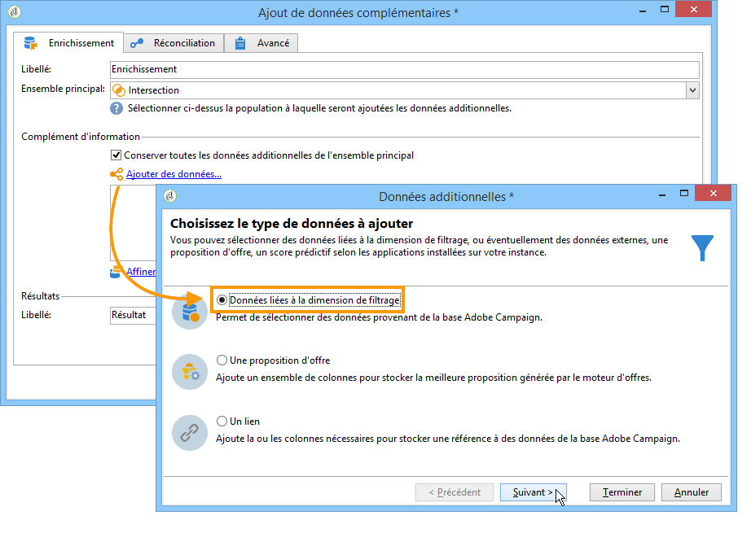

1. Sélectionnez ensuite l’ **[!UICONTROL Data linked to the filtering dimension]** option, sélectionnez le **[!UICONTROL Competition results]** tableau et cliquez sur **[!UICONTROL Next]**.

   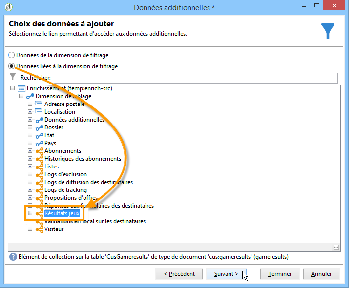

1. Saisissez un ID et une étiquette, puis sélectionnez l’ **[!UICONTROL Limit the line count]** option dans le **[!UICONTROL Data collected]** champ. Dans le **[!UICONTROL Lines to retrieve]** champ, sélectionnez &quot;1&quot; comme valeur. Pour chaque destinataire, l’activité d’enrichissement ajoute une ligne unique du **[!UICONTROL Competition results]** tableau à la table de travail du flux de travail. Clics **[!UICONTROL Next]**.

   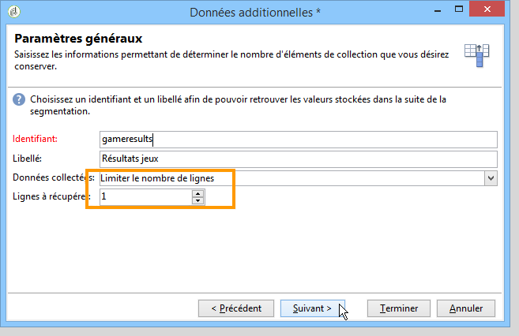

1. Dans cet exemple, nous voulons récupérer le score le plus élevé du destinataire, mais uniquement pour le dernier concours. Pour ce faire, ajoutez un filtre au **[!UICONTROL Competition name]** champ afin d’exclure toutes les lignes liées aux concours précédents. Clics **[!UICONTROL Next]**.

   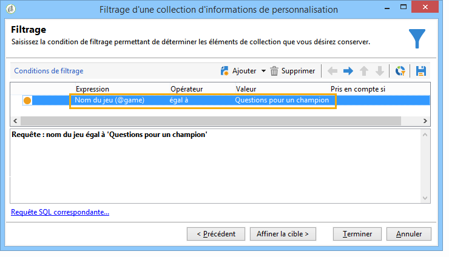

1. Accédez à l’ **[!UICONTROL Sort]** écran et cliquez sur le **[!UICONTROL Add]** bouton, sélectionnez le **[!UICONTROL Score]** champ et cochez la case de la **[!UICONTROL descending]** colonne pour trier les éléments des **[!UICONTROL Score]** champs dans l’ordre décroissant. Pour chaque destinataire, l’activité d’enrichissement ajoute une ligne qui correspond au score le plus élevé pour le dernier match. Clics **[!UICONTROL Next]**.

   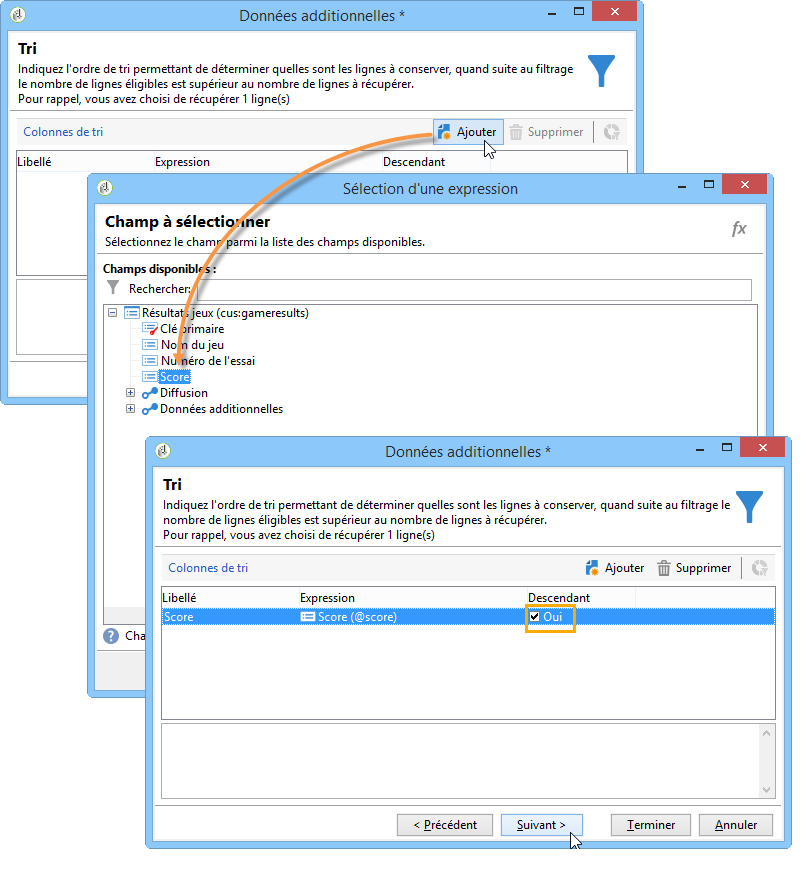

1. Dans la **[!UICONTROL Data to add]** fenêtre, double-cliquez sur le **[!UICONTROL Score]** champ. Pour chaque destinataire, l&#39;activité d&#39;enrichissement n&#39;ajoute que le **[!UICONTROL Score]** champ. Clics **[!UICONTROL Finish]**.

   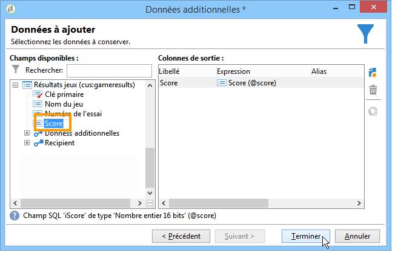

Right-click the inbound transition of the enrichment activity and select **[!UICONTROL Display the target]**. The work table contains the following data:

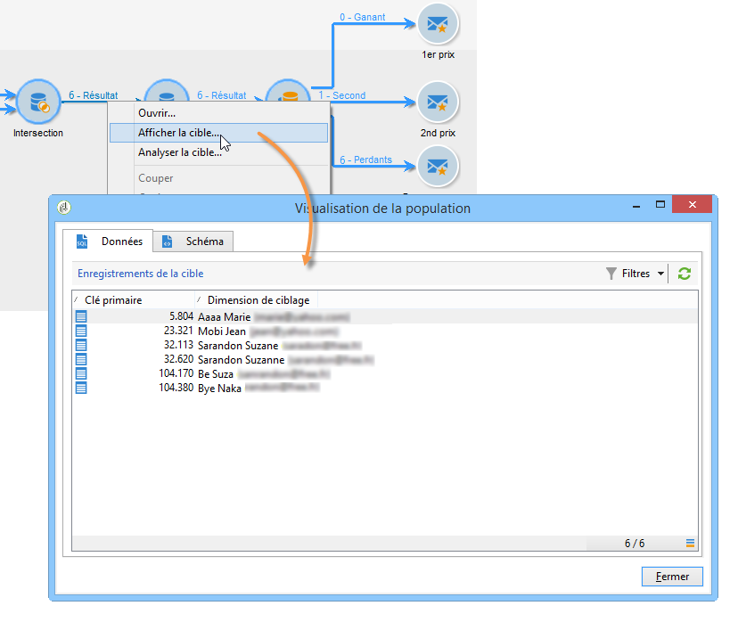

Le schéma associé est le suivant :

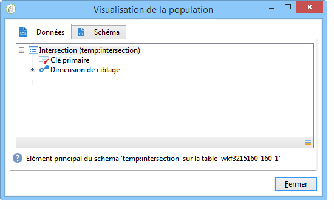

Renouvelez cette opération sur la transition sortante de l&#39;activité d&#39;enrichissement. Vous pouvez constater que les données relatives au score des destinataires ont été ajoutées. Pour chaque destinataire, le score le plus élevé a bien été récupéré.

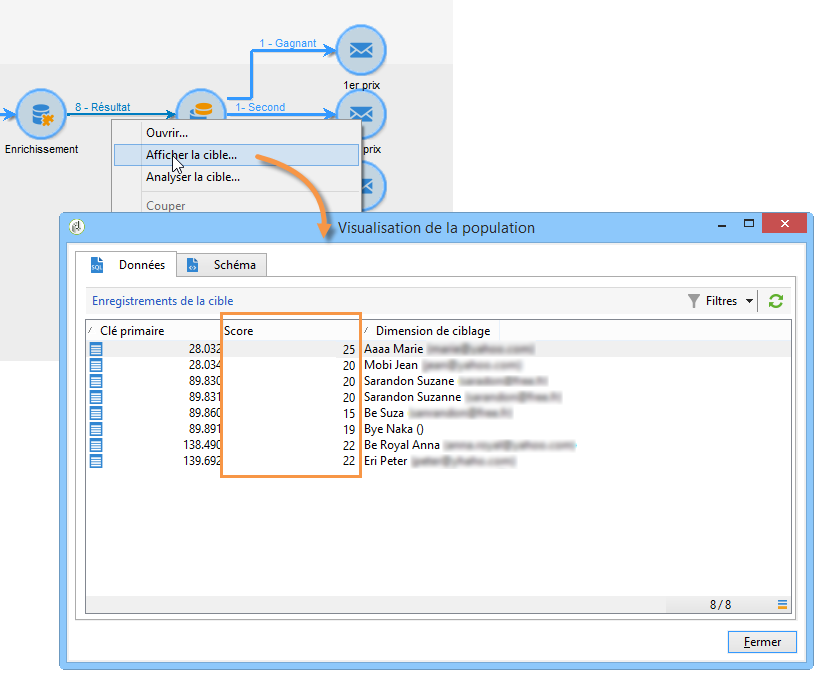

Le schéma correspondant a également été enrichi.

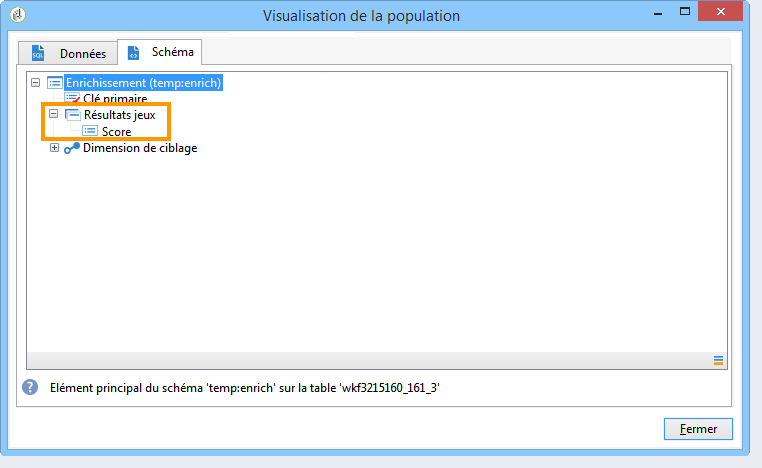

## Etape 3 : Partage et diffusions {#step-3--split-and-delivery}

To sort the recipients based on their scores, a **[!UICONTROL Split]** activity is added after the enrichment.

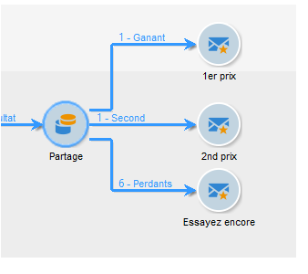

1. Un premier sous-ensemble (**Gagnant**), a été défini pour inclure le destinataire ayant obtenu le meilleur score. Pour cela, définissez une limitation du nombre d&#39;enregistrements, appliquez un tri descendant sur le score, et limitez le nombre d&#39;enregistrements à 1.

   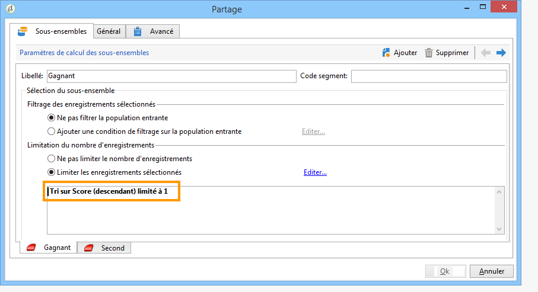

1. Le second sous-ensemble (**Second**), inclut le destinataire ayant obtenu le second meilleur score. Le paramétrage est le même que pour le premier sous-ensemble.

   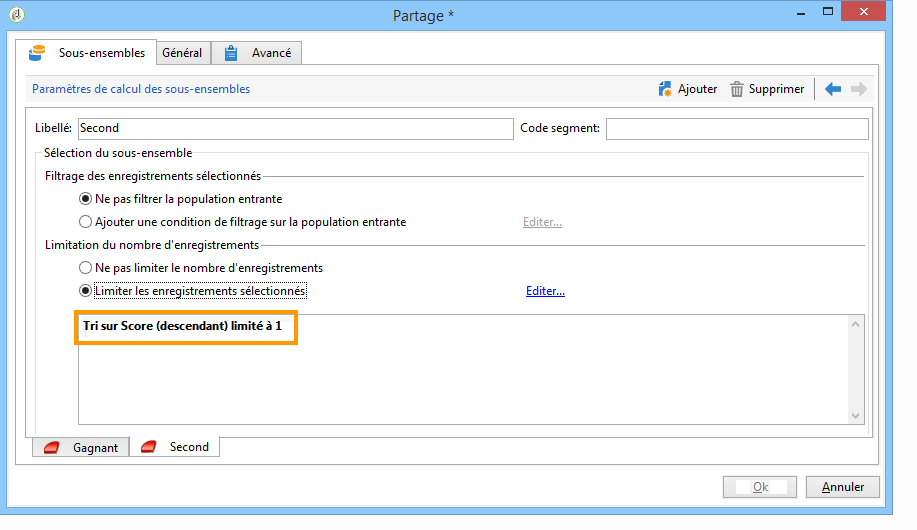

1. Le troisième sous-ensemble (**perdants**) contient tous les autres destinataires. Accédez à l’ **[!UICONTROL General]** onglet et cochez la **[!UICONTROL Generate complement]** case pour cibler tous les destinataires qui n’ont pas obtenu les deux meilleures notes.

   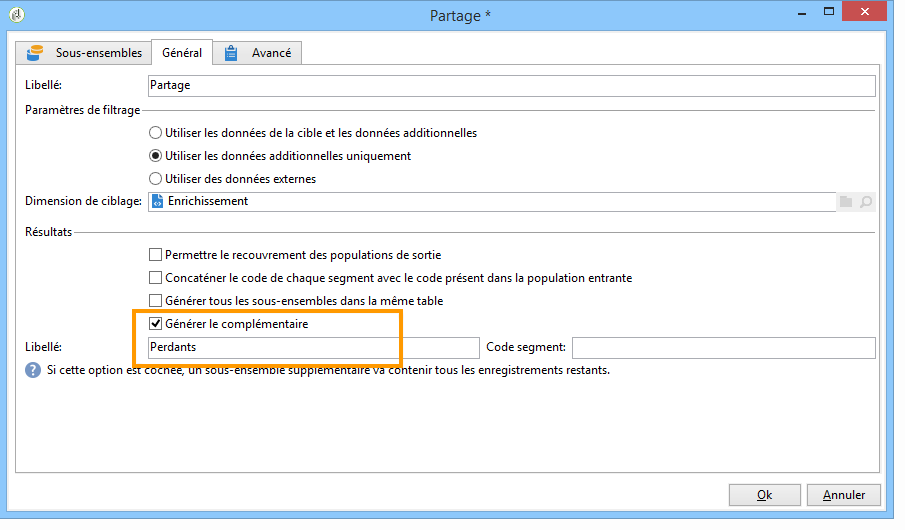

1. Add a **[!UICONTROL Delivery]** type activity for each subset, using a different delivery template for each.

   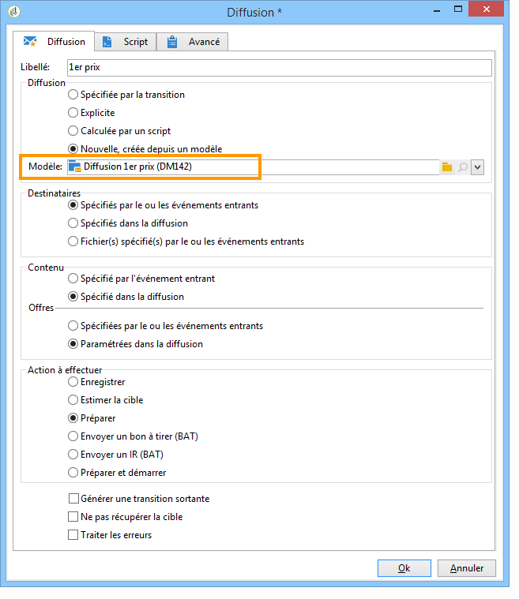

