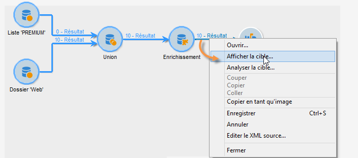
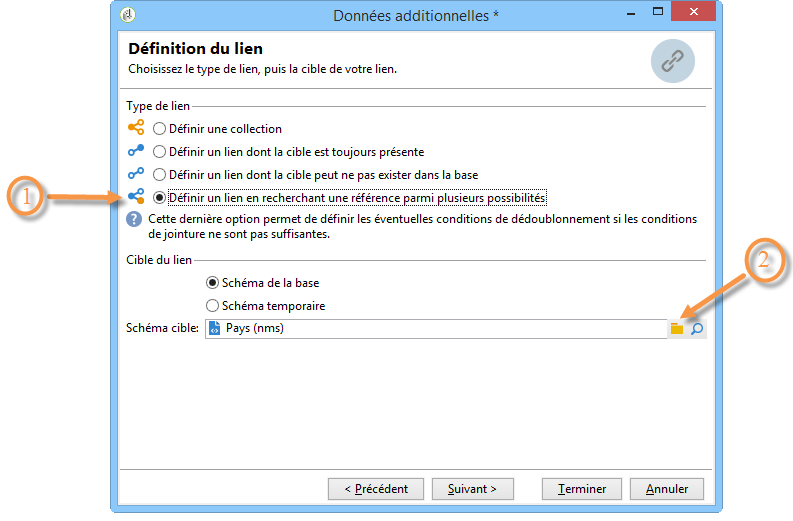

# Enrichissement{#enrichment}

L’ **[!UICONTROL Enrichment]** activité vous permet d’ajouter des informations à une liste de profils et de créer des liens vers un tableau existant (créer un nouveau sommet). Les critères de rapprochement avec les profils de la base de données peuvent également être définis.


## Définitions {#definitions}

Pour utiliser l&#39;activité d&#39;enrichissement, il est important de connaître les différentes possibilités offertes lors de l&#39;ajout de données.


L’ **[!UICONTROL Data linked to the filtering dimension]** option vous donne accès à :

* Données de la dimension de filtrage : accès aux données de la table de travail.
* Données liées à la dimension de filtrage : accès aux données liées à la table de travail.


The **[!UICONTROL A link]** option lets you create a join on any table of the database.


Il existe quatre types de liens :

* **[!UICONTROL Define a collection]**: vous permet de définir un lien avec une cardinalité 1-N entre les tables.
* **[!UICONTROL Define a link whose target is still available]**: vous permet de définir un lien avec une cardinalité 1-1 entre les tableaux. Les conditions de jointure doivent être définies par un enregistrement unique dans la table cible.
* **[!UICONTROL Define a link whose target does not necessarily exist in the base]**: vous permet de définir un lien avec une cardinalité 0-1 entre les tableaux. La condition de jointure doit être définie par 0 ou 1 (max.) dans la table cible.

   Cette option est configurée dans l’ **[!UICONTROL Simple Join]** onglet accessible via le **[!UICONTROL Edit additional data]** lien de l’ **[!UICONTROL Enrichment]** activité.

* **[!UICONTROL Define a link by searching for a reference among several options]**: ce type de lien définit un rapprochement vers un enregistrement unique. Adobe Campaign crée un lien vers un tableau cible en ajoutant une clé étrangère dans le tableau cible pour stocker une référence à l’enregistrement unique.

   Cette option est configurée dans l’ **[!UICONTROL Reconciliation and deduplication]** onglet accessible via le **[!UICONTROL Edit additional data]** lien de l’ **[!UICONTROL Enrichment]** activité.

Les exemples d’utilisation [Enrichir les données](../../workflow/using/enriching-data.md) et [Créer une liste](../../workflow/using/creating-a-summary-list.md) récapitulative détaillent le fonctionnement des activités d’enrichissement dans leur contexte.

## Ajouter des informations {#adding-information}

Use the **[!UICONTROL Enrichment]** activity to add columns to a work table: this activity can be used as a complement to a query activity.

The configuration of additional columns is detailed in [Adding data](../../workflow/using/query.md#adding-data).

The **[!UICONTROL Primary set]** field lets you select the inbound transition: the data of this activity&#39;s worktable will be enriched.

Cliquez sur le **[!UICONTROL Add data]** lien et sélectionnez le type de données à ajouter. La liste des types de données proposés dépend des modules et options installés sur votre plateforme. Dans une configuration minimale, vous pouvez toujours ajouter des données liées à la dimension de filtrage et à un lien.


Dans l&#39;exemple ci-dessous, la transition sortante sera enrichie avec les informations relatives à l&#39;âge des profils ciblés.


Cliquez avec le bouton droit sur la transition entrante de l&#39;activité d&#39;enrichissement pour visualiser les données avant l&#39;étape d&#39;enrichissement.


La table de travail contient les données suivantes et le schéma associé :


Renouvelez cette opération en sortie de l&#39;étape d&#39;enrichissement.



Vous pouvez constater que les données relatives à l&#39;âge des profils ont été ajoutées :


Le schéma correspondant a également été enrichi.

## Gérer les données additionnelles {#managing-additional-data}

Désélectionnez l’ **[!UICONTROL Keep all additional data from the main set]** option si vous ne souhaitez pas conserver les données supplémentaires précédemment définies. Dans ce cas, seules les colonnes supplémentaires qui ont été sélectionnées dans l&#39;activité d&#39;enrichissement seront ajoutées au tableau de travail sortant. Les informations supplémentaires ajoutées aux activités en amont ne seront pas enregistrées.


Les données et le schéma en sortie de l&#39;étape d&#39;enrichissement seront alors les suivants :


## Créer un lien {#creating-a-link}

Vous pouvez utiliser l&#39;activité d&#39;enrichissement pour créer un lien entre les données de travail et les données de la base Adobe Campaign : il s&#39;agira d&#39;un lien local au workflow entre les données entrantes.

Par exemple, si vous chargez les données d&#39;un fichier contenant le numéro de compte, le pays et l&#39;email des destinataires, vous devez créer un lien vers la table des pays afin de mettre à jour cette information dans leur profil.

Pour cela, les étapes sont les suivantes :

1. Collectez et chargez un fichier de type :

   ```
   Account number;Country;Email
   18D65;FRANCE;agnes@gmail.com
   243PP;RUSSIA;paul@gmail.com
   55H87;CROATIA;dave@gmail.com
   56U81;USA;susan@gmail.com
   853PI;ITALY;anna@gmail.com
   890LP;FRANCE;robert@gmail.com
   83TY2;SWITZERLAND;mike@gmail.com
   ```

1. Editez l&#39;activité d&#39;enrichissement et cliquez sur le lien **Ajouter des données...** pour créer une jointure avec la table des Pays.

   

1. Sélectionnez l’ **[!UICONTROL Link definition]** option et cliquez sur le **[!UICONTROL Next]** bouton. Spécifiez le type de lien à créer. Dans cet exemple, nous voulons concilier le pays du destinataire du fichier avec un pays dans la liste des pays disponibles dans la table dédiée de la base de données. Choisissez l’ **[!UICONTROL Define a link by searching for a reference among several options]** option. Sélectionnez le tableau de pays dans le **[!UICONTROL Target schema]** champ.

   

1. Sélectionnez enfin le ou les champs qui permettront d&#39;associer les valeurs du fichier source avec celles de la base de données.

   

En sortie de cette activité d&#39;enrichissement, le schéma temporaire contiendra le lien vers la table des pays :


## Réconciliation des données {#data-reconciliation}

L’activité d’enrichissement peut être utilisée pour configurer le rapprochement des données, y compris une fois les données chargées dans la base de données. Dans ce cas, l’ **[!UICONTROL Reconciliation]** onglet vous permet de définir le lien entre les données de la base de données Adobe Campaign et celles de la table de travail.

Sélectionnez l’ **[!UICONTROL Identify the targeting document based on work data]** option, spécifiez le schéma auquel vous souhaitez créer un lien et définissez les conditions de jonction : pour ce faire, sélectionnez les champs à rapprocher dans les données de travail (**[!UICONTROL Source expression]**) et dans la dimension de ciblage (**[!UICONTROL Destination expression]**).

Vous pouvez utiliser un ou plusieurs critères de réconciliation.


Si plusieurs conditions de jointure sont indiquées, elles doivent TOUTES être vérifiées pour que le lien entre les données puisse se faire.

## Insérer une proposition d&#39;offre {#inserting-an-offer-proposition}

L&#39;activité d&#39;enrichissement vous permet d&#39;ajouter des offres ou des liens vers des offres pour les destinataires d&#39;une diffusion.

Pour plus d&#39;informations sur l&#39;activité d&#39;enrichissement, consultez cette [section](../../workflow/using/enrichment.md).

Vous pouvez par exemple enrichir les données d&#39;une requête sur les destinataires, avant une diffusion.


Après avoir paramétré votre requête (voir cette [section](../../workflow/using/query.md)) :

1. Placez et ouvrez une activité d&#39;enrichissement.
1. Dans l’ **[!UICONTROL Enrichment]** onglet, sélectionnez **[!UICONTROL Add data]**.
1. Sélectionnez **[!UICONTROL An offer proposition]** les types de données à ajouter.

   

1. Indiquez un identifiant ainsi qu&#39;un libellé pour la proposition qui sera ajoutée.
1. Définissez la sélection de l&#39;offre. Deux options sont possibles :

   * **[!UICONTROL Search for the best offer in a category]**: cochez cette option et spécifiez les paramètres d’appel du moteur d’offre (espace d’offre, catégorie ou thème(s), date de contact, nombre d’offres à conserver). Le moteur calculera automatiquement les offres à ajouter en fonction de ces paramètres. Nous vous recommandons de remplir le champ **[!UICONTROL Category]** ou le **[!UICONTROL Theme]** champ, plutôt que les deux en même temps.

      

   * **[!UICONTROL A predefined offer]**: cochez cette option et spécifiez un espace d’offre, une offre spécifique et une date de contact pour configurer directement l’offre que vous souhaitez ajouter, sans appeler le moteur d’offre.

      

1. Configurez ensuite une activité de diffusion correspondant au canal choisi. Reportez-vous à la section Livraisons [](../../workflow/using/cross-channel-deliveries.md)cross-canal.

   Le nombre de propositions disponibles pour la prévisualisation dépend du paramétrage réalisé dans l&#39;activité d&#39;enrichissement et non d&#39;un éventuel paramétrage directement dans la diffusion.

Pour spécifier des propositions d’offre, vous pouvez également choisir de référencer un lien vers une offre. Pour plus d’informations, reportez-vous à la section suivante [Référence à un lien vers une offre](#referencing-a-link-to-an-offer).

## Référencer un lien vers une offre {#referencing-a-link-to-an-offer}

Vous avez également la possibilité de référencer un lien vers une offre dans une activité d&#39;enrichissement.

Pour cela :

1. Sélectionnez **[!UICONTROL Add data]** dans l’ **[!UICONTROL Enrichment]** onglet de l’activité.
1. In the window where you choose the type of data to add, select **[!UICONTROL A link]**.
1. Sélectionnez le type du lien que vous souhaitez établir ainsi que sa cible. Dans le cas présent, la cible est le schéma des offres.

   

1. Définissez la jointure entre les données de la table entrante dans l&#39;activité d&#39;enrichissement (ici la table des destinataires) et la table des offres. Vous pouvez par exemple associer un code offre à un destinataire.

   

1. Configurez ensuite une activité de diffusion correspondant au canal choisi. Reportez-vous à la section Livraisons [](../../workflow/using/cross-channel-deliveries.md)cross-canal.

   >[!NOTE]
   >
   >Le nombre de propositions disponibles pour la prévisualisation dépend du paramétrage réalisé dans la diffusion.

## Stocker le rang et le poids des offres {#storing-offer-rankings-and-weights}

Par défaut, lorsque l&#39;activité d&#39;**enrichissement** est utilisée pour diffuser des offres, leur rang ainsi que leur poids ne sont pas stockés dans la table des propositions.

The **[!UICONTROL Offer engine]** activity does store this information by default.

Cependant, il est possible de stocker ces informations de la manière suivante :

1. Créez un appel au moteur d&#39;offre dans une activité d&#39;enrichissement placée après une requête et avant une activité de diffusion. Consultez cette [section](../../interaction/using/integrating-an-offer-via-a-workflow.md#specifying-an-offer-or-a-call-to-the-offer-engine).
1. Dans la fenêtre principale de l’activité, sélectionnez **[!UICONTROL Edit additional data...]**.

   

1. Add the **[!UICONTROL @rank]** columns for the ranking and **[!UICONTROL @weight]** for the offer weight.

   

1. Validez votre ajout et enregistrez votre workflow.

La diffusion stocke automatiquement le classement et le poids des offres. Ces informations sont visibles dans l’ **[!UICONTROL Offers]** onglet de la remise.
