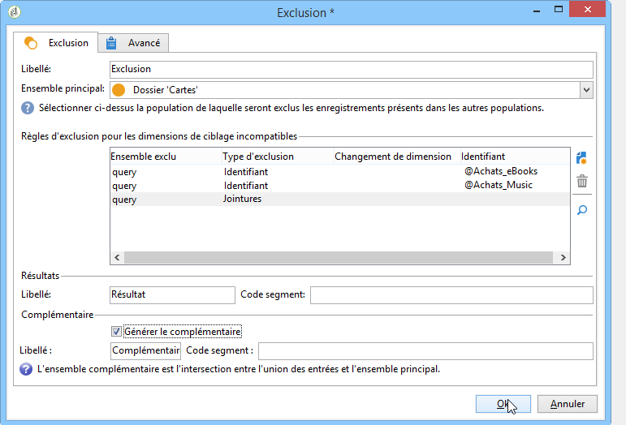
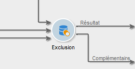
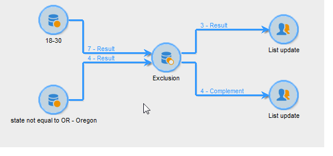

# Exclusion{#exclusion}

Une activité de type **Exclusion** crée une cible à partir d&#39;une cible principale dont on extrait une ou plusieurs autres cibles.

Pour configurer cette activité, saisissez son libellé et sélectionnez l’ensemble de personnes destinataires principal : la population de l’ensemble principal vous permet de construire le résultat.Les profils communs à l’ensemble principal et à au moins une des activités en entrée seront exclus.

>[!NOTE]
>
>Pour plus d’informations sur la configuration et l’utilisation de l’activité d’exclusion, voir [Exclure une population (Exclusion)](targeting-data.md#excluding-a-population--exclusion-).

Cochez l’option **[!UICONTROL Générer le complémentaire]** si vous souhaitez exploiter la population restante.Le complémentaire contiendra la population entrante principale, moins la population sortante.Une autre transition de sortie sera alors ajoutée à l’activité, comme suit :

## Exemples d&#39;exclusion {#exclusion-examples}

L&#39;exemple suivant cherche à constituer une liste des destinataires dont l&#39;âge est compris entre 18 et 30 ans, mais en y excluant les habitants de Paris.

1. Insérez et ouvrez une activité de type **[!UICONTROL Exclusion]** suite à deux requêtes.La première requête cible les personnes destinataires résidant à Paris.La deuxième requête cible les 18 à 30 ans.
1. Indiquez l&#39;ensemble principal. Ici, l&#39;ensemble principal est la requête **18-30 ans**. Les éléments appartenant au second ensemble seront exclus du résultat final.
1. Cochez l’option **[!UICONTROL Générer le complémentaire]** si vous souhaitez exploiter les données non retenues après l’exclusion.Dans ce cas, le complémentaire comporte les personnes destinataires âgées de 18 à 30 ans habitant à Paris.
1. Approuvez la configuration de l’exclusion puis insérez une activité de mise à jour de liste au niveau du résultat.Vous pouvez également insérer une autre mise à jour de liste au niveau du complémentaire, si nécessaire.
1. Exécutez le workflow.Dans cet exemple, le résultat comporte toutes les personnes destinataires âgées de 18 à 30 ans, mais celles habitant à Paris sont exclues et sont envoyées vers le complémentaire.

   

## Paramètres d&#39;entrée {#input-parameters}

* tableName
* schéma

Chacun des événements entrants doit spécifier une cible définie par ces paramètres.

## Paramètres de sortie {#output-parameters}

* tableName
* schéma
* recCount

Ce triplet de valeurs identifie la cible résultant de l&#39;exclusion. **[!UICONTROL tableName]** est le nom de la table qui enregistre les identifiants de la cible, **[!UICONTROL schema]** est le schéma de la population (généralement nms:recipient) et **[!UICONTROL recCount]** est le nombre d’éléments dans la table.

La transition associée au complément possède les mêmes paramètres.
