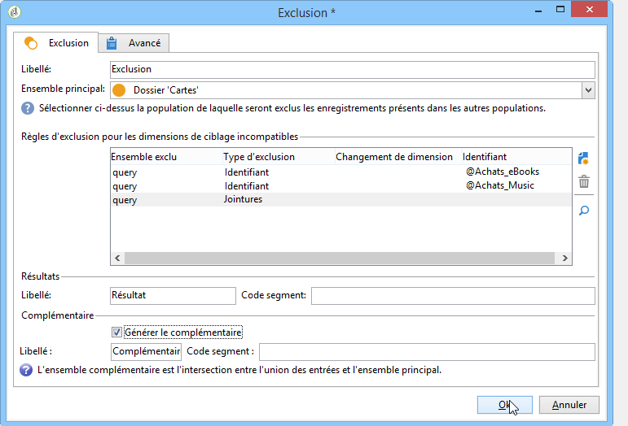
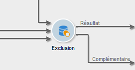

# Exclusion{#exclusion}

Une activité de type **Exclusion** crée une cible à partir d&#39;une cible principale dont on extrait une ou plusieurs autres cibles.

Pour paramétrer cette activité, vous devez saisir son libellé et sélectionner l&#39;ensemble principal : la population de l&#39;ensemble principal permet de construire le résultat. Les profils communs à l&#39;ensemble principal et à au moins une des activités en entrée seront exclus.

>[!NOTE]
>
>Pour plus d’informations sur la configuration et l’utilisation de l’activité d’exclusion, voir [Exclure une population (Exclusion)](../../workflow/using/targeting-data.md#excluding-a-population--exclusion-).

Cochez l&#39;option **[!UICONTROL Générer le complémentaire]** si vous souhaitez exploiter la population restante. Le complémentaire contiendra la population principale en entrée moins la population en sortie. Une seconde transition sera alors ajoutée à l&#39;activité, comme suit :

## Exemples d&#39;exclusion {#exclusion-examples}

L&#39;exemple suivant cherche à constituer une liste des destinataires dont l&#39;âge est compris entre 18 et 30 ans, mais en y excluant les habitants de Paris.

1. Insérez et ouvrez une activité de type **[!UICONTROL Exclusion]** à la suite de deux requêtes. La première requête cible les destinataires vivant à Paris. La seconde requête cible les destinataires âgés de 18 à 30 ans.
1. Indiquez l&#39;ensemble principal. Ici, l&#39;ensemble principal est la requête **18-30 ans**. Les éléments appartenant au second ensemble seront exclus du résultat final.
1. Cochez la case **[!UICONTROL Générer le complémentaire]** si vous souhaitez exploiter les données non retenues après l&#39;exclusion. Dans le cas présent, le complément comporte les destinataires âgés de 18 à 30 ans habitant à Paris.
1. Validez le paramétrage de l&#39;exclusion puis insérez une activité de mise à jour de liste au niveau du résultat. Insérez également une mise à jour de liste au niveau du complémentaire, le cas échéant.
1. Exécutez le workflow. Dans cet exemple, le résultat comporte tous les destinataires âgés de 18 à 30 ans, mais ceux habitant à Paris sont exclus et sont envoyés vers le complémentaire.

   

## Paramètres d&#39;entrée {#input-parameters}

* tableName
* schema

Chacun des événements entrants doit spécifier une cible définie par ces paramètres.

## Paramètres de sortie {#output-parameters}

* tableName
* schema
* recCount

Ce triplet de valeurs identifie la cible résultant de l&#39;exclusion. **[!UICONTROL tableName]** est le nom de la table qui mémorise les identifiants de la cible, **[!UICONTROL schema]** est le schéma de la population (habituellement nms:recipient) et **[!UICONTROL recCount]** est le nombre d&#39;éléments dans la table.

La transition associée au complémentaire possède les mêmes paramètres.
