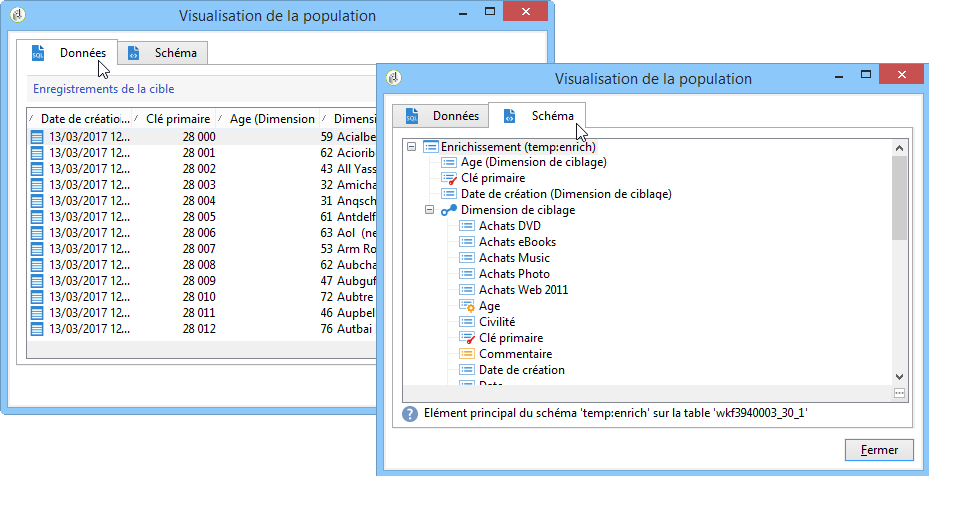
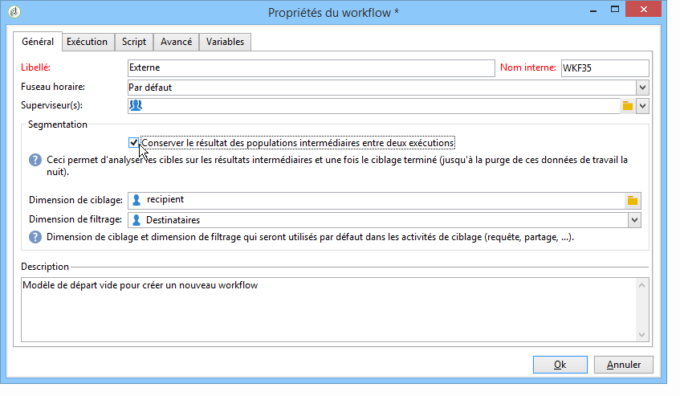
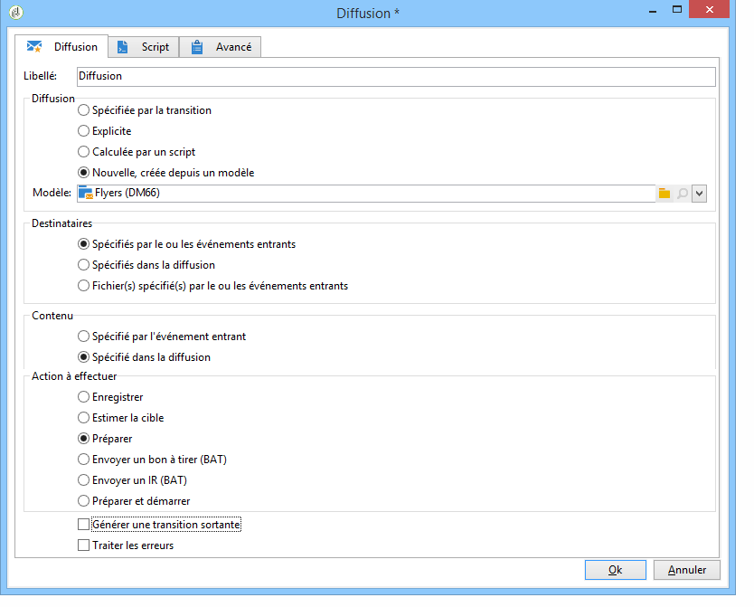
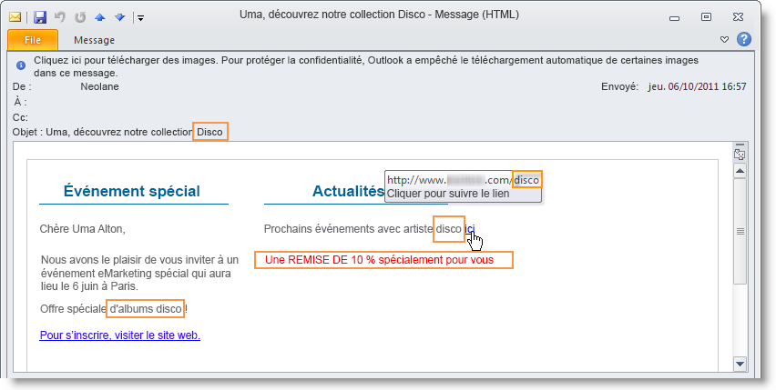

# Exécuter un workflow{#executing-a-workflow}

Des instructions de dépannage relatives à l’exécution des processus sont disponibles dans [cette section](../../production/using/workflow-execution.md).

## Démarrer un workflow {#starting-a-workflow}

Un workflow est toujours démarré manuellement. Au démarrage, il peut toutefois rester inactif en fonction des informations spécifiées par le biais d’un planificateur (voir [Planificateur](../../workflow/using/scheduler.md)) ou d’une planification d’activité.

Les actions relatives à l&#39;exécution du workflow de ciblage (lancement, arrêt, pause, etc.) sont des processus **asynchrones** : la commande est enregistrée et sera effective dès que le serveur sera disponible pour l&#39;appliquer.

La barre d&#39;outils permet de lancer et suivre l&#39;exécution du workflow.

La liste des options disponibles dans le menu **[!UICONTROL Actions]** et le menu contextuel sont présentées dans les sections suivantes.

### Barre d&#39;outils des actions {#actions-toolbar}

Les boutons de la barre d&#39;outils sont décrits dans cette [section](../../campaign/using/marketing-campaign-deliveries.md#building-the-main-target-in-a-workflow). Le bouton **[!UICONTROL Actions]** vous donne accès à des options d&#39;exécution supplémentaires permettant d&#39;agir individuellement sur le ou les workflows sélectionnés. Vous pouvez également utiliser le menu **[!UICONTROL Fichier > Actions]** ou cliquer avec le bouton droit sur un workflow et sélectionner **[!UICONTROL Actions]**.


* **[!UICONTROL Début]**

   Cette action permet de lancer l&#39;exécution d&#39;un workflow : un workflow **Terminé**, **En édition** ou **En pause** passe alors en état **Démarré**. Le moteur de workflow va prendre en charge l&#39;exécution de ce workflow. Si le workflow était en pause, il s&#39;agit d&#39;une reprise, sinon il s&#39;agit d&#39;un démarrage et les activités initiales sont alors activées.

   Le démarrage est un processus asynchrone : la demande est enregistrée et sera traitée dès que possible par un serveur de workflow.

* **[!UICONTROL Pause]**

   Cette action a pour effet de passer le workflow **En pause**. Aucune activité ne sera activée jusqu&#39;à la prochaine reprise mais les opérations en cours ne seront pas suspendues.

* **[!UICONTROL Stopper]**

   Cette action arrête un workflow en cours d&#39;exécution : l&#39;instance passe alors en état **Terminé**. Les opérations en cours sont interrompues, si possible. Les imports ou requêtes SQL en cours sont immédiatement annulées.

   L&#39;arrêt est un processus asynchrone. La demande est enregistrée, puis le ou les serveurs de workflow vont annuler les opérations en cours. L&#39;arrêt d&#39;une instance peut donc prendre un certain temps, notamment si le workflow est distribué sur plusieurs serveurs : chacun des serveurs doit prendre la main pour annuler les tâches en cours.

* **[!UICONTROL Redémarrer]**

   Cette action consiste à arrêter puis démarrer un workflow. Dans la plupart des cas, elle permet de redémarrer plus vite. Elle est également utile pour automatiser le redémarrage lorsque l&#39;arrêt prend un certain temps : en effet la commande &#39;Démarrer&#39; n&#39;est disponible que lorsque l&#39;arrêt est effectif.

   Les actions **[!UICONTROL Démarrer / Pause / Stopper / Redémarrer]** sont également disponibles via les icônes d&#39;exécution de la barre d&#39;outils. Voir à ce sujet cette [section](../../campaign/using/marketing-campaign-deliveries.md#creating-a-targeting-workflow).

* **[!UICONTROL Purge de l&#39;historique]**

   Cette action vous permet de purger l’historique du processus. Pour plus d’informations, reportez-vous à la section [Purge des journaux](../../workflow/using/monitoring-workflow-execution.md#purging-the-logs).

* **[!UICONTROL Démarrer en mode simulation]**

   Cette option permet de démarrer le workflow, non pas en mode réel, mais en mode simulation. Lorsque vous activez ce mode, seules les activités n&#39;ayant pas d&#39;impact sur la base ni sur le système de fichiers sont exécutées, par exemple les activités de type **[!UICONTROL Requête]**, **[!UICONTROL Union]**, **[!UICONTROL Intersection]**, etc. Les activités ayant un impact (**[!UICONTROL Export]**, **[!UICONTROL Import]**, etc) ainsi que celles qui leur succèdent (dans la même branche) ne sont pas exécutées.

* **[!UICONTROL Traitement anticipé des tâches en attente]**

   Cette action permet de lancer dès que possible toutes les tâches en attente. Si vous souhaitez lancer une tâche particulière, cliquez avec le bouton droit sur l&#39;activité correspondante et sélectionnez **[!UICONTROL Traitement anticipé de la (des) tâche(s)]**.

* **[!UICONTROL Arrêt inconditionnel]**

   Lorsque cette option est sélectionnée, l&#39;état du workflow passe à **[!UICONTROL Terminé]**. Cette action ne doit être utilisée qu&#39;en dernier recours, lorsqu&#39;un arrêt normal ne fonctionne pas après plusieurs minutes. N&#39;utilisez l&#39;arrêt inconditionnel que si vous êtes sûr qu&#39;il n&#39;y a aucun traitement réel en cours sur le workflow.

   >[!CAUTION]
   >
   >Cette option est réservée à un utilisateur expert.

* **[!UICONTROL Sauver comme modèle]**

   Cette action crée un nouveau modèle de workflow à partir du workflow sélectionné. Vous devez indiquer son dossier d&#39;enregistrement (dans le champ **[!UICONTROL Dossier]**).

   Les options **[!UICONTROL Mettre à jour en masse les lignes sélectionnées]** et **[!UICONTROL Fusionner les lignes sélectionnées]** sont des options génériques de la plateforme disponibles dans tous les menus **[!UICONTROL Actions]**. Voir à ce sujet cette [section](../../platform/using/updating-data.md).

### Menu contextuel {#right-click-menu}

Lorsqu&#39;une ou plusieurs activités d&#39;un workflow sont sélectionnées, vous pouvez cliquer avec le bouton droit de la souris afin d&#39;agir sur votre sélection.


Les options disponibles dans le menu contextuel sont les suivantes :

**[!UICONTROL Ouvrir :]** cette option permet d&#39;accéder aux propriétés de l&#39;activité.

**** Afficher les journaux : cette option vous permet d’afficher le journal d’exécution de la tâche pour l’activité sélectionnée. Reportez-vous à [Affichage des journaux](../../workflow/using/monitoring-workflow-execution.md#displaying-logs).

**[!UICONTROL Traitement anticipé de la (des) tâche(s) :]** cette action permet de lancer dès que possible la ou les tâches en attente de l&#39;activité.

**[!UICONTROL Redémarrage du workflow à partir d&#39;une tâche :]** cette option permet de redémarrer le workflow en utilisant les résultats précédemment stockés pour cette activité.

**[!UICONTROL Couper/Copier/Coller/Supprimer :]** ces options permettent de couper, copier, coller et supprimer les activités.

**[!UICONTROL Copier en tant qu&#39;image :]** cette option permet d&#39;effectuer une capture d&#39;écran de l&#39;ensemble des activités.

**** Exécution normale / Activer mais pas exécuter / Ne pas activer : ces options sont également disponibles dans l’onglet **[!UICONTROL Avancé]** des propriétés de l’activité. Ils sont détaillés dans [Exécution](../../workflow/using/advanced-parameters.md#execution).

**[!UICONTROL Enregistrer/Annuler :]** permet d&#39;enregistrer ou d&#39;annuler les modifications effectuées sur le workflow.

>[!NOTE]
>
>Vous pouvez sélectionner un groupe d&#39;activités pour leur appliquer une de ces commandes.

Le menu contextuel est également présenté dans cette [section](../../campaign/using/marketing-campaign-deliveries.md#executing-a-workflow).

## Cycle de vie d&#39;un workflow {#workflow-life-cycle}

Le cycle de vie d&#39;un workflow comporte trois grandes étapes.

* **En édition**

   C&#39;est la phase de conception initiale : lorsqu&#39;un nouveau workflow est créé, il est en état d&#39;édition. Un tel workflow n&#39;est pas encore pris en charge par le serveur, il peut donc être modifié sans risque.

* **Démarré**

   Une fois la phase de conception terminée, le workflow peut être démarré. Dans cette phase, l&#39;instance est prise en charge par le serveur, les tâches élémentaires sont exécutées. Le workflow peut encore être modifié, mais avec certaines précautions.

* **Terminé**

   Un workflow est terminé lorsqu&#39;il n&#39;a plus de tâche en cours ou lorsqu&#39;un opérateur a arrêté explicitement l&#39;instance.

Par exemple, dans le workflow ci-dessous, les activités **Début** et **Diffusion** sont entourées tandis que l&#39;activité **Validation** clignote.


Cela signifie que les deux premières activités ont été exécutées avec succès et que la validation est en cours, c&#39;est-à-dire que l&#39;activité est créée mais pas encore complétée.

Les caractères **574 - Ok** affichés au-dessus de la transition suivant l&#39;activité **Diffusion** signifient que la préparation de la diffusion a ciblé 574 destinataires et que l&#39;opération s&#39;est déroulée correctement. Ces informations, ajoutées sur les transitions au moment de l&#39;exécution, sont calculées par les activités traitant des données.

Le workflow est donc démarré et attend la décision d&#39;un opérateur du groupe spécifié dans l&#39;activité **Validation**. Les opérateurs du groupe ayant un email ou un numéro de téléphone mobile renseigné sont notifiés via ce média.

La gestion des opérateurs est présentée dans cette [section](../../platform/using/access-management.md).

Pour plus d’informations sur la manière de surveiller vos processus, reportez-vous à [cette section](../../workflow/using/monitoring-workflow-execution.md).

## Cycle de vie des données {#data-life-cycle}

### Table de travail {#work-table}

Dans un workflow, les données véhiculées d&#39;une activité à l&#39;autre sont stockées dans une table de travail temporaire.

Ces données peuvent être affichées et analysées à partir du bouton droit de la souris sur la transition visée.


Sélectionnez pour cela le menu correspondant :

* Afficher la cible

   Ce menu affiche les données relatives à la population de la cible ainsi que la structure de la table de travail (onglet **[!UICONTROL Schéma]**).

   

   Pour plus d’informations, reportez-vous à la section [Tables de travail et schéma](../../workflow/using/monitoring-workflow-execution.md#worktables-and-workflow-schema)de flux de travail.

* Analyser la cible

   Ce menu permet d&#39;accéder à l&#39;assistant d&#39;analyse descriptive qui permet de produire des statistiques et des rapports sur les données de la transition.

   Voir à ce propos cette [section](../../reporting/using/using-the-descriptive-analysis-wizard.md).

Les données de la cible sont purgées au fur et à mesure de l&#39;exécution du workflow. Seule la dernière table de travail est accessible. Vous pouvez paramétrer le workflow pour que toutes les tables de travail restent accessibles. Pour cela, cochez l&#39;option **[!UICONTROL Conserver le résultat des populations intermédiaires entre deux exécutions]** dans les propriétés du workflow.

Toutefois, l&#39;activation de cette option est à éviter lorsque les données manipulées sont volumineuses.



### Données de la cible {#target-data}

Les données stockées dans la table de travail du workflow sont accessibles notamment dans les champs de personnalisation.

Vous pouvez ainsi utiliser dans une diffusion des données collectées via une liste ou à partir des réponses fournies à un questionnaire. Pour cela, utilisez la syntaxe suivante :

```
%= targetData.FIELD %
```

Les éléments de personnalisation de type **[!UICONTROL Extension de la cible]** (targetData) ne sont disponible que dans le cadre des workflows de ciblage. Ainsi, la cible de la diffusion doit être construite dans le workflow et spécifiée dans la transition entrante de la diffusion.

Si vous souhaitez créer des BAT pour les diffusions, la cible des BAT doit alors être construite selon le mode **[!UICONTROL Substitution des adresses]**, afin que les données de personnalisation puissent être renseignées. Voir à ce propos cette [section](../../delivery/using/steps-defining-the-target-population.md#using-address-substitution-in-proof).

Dans l&#39;exemple suivant, nous allons collecter dans une liste des informations relatives à des clients qui seront utilisées dans un mail personnalisé.

Les étapes sont les suivantes :

1. Créez un workflow afin de collecter les informations, les réconcilier avec celles de la base puis lancer une diffusion.

   

   Dans notre exemple, le contenu du fichier est le suivant :

   ```
   Music,First name,Last name,Account,CD/DVD,Card
   Pop,David,BLAIR,4323,CD,0
   Rock,Daniel,ARCARI,3222,DVD,1
   Disco,Uma,ALTON,0488,DVD,0
   Jazz,Paul,BOLES,6475,CD,1
   Jazz,David,BOUKHARI,0841,DVD,1
   [...]
   ```

   L&#39;activité de chargement de fichier est paramétrée comme suit :

   

1. Paramétrez l&#39;activité de type **[!UICONTROL Enrichissement]** afin de réconcilier les données collectées avec celles de la base Adobe Campaign.

   Ici, la clé de réconciliation est le numéro de compte :

   

1. Configurez ensuite la **[!UICONTROL Diffusion]** : elle est créée depuis un modèle et les destinataires sont ceux spécifiés par la transition entrante.

   

   >[!CAUTION]
   >
   >Seules les données contenues dans la transition peuvent être utilisées pour personnaliser la diffusion. Les champs de personnalisation de type **targetData** ne sont disponibles que pour la population en entrée de l&#39;activité **[!UICONTROL Diffusion]**.

1. Dans le modèle de diffusion, utilisez les champs collectés dans le workflow.

   Pour cela, insérez des champs de personnalisation de type **[!UICONTROL Extension de la cible]**.

   

   Ici, nous allons insérer le genre musical favori du client, ainsi que le type de support privilégié (CD ou DVD), tels qu&#39;ils sont indiqués dans le fichier collecté via le workflow.

   En complément, nous ajouterons une promotion réservée aux porteurs de la carte de fidélité, soit ceux pour lesquels la valeur &#39;Carte&#39; est égale à 1.

   

   Les données de type **[!UICONTROL Extension de la cible]** (targetData) sont insérées dans les diffusions selon les mêmes caractéristiques que tous les champs de personnalisation. Elles peuvent ainsi par exemple être utilisées dans l&#39;objet du message, les libellés des liens ou les liens eux-mêmes, etc.

   Les messages adressés aux destinataires collectés contiendront donc les données suivantes :

   

## Définir les validations {#defining-approvals}

Les validations permettent à des opérateurs de prendre des décisions à certaines étapes d&#39;un workflow ou de confirmer la poursuite d&#39;un traitement.

Un message est envoyé à un groupe d&#39;opérateurs et le workflow attend une réponse pour poursuivre le traitement qui suit la validation. Le workflow n&#39;est pas bloqué et peut effectuer d&#39;autres opérations en l&#39;attente d&#39;une réponse. Il peut donc, par exemple, y avoir plusieurs validations simultanées en attente.

Une validation peut proposer plusieurs choix : l&#39;opérateur devra sélectionner une option parmi les choix possibles. Cependant, il est possible de n&#39;autoriser qu&#39;un seul choix dans le but de soumettre une tâche à réaliser à un opérateur, par exemple effectuer un ciblage : l&#39;opérateur répond lorsque la tâche est réalisée (puis le processus se poursuit). L&#39;exemple ci-dessous illustre les deux types de validations :


Dans les opérations, toutes les étapes qui nécessitent une validation fonctionnent sur le même principe.


Des exemples de validations sont proposés dans cette [section](../../campaign/using/marketing-campaign-approval.md#checking-and-approving-deliveries).

Pour répondre, l&#39;opérateur dispose de deux modes : valider via la page web dont l&#39;URL est fournie dans l&#39;email envoyé, ou valider directement depuis la console.

>[!NOTE]
>
>Une fois la réponse enregistrée, elle ne peut plus être modifiée.

### Envoi d&#39;emails {#sending-emails}

Il est possible de recevoir un message de validation qui contient un lien vers une page Web permettant de répondre. Pour le recevoir l&#39;opérateur ciblé doit renseigner son adresse email dans son profil. Dans le cas contraire, il devra passer par la console pour répondre.

La gestion des opérateurs est présentée dans cette [section](../../platform/using/access-management.md).

L&#39;envoi des emails de validation se fait grâce à une diffusion au fil de l&#39;eau. Le modèle de diffusion par défaut est **[!UICONTROL notifyAssignee]** : il est enregistré dans le dossier **[!UICONTROL Administration > Gestion de campagne > Modèles des diffusions techniques]**. Ce modèle peut être personnalisé, mais il est recommandé d&#39;en faire une copie et de changer de modèle pour chaque activité.

Les diffusions créées depuis ce modèle sont stockées dans le dossier **[!UICONTROL Administration > Exploitation > Objets créés automatiquement > Diffusions techniques > Notifications de workflow]**.

### Validation depuis la console {#approval-via-the-console}

Dans les opérations, les éléments à valider sont affichés dans le tableau de bord de l&#39;opération.

Pour les workflows techniques, les tâches que l&#39;utilisateur peut valider sont accessibles depuis l&#39;arborescence en sélectionnant le dossier **[!UICONTROL Administration > Exploitation > Objets créés automatiquement > Validations en attente]**.


### Groupes {#groups}

Une validation est assignée à un groupe d&#39;opérateurs, un opérateur unique ou un ensemble d&#39;opérateurs sélectionnés au travers d&#39;une condition de filtrage.

1. Pour une validation simple, la tâche est terminée dès qu&#39;un opérateur a répondu. Tout autre opérateur qui essayera de répondre recevra alors un message lui signalant que quelqu&#39;un d&#39;autre a déjà répondu.
1. Pour obtenir plusieurs approbations, reportez-vous à la section [Approbation](#multiple-approval)multiple.

Les groupes d&#39;opérateurs destinés aux validations doivent être conçus comme des rôles ou des fonctions plutôt que des personnes nommées. Par exemple, un groupe &quot;Responsable budget campagne&quot; est plus pertinent que &quot;Equipe Martine&quot;. Il est conseillé d&#39;avoir toujours au moins deux personnes dans un groupe pour valider une tâche, afin qu&#39;en cas d&#39;absence, une personne puisse toujours répondre.

### Expirations {#expirations}

Les expirations sont des transitions particulières que l&#39;on retrouve sur différents types d&#39;activités mais qui sont surtout utilisées pour les validations. Une expiration permet de déclencher une action après un certain délai si personne n&#39;a répondu, ou de continuer l&#39;exécution du workflow (et par exemple assigner une validation à un groupe différent).

Le deuxième onglet des propriétés de l&#39;activité de validation permet de définir une ou plusieurs expirations. En effet, vous pouvez définir plusieurs types d&#39;expiration.


Pour ajouter une nouvelle expiration, cliquez sur le bouton **[!UICONTROL Ajouter]**. Une transition est ajoutée pour chacune des expirations créées. Vous pouvez :

* soit modifier les paramètres usuels directement depuis la liste en cliquant sur une cellule (ou en appuyant sur la touche F2),
* soit éditer l&#39;expiration en cliquant sur le bouton **[!UICONTROL Détail...]**.

>[!NOTE]
>
>Il n&#39;est pas nécessaire d&#39;ordonner les expirations, elles seront traitées par ordre chronologique.

L&#39;option **[!UICONTROL Ne pas terminer la tâche]** laisse la validation active une fois le délai expiré. Ce mode de fonctionnement permet de gérer des relances tout en laissant la validation active : les opérateurs ont toujours la possibilité de répondre. Cette option est désactivée par défaut : lorsque le délai est expiré la tâche est terminée et les opérateurs ne peuvent plus répondre.

Vous pouvez créer quatre types d&#39;expirations :

* **Délai après le début de la tâche**: l&#39;expiration est calculée en ajoutant une durée que vous spécifiez à la date d&#39;activation de la validation.
* **Délai après une date donnée** : l&#39;expiration est calculée en ajoutant une durée à une date que vous spécifiez.
* **Délai avant une date donnée** : l&#39;expiration est calculée en soustrayant une durée à une date que vous spécifiez.
* **Expiration calculée par script** : l&#39;expiration est calculée à partir d&#39;un script JavaScript.

   L&#39;exemple suivant calcule une expiration 24 heures avant la date de démarrage d&#39;une diffusion (identifiée par **vars.deliveryId**) :

   ```
   var delivery = nms.delivery.get(vars.deliveryId)
   var expiration = delivery.scheduling.contactDate
   var oneDay = 1000*60*60*24
   expiration.setTime(expiration.getTime() - oneDay)
   return expiration
   ```

### Validation multiple {#multiple-approval}

La validation multiple permet à tous les opérateurs validants de répondre. Une transition est activée pour chaque réponse.

La validation multiple est utile pour des mécanismes de votes ou de sondages. Il est possible de compter les réponses, puis de traiter le résultat du vote après un délai donné en ajoutant une expiration.

### Droits requis {#required-rights}

Les opérateurs d&#39;un groupe doivent avoir au minimum les droits suivants pour répondre à une demande de validation :

* Droit en lecture sur le workflow.
* Droit en lecture et en écriture sur le dossier des tâches à valider.

Le groupe &#39;Exécution des workflows&#39; possède ces droits. Pour qu&#39;un opérateur puisse répondre à une demande de validation, il suffit donc de l&#39;ajouter à ce groupe.

## Architecture {#architecture}

Les workflows sont pris en charge par un module spécifique. Ce module peut être démarré sur plusieurs serveurs afin de répartir la charge d&#39;exécution.


* Le processus &#39;Workflow Instance Runner&#39; (runwf) exécute toutes les tâches d&#39;une instance de workflow donnée. Lorsqu&#39;il n&#39;y a plus de tâche à exécuter dans l&#39;immédiat, ce processus devient passif, c&#39;est-à-dire qu&#39;il sauvegarde son état dans la base de données puis s&#39;arrête.
* Le module &#39;Workflow Server&#39; (wfserver) surveille les instances de workflow en cours. Lorsqu&#39;il y a une tâche à effectuer, ce module crée un processus pour activer (ou réactiver) l&#39;instance correspondante.

Lorsque un opérateur commande une action sur un workflow (démarrer, arrêter, mettre en pause, etc.), l&#39;action n&#39;est pas exécutée immédiatement par le module &#39;nlserver&#39;, mais placée dans une file d&#39;attente pour être traitée par un module de workflow.
