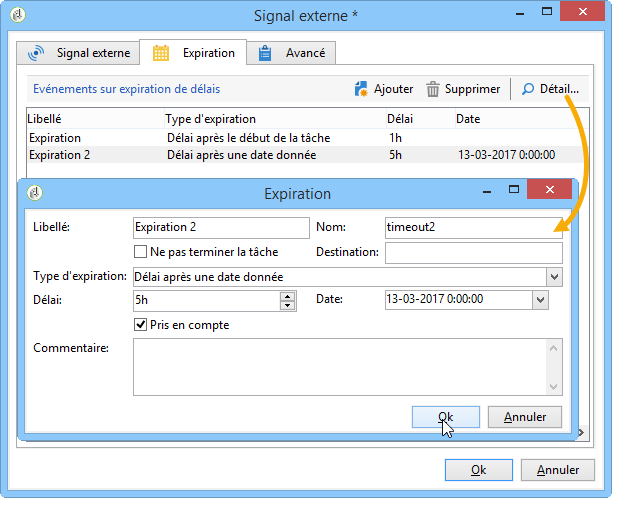
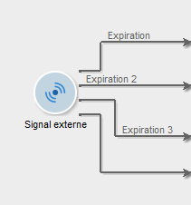

# Signal externe{#external-signal}

L&#39;activité **Signal externe** permet de déclencher l&#39;exécution d&#39;un ensemble de tâches dans un workflow par programmation.

Lorsqu’une tâche &quot;Signal externe&quot; est activée, elle est suspendue indéfiniment ou jusqu’à la fin de la période spécifiée. Sa transition est activée par l’appel SOAP **PostEvent(sessionToken, workflowId, activité, transition, paramètres, complete).** Le paramètre **[!UICONTROL complete]** permet à la tâche d’être terminée. Il ne réagira donc pas aux appels suivants.

Reportez-vous à la documentation en ligne sur les appels SOAP pour plus d&#39;information sur la fonction PostEvent.

Vous pouvez paramétrer cette activité afin de définir des événements en cas de non-réception de signal. Pour cela, éditez l&#39;activité et cliquez sur l&#39;onglet **[!UICONTROL Expiration]**. Cliquez sur le bouton **[!UICONTROL Ajouter]** pour créer et paramétrer un événement.

The configuration of expirations is detailed in [Expirations](../../workflow/using/executing-a-workflow.md#expirations).

The **Delay** field lets you specify an expiration delay in the units of your choice. Voir [Attendre](../../workflow/using/wait.md).

Chaque ligne représente un type d&#39;expiration et correspond à une transition.

