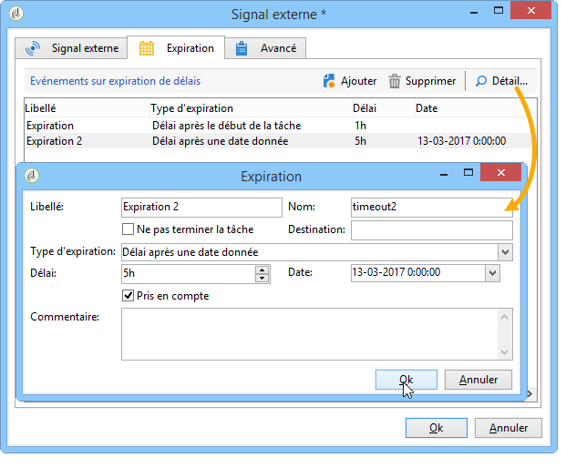
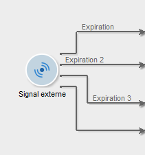

# Signal externe{#external-signal}

L&#39;activité **Signal externe** permet de déclencher l&#39;exécution d&#39;un ensemble de tâches dans un workflow par programmation.

Lorsqu’une tâche « Signal externe » est activée, elle est suspendue indéfiniment ou jusqu’à la fin de la période spécifiée. Sa transition est activée par l’appel SOAP **PostEvent(sessionToken, workflowId, activity, transition, parameters, complete).** Le paramètre **[!UICONTROL complete]** permet de terminer la tâche, de sorte qu’elle ne réagira pas aux appels suivants.

Reportez-vous à la documentation en ligne sur les appels SOAP pour plus d&#39;information sur la fonction PostEvent.

Vous pouvez configurer cette activité afin de définir des événements en cas d’absence de signal. Pour cela, modifiez l’activité et cliquez sur l’onglet **[!UICONTROL Expiration]**. Cliquez sur le bouton **[!UICONTROL Insérer]** pour créer et configurer un événement.

Le paramétrage des expirations est présenté dans la section [Expirations](defining-approvals.md).

Le champ **Délai** permet de spécifier un délai d&#39;expiration exprimé dans l&#39;unité de votre choix. Voir [Attente](wait.md).

Chaque ligne représente un type d&#39;expiration et correspond à une transition.

