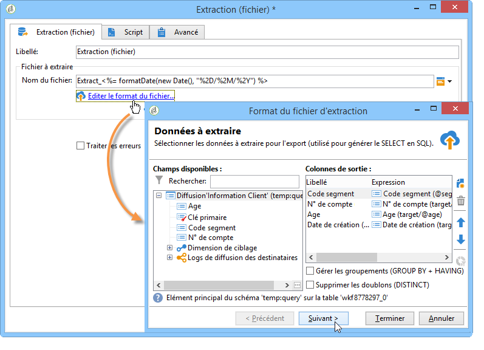

# Extraction de données (fichier){#extraction-file}

You can extract data from a workflow table in an external file using the **[!UICONTROL Data extraction (file)]** activity.

>[!CAUTION]
>
>Cette activité doit toujours avoir une transition entrante qui contient les données à extraire.

Pour paramétrer l&#39;extraction des données, les étapes sont les suivantes :

1. Indiquez le nom du fichier de sortie : ce nom peut contenir des variables, insérées à partir du bouton de personnalisation situé à droite du champ.
1. Cliquez sur **[!UICONTROL Edit the file format...]** pour sélectionner les données à extraire.

   

   The **[!UICONTROL Handle groupings (GROUP BY + HAVING)]** option adds an extra step to filter the final result of the aggregate, for example on a given purchase order type, customers who have ordered more than 10 times, etc.

1. Si nécessaire, vous pouvez ajouter de nouvelles colonnes au fichier de sortie, telles que le calcul ou les résultats de traitement, par exemple. To do this, click the **[!UICONTROL Add]** icon

   

   In the additional line, click the **[!UICONTROL Edit expression]** icon to define the content of the new column.

   

   Vous accédez alors à la fenêtre de sélection. Cliquez sur **[!UICONTROL Advanced selection]** pour choisir le processus à appliquer aux données.

   

   Sélectionnez la formule souhaitée parmi celles proposées.

   

## Liste des fonctions d&#39;agrégats {#list-of-aggregate-functions}

Les fonctions d&#39;agrégat disponibles sont les suivantes :

* **[!UICONTROL Count]** pour comptabiliser toutes les valeurs non nulles du champ à agréger, y compris les valeurs en double (du champ agrégé),

   **[!UICONTROL Distinct]** Comptage   pour compter le nombre total de valeurs différentes et non nulles du champ à agréger (les valeurs en double sont éliminées avant le calcul),

* **[!UICONTROL Sum]** pour calculer la somme des valeurs d’un champ numérique,
* **[!UICONTROL Minimum value]** pour calculer les valeurs minimales d’un champ (numériques ou autres),
* **[!UICONTROL Maximum value]** pour calculer les valeurs maximales d’un champ (numériques ou autres),
* **[!UICONTROL Average]** pour calculer la moyenne des valeurs d’un champ numérique.

