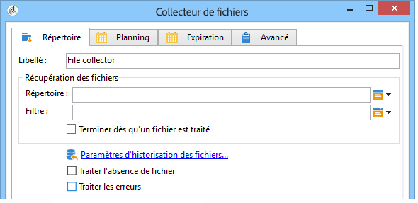

# Collecteur de fichiers{#file-collector}

Le **Collecteur de fichiers** assure un suivi de l&#39;arrivée d&#39;un ou plusieurs fichiers dans un répertoire et active sa transition pour chacun des fichiers reçus. Pour chaque événement, une variable **[!UICONTROL filename]** contient le nom complet du fichier reçu. Les fichiers collectés sont déplacés dans un autre répertoire afin de ne les prendre en compte qu&#39;une seule fois et pour historisation.

Par défaut, le collecteur de fichiers est une tâche persistante testant la présence de fichiers aux heures spécifiées par le planning.

Les fichiers doivent se trouver sur le serveur sur lequel s&#39;exécute le module wfserver qui prend en charge ce workflow. Si plusieurs modules wfserver sont déployés sur une même instance, il faut spécifier soit l&#39;affinité des activités utilisant ces fichiers, soit l&#39;affinité globale du workflow.

## Propriétés {#properties}

Le premier onglet de l’activité du collecteur **[!UICONTROL de]** fichiers vous permet de sélectionner le répertoire source et, si nécessaire, de filtrer les fichiers collectés. Les autres onglets sont détaillés dans la section Courriers électroniques  entrants (onglets **[!UICONTROL Planification]** et **[!UICONTROL Expiration]** ).

1. **Récupération des fichiers**

   * **[!UICONTROL Répertoire]**

      Répertoire contenant le ou les fichiers à récupérer. Ce répertoire doit être créé au préalable sur le serveur : s&#39;il n&#39;existe pas, une erreur est générée.

   * **[!UICONTROL Filtre]**

      Seuls les fichiers correspondant à ce filtre sont pris en compte. Les autres fichiers du répertoire sont ignorés. Si le filtre est vide, tous les fichiers du répertoire sont pris en compte. Exemples de filtrage : ***.zip**, **import-*.txt**.

   * **[!UICONTROL Terminer dès qu&#39;un fichier est traité]**

      Si cette option est activée, la tâche se termine après réception du premier fichier. Si plusieurs fichiers correspondant au filtre sont présents dans le répertoire, un seul sera pris en compte. Cette option garantit qu&#39;un seul événement sera émis. Le fichier pris en compte est le premier de la liste dans l&#39;ordre alphabétique.

      Dans le cas d&#39;une activité non planifiée, si aucun fichier correspondant au filtre n&#39;est trouvé dans le répertoire spécifié et si l&#39;option **[!UICONTROL Traiter l&#39;absence de fichier]** n&#39;est pas activée, une erreur est générée.

   * **[!UICONTROL Planning d&#39;exécution]**

      Détermine la fréquence de vérification de la présence des fichiers via les paramétres de l&#39;onglet **[!UICONTROL Planning]**.

1. **Traitement des erreurs**

   Les deux options suivantes sont disponibles :

   * **[!UICONTROL Traiter l&#39;absence de fichier]**

      Cette option fait apparaître une transition particulière qui sera activée à chaque vérification de présence de fichier si aucun fichier correspondant au filtre n&#39;est trouvé dans le répertoire spécifié.

      Si la tâche n&#39;est pas planifiée, cette transition sera activée une seule fois.

   * **[!UICONTROL Traiter les erreurs]**

      Cette option fait apparaître une transition particulière qui sera activée si une erreur est générée. Dans ce cas, le workflow ne passe pas en état d&#39;erreur et continue son exécution.

      Les erreurs prises en compte sont les erreurs du système de fichiers (impossible de déplacer un fichier, impossible d&#39;accéder au répertoire, etc.).

      Cette option ne traite pas les erreurs liées au paramétrage de l&#39;activité, c&#39;est-à-dire des valeurs invalides.

1. **Historisation**

   Refer to the **[!UICONTROL File historization]** step here: [Web download](../../workflow/using/web-download.md).

L&#39;ordre de traitement des fichiers ne peut être déterminé. Pour traiter séquentiellement un ensemble de fichier, il faut utiliser l&#39;option **[!UICONTROL Terminer dès qu&#39;un fichier est traité]** et faire une boucle. Dans ce cas, les fichiers seront traités par ordre alphabétique. L&#39;option **[!UICONTROL Traiter l&#39;absence de fichier]** permet de terminer l&#39;itération.

## Paramètres de sortie {#output-parameters}

* filename

Nom complet du fichier. C&#39;est le nom du fichier après son déplacement dans le répertoire d&#39;historique. Le chemin est donc différent, mais le nom est également différent s&#39;il existe déjà un autre fichier ayant le même nom dans le répertoire. L&#39;extension est conservée.
