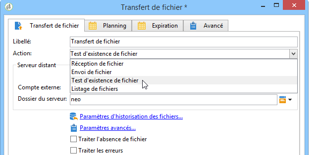
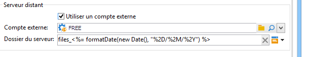
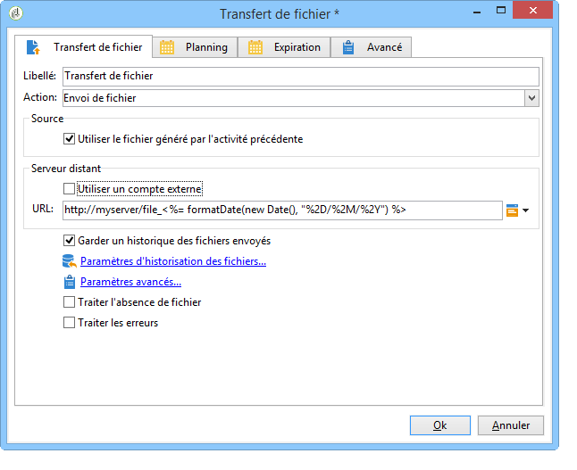
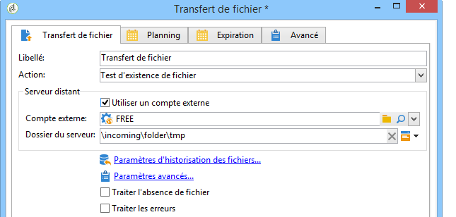

# Envoi de fichier{#file-transfer}

L&#39;activité de type **Transfert de fichier** permet de recevoir ou envoyer des fichiers, de tester la présence de fichiers ou de lister les fichiers sur un serveur. Le protocole utilisé est soit Amazon Simple Storage Service (S3) le FTP ou le SFTP.
Avec la connexion S3 ou SFTP, vous pouvez également importer des données de segments dans Adobe Campaign avec la plate-forme de données clientes en temps réel d’Adobe. For more on this, refer to this [documentation](https://docs.adobe.com/content/help/en/experience-platform/rtcdp/destinations/destinations-cat/adobe-destinations/adobe-campaign-destination.html).

## Propriétés {#properties}

Utilisez la liste déroulante du champ **[!UICONTROL Action]** pour sélectionner l&#39;action de l&#39;activité.

Le paramétrage dépend de l&#39;action sélectionnée.

1. **Réception de fichier**

   Pour recevoir des fichiers stockés sur un serveur distant, sélectionnez l&#39;option **[!UICONTROL Réception de fichier]** dans le champ **[!UICONTROL Action]**. Vous devez en indiquer l&#39;URL dans le champ correspondant.

   

   Cochez l&#39;option **[!UICONTROL Utilisez un compte externe]** pour sélectionner un compte parmi les comptes S3, FTP ou SFTP paramétrés dans le nœud **[!UICONTROL Administration > Plate-forme > Comptes externes]** de l&#39;arborescence. Indiquez ensuite le répertoire sur le serveur contenant le ou les fichiers à transférer.

   

1. **Envoi de fichier**

   Pour envoyer un fichier sur un serveur, sélectionnez l&#39;option **[!UICONTROL Envoi de fichier]** dans le champ **[!UICONTROL Action]**. Vous devez indiquer le serveur cible dans la section **[!UICONTROL Serveur distant]** de l&#39;éditeur. Les paramètres sont les mêmes que pour la réception de fichiers. Voir ci-dessus.

   Le fichier source peut être issu de l&#39;activité précédente : dans ce cas, l&#39;option **[!UICONTROL Utiliser le fichier généré par l&#39;activité précédente]** doit être cochée.

   

   Il peut également s&#39;agir d&#39;un ou plusieurs autres fichiers. Pour les choisir, décochez l&#39;option et cliquez sur le bouton **[!UICONTROL Ajouter]**. Indiquez le chemin d&#39;accès au fichier à envoyer. Pour ajouter un autre fichier, cliquez de nouveau sur le bouton **[!UICONTROL Ajouter]**. Les fichiers sont alors répartis dans des onglets.

   

   Utilisez les flèches pour modifier l&#39;ordre des onglets. Il correspond à l&#39;ordre d&#39;envoi des fichiers au serveur.

   L&#39;option **[!UICONTROL Garder un historique des fichiers envoyés]** permet de conserver une trace des envois effectués. Cet historique est accessible dans le répertoire.

1. **Test d&#39;existence de fichier**

   Pour tester l&#39;existence d&#39;un fichier, sélectionnez l&#39;option **[!UICONTROL Test d&#39;existence de fichier]** dans le champ **[!UICONTROL Action]**. Le paramétrage du serveur distant est le même que pour la réception de fichiers. Pour plus d&#39;informations, reportez-vous à cette [section](#properties).

   

1. **Listage des fichiers**

   Pour lister les fichiers, sélectionnez l&#39;option **[!UICONTROL Listage de fichiers]** dans le champ **[!UICONTROL Action]**. Le paramétrage du serveur distant est le même que pour la réception de fichiers. Pour plus d&#39;informations, reportez-vous à cette [section](#properties).

   The **[!UICONTROL List all files]** option, available when selecting the **[!UICONTROL File listing]** action, allows you to store all files present on the server in the event variable **vars.filenames** wherein the file names are separated by `\n` characters.

Pour toutes les actions de transfert de fichiers, deux options peuvent être sélectionnées :

* The **[!UICONTROL Process missing file]** option adds a transition which is activated if no file is found in the specified directory.
* The **[!UICONTROL Process errors]** option is detailed in [Processing errors](../../workflow/using/monitoring-workflow-execution.md#processing-errors).

Le lien **[!UICONTROL Paramètres avancés...]** permet d&#39;accéder aux options suivantes :

* **[!UICONTROL Effacer les fichiers source après leur transfert]**.

   Efface les fichiers sur le serveur distant.

* **[!UICONTROL Utiliser SSL]**

   Permet d&#39;utiliser une connexion sécurisée via le protocole SSL lors des transferts de fichier.

* **[!UICONTROL Afficher les logs de la session]**

   Permet de récupérer les logs du transfert S3, FTP ou SFTP et de les inclure dans les logs du workflow.

* **[!UICONTROL Désactiver le mode passif]**.

   Permet d&#39;indiquer le port de connexion à utiliser pour le transfert des données.

**[!UICONTROL Les paramètres d&#39;historique des]** fichiers... donne accès aux options détaillées dans la section Téléchargement  Web (**[!UICONTROL étape d’historique]** des fichiers).

## Paramètres d&#39;entrée {#input-parameters}

* filename

   Nom complet du fichier envoyé.

## Paramètres de sortie {#output-parameters}

* filename

   Nom complet du fichier reçu lorsque l&#39;option **[!UICONTROL Utiliser le fichier généré par l&#39;activité précédente]** est sélectionnée.

