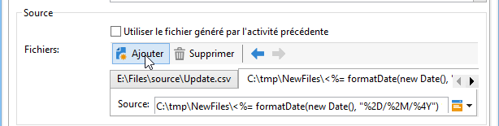
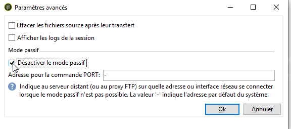

# Envoi de fichier{#file-transfer}

L&#39;activité de type **Transfert de fichier** permet de recevoir ou envoyer des fichiers, de tester la présence de fichiers ou de lister les fichiers sur un serveur. Le protocole utilisé est soit Amazon Simple Storage Service (S3) le FTP ou le SFTP.
Avec la connexion S3 ou SFTP, vous pouvez également importer des données de segments dans Adobe Campaign avec la plate-forme de données clientes en temps réel d’Adobe. For more on this, refer to this [documentation](https://docs.adobe.com/content/help/en/experience-platform/rtcdp/destinations/destinations-cat/adobe-destinations/adobe-campaign-destination.html).

## Propriétés {#properties}

Utilisez la liste déroulante du champ **[!UICONTROL Action]** pour sélectionner l&#39;action de l&#39;activité.

Le paramétrage dépend de l&#39;action sélectionnée.

1. **Réception de fichier**

   Pour recevoir les fichiers stockés sur un serveur distant, sélectionnez **[!UICONTROL File download]** dans le **[!UICONTROL Action]** champ. Vous devez spécifier son URL dans le champ correspondant.

   

   Cochez **[!UICONTROL Use an external account]** la case de sélection d’un compte à partir des comptes S3, FTP ou SFTP configurés dans le **[!UICONTROL Administration > Platform > External accounts]** noeud de l’arborescence. Indiquez ensuite le répertoire sur le serveur contenant le ou les fichiers à télécharger.

   

1. **Envoi de fichier**

   Pour envoyer un fichier à un serveur, sélectionnez **[!UICONTROL File upload]** dans le **[!UICONTROL Action]** champ. Vous devez spécifier le serveur cible dans la **[!UICONTROL Remote server]** section de l’éditeur. Les paramètres sont identiques à ceux des fichiers entrants. Voir ci-dessus.

   Le fichier source peut provenir de l’activité précédente. Dans ce cas, l’ **[!UICONTROL Use the file generated by the previous activity]** option doit être sélectionnée.

   

   Cela peut également concerner un ou plusieurs autres fichiers. Pour les sélectionner, décochez l’option, puis cliquez sur **[!UICONTROL Insert]**. Spécifiez le chemin d’accès du fichier à envoyer. Pour ajouter un autre fichier, cliquez de **[!UICONTROL Insert]** nouveau. Les fichiers ont maintenant chacun leur propre onglet.

   

   Utilisez les flèches pour modifier l&#39;ordre des onglets. Il correspond à l&#39;ordre d&#39;envoi des fichiers au serveur.

   Cette **[!UICONTROL Keep history of files sent]** option vous permet de suivre les fichiers envoyés. Cet historique est accessible à partir du répertoire.

1. **Test d&#39;existence de fichier**

   Pour tester l’existence d’un fichier, sélectionnez l’ **[!UICONTROL Test to see if file exists]** option dans le **[!UICONTROL Action]** champ. La configuration du serveur distant est la même que pour le téléchargement de fichier. For more information, refer to this [section](#properties).

   

1. **Listage des fichiers**

   Pour répertorier les fichiers, sélectionnez l’ **[!UICONTROL File listing]** option dans le **[!UICONTROL Action]** champ. La configuration du serveur distant est la même que pour la réception des fichiers. For more information, refer to this [section](#properties).

   The **[!UICONTROL List all files]** option, available when selecting the **[!UICONTROL File listing]** action, allows you to store all files present on the server in the event variable **vars.filenames** wherein the file names are separated by `\n` characters.

Pour toutes les actions de transfert de fichiers, deux options peuvent être sélectionnées :

* The **[!UICONTROL Process missing file]** option adds a transition which is activated if no file is found in the specified directory.
* Cette **[!UICONTROL Process errors]** option est détaillée dans la section Erreurs [de](../../workflow/using/monitoring-workflow-execution.md#processing-errors)traitement.

The **[!UICONTROL Advanced parameters...]** link lets you access the following options:

* **[!UICONTROL Delete the source files after transfer]**

   Efface les fichiers sur le serveur distant.

* **[!UICONTROL Use SSL]**

   Permet d&#39;utiliser une connexion sécurisée via le protocole SSL lors des transferts de fichier.

* **[!UICONTROL Display the session logs]**

   Permet de récupérer les logs du transfert S3, FTP ou SFTP et de les inclure dans les logs du workflow.

* **[!UICONTROL Disable passive mode]**

   Permet d&#39;indiquer le port de connexion à utiliser pour le transfert des données.

Le **[!UICONTROL File historization settings...]** lien donne accès aux options détaillées dans le téléchargement  Web (**[!UICONTROL File historization]** étape).

## Paramètres d&#39;entrée {#input-parameters}

* filename

   Nom complet du fichier envoyé.

## Paramètres de sortie {#output-parameters}

* filename

   Nom complet du fichier reçu si l’ **[!UICONTROL Use the file generated by the previous activity]** option est sélectionnée.

