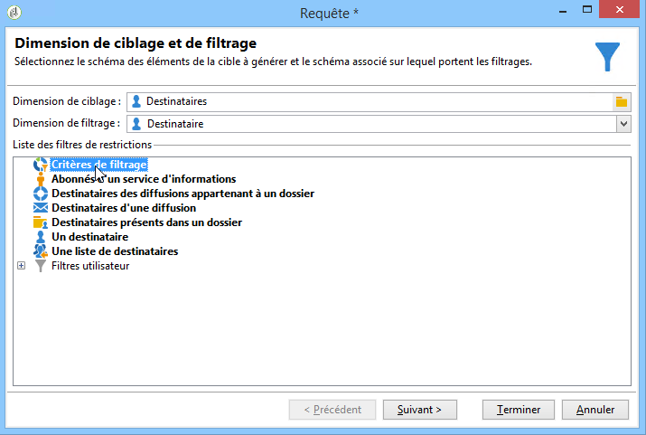
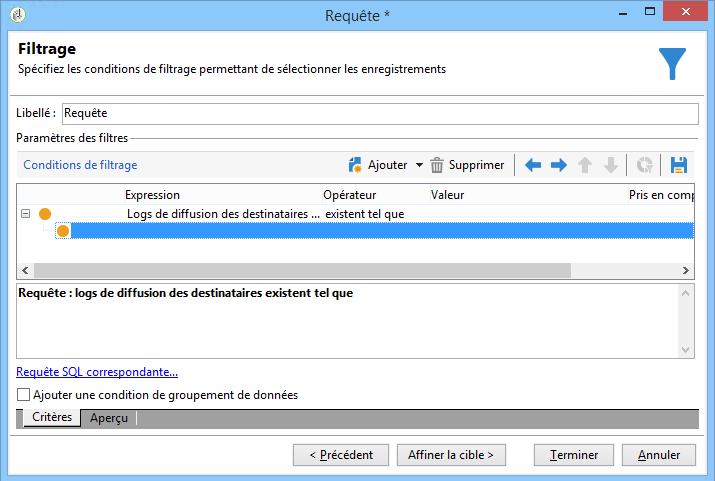
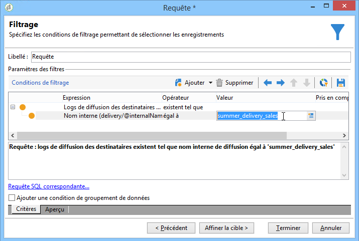
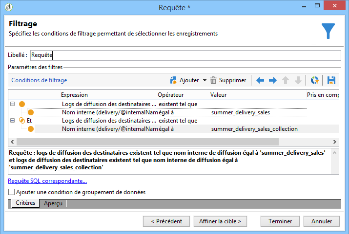

# Filtrer les destinataires en double {#filtering-duplicated-recipients}

Dans cet exemple, nous allons filtrer les destinataires qui apparaissent deux fois ou davantage dans une diffusion afin de récupérer les profils dupliqués.

Pour réaliser cet exemple, les étapes sont les suivantes :

1. Placez une activité **[!UICONTROL Requête]** dans un workflow, puis ouvrez-la.
1. Cliquez sur **[!UICONTROL Edition de la requête]** et définissez les dimensions de ciblage et de filtrage sur **[!UICONTROL Destinataires]**.

   

1. Définissez la condition de filtrage suivante pour cibler les destinataires qui se trouvent dans le log de diffusion. Sélectionnez **Log de diffusion d&#39;un destinataire (broadlog)** dans la colonne **Expression**. Sélectionnez ensuite **existent tel que** dans la colonne **Opérateur**.

   

1. Définissez la condition de filtrage suivante pour cibler votre diffusion. Sélectionnez **[!UICONTROL Nom interne]** dans la colonne Expression et **[!UICONTROL égal à]** dans la colonne Opérateur.
1. Dans la colonne de la valeur, ajoutez le nom interne de la diffusion ciblée.

   

1. Répétez les mêmes opérations pour cibler d&#39;autres diffusions à l&#39;aide d&#39;un opérateur **[!UICONTROL ET]**.

   

Votre transition sortante contient les destinataires dupliqués ciblés dans les diffusions.
