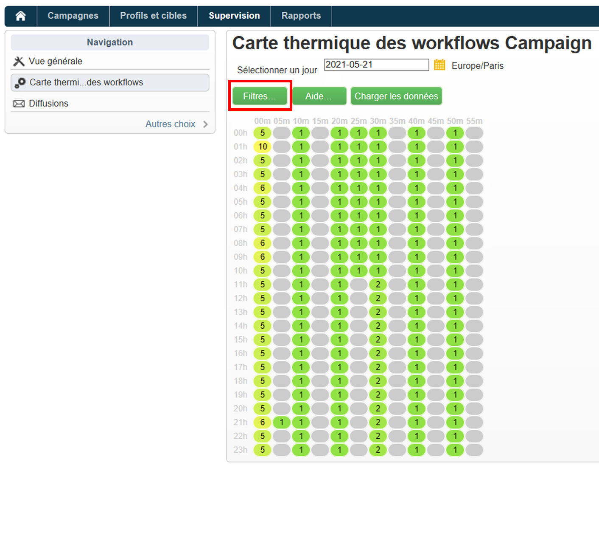
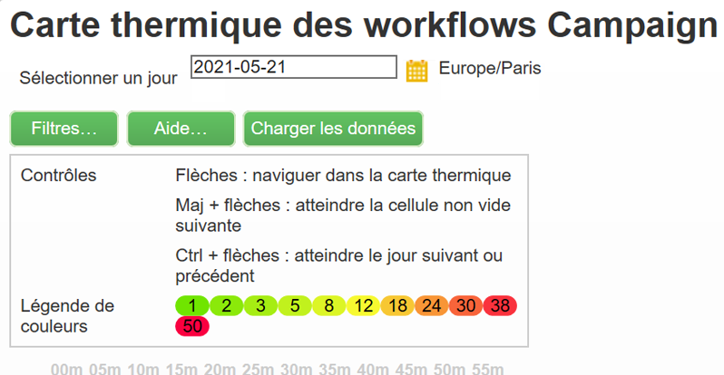
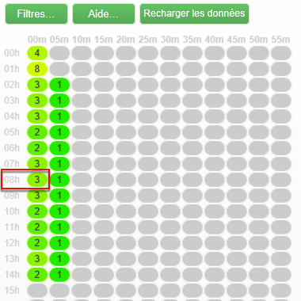
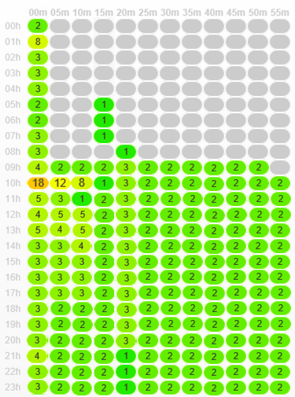

# Carte thermique des workflows {#workflow-heatmap}

La Carte thermique des workflows d&#39;Adobe Campaign est une représentation graphique avec code-couleur de tous les workflows en cours d&#39;exécution. Elle est disponible uniquement pour les administrateurs de l’instance.

D’autres méthodes de surveillance des différents processus de campagne sont présentées dans [cette page](https://helpx.adobe.com/campaign/kb/acc-maintenance.html).

## A propos de la carte thermique des workflows {#about-the-workflow-heatmap}

En donnant un aperçu rapide du nombre de workflows simultanés, la carte thermique des workflows permet aux administrateurs de la plateforme Adobe Campaign de surveiller la charge de l&#39;instance et de planifier les workflows en conséquence.

Elle permet plus précisément aux administrateurs de la plate-forme d’effectuer les opérations suivantes :

* afficher et analyser les workflows simultanés ;
* filtrer les workflows par durée pour déterminer ceux risquant de rencontrer des problèmes ;
* filtrer les activités par durée pour déterminer celles risquant de rencontrer des problèmes ;
* trouver facilement des workflows distincts et toutes les activités associées (avec leur durée) ;
* effectuer une recherche par type de workflow ([workflows techniques](../../workflow/using/building-a-workflow.md#technical-workflows) ou [workflows de campagne](../../workflow/using/building-a-workflow.md#campaign-workflows)) ;
* rechercher un workflow spécifique à analyser.

>[!NOTE]
>
>Outre la **carte thermique des workflows**, vous pouvez créer un workflow qui vous permettra de surveiller le statut d’un ensemble de workflows et d’envoyer des messages récurrents aux superviseurs. Voir à ce sujet la [section dédiée](../../workflow/using/supervising-workflows.md).

L’utilisation de la carte thermique des workflows demande une bonne maîtrise des concepts suivants : [Workflows](../../workflow/using/about-workflows.md), [Activités](../../workflow/using/about-activities.md) et [Bonnes pratiques relatives aux workflows](../../workflow/using/workflow-best-practices.md).

La carte thermique des workflows est disponible par défaut dans Adobe Campaign à compter de la version 18.10. Si vous disposez d’un build entre 8700 et 8977 (18.10), vous pouvez également bénéficier de cette fonctionnalité. Pour demander le package correspondant, contactez l’[Assistance clientèle Adobe](https://support.neolane.net/) et suivez les instructions sur [cette page](https://helpx.adobe.com/campaign/kb/install-workflow-heatmap-package.html) pour savoir comment l’installer.

Lors de votre premier accès à la carte thermique des workflows, la fenêtre contextuelle suivante apparaît. Cet accord autorise le transfert et le stockage aux États-Unis pour permettre à Adobe Campaign de :

* surveiller les instances pour enquêter sur tout problème de performance ;
* collecter des données afin de détecter des anomalies.

Notez que le transfert de vos données est uniquement disponible pour les utilisateurs qui se connectent à Adobe Campaign au moyen de leur Adobe ID.

Trois options sont disponibles :

* **[!UICONTROL Accept]** : En acceptant cet accord, vous autorisez Adobe Campaign à collecter vos données et à les transférer aux États-Unis afin de pouvoir vous aider en cas de détection d’anomalies.
* **[!UICONTROL Refuse]** : En refusant le contrat, vos données ne seront pas transférées, mais vous pouvez toujours utiliser Workflow Heatmap.
* **[!UICONTROL Do not show this message again]** : En cliquant sur **[!UICONTROL Do not show this message again]** , la fenêtre contextuelle ne s’affichera plus lors de l’accès au plan de chauffage du flux de travail, mais elle est toujours disponible à partir du **[!UICONTROL Term of use]** bouton.

This choice is not final, you can always change it by clicking the **[!UICONTROL Term of use]** button.

## Utilisation de la carte thermique {#using-the-heatmap}

>[!NOTE]
>
>Seuls les utilisateurs disposant de droits d&#39;administration peuvent accéder à la Carte thermique des workflows Campaign.

1. Accédez à **[!UICONTROL Monitoring]** et cliquez sur le **[!UICONTROL Workflow HeatMap]** lien pour afficher la **[!UICONTROL Campaign Workflow HeatMap]** page.

   

1. Cliquez sur le calendrier pour sélectionner un jour.

   Par défaut, la page affiche l&#39;activité des workflows pour le jour en cours. Vous pouvez le changer et sélectionner n&#39;importe quel jour précédent.

   >[!NOTE]
   >
   >Seuls les processus qui n’ont pas été supprimés par le **[!UICONTROL Database cleanup]** processus sont visibles. For more on the Database cleanup workflow, refer to [this section](../../production/using/database-cleanup-workflow.md).\
   >Par défaut, le fuseau horaire de la carte thermique des workflows est celui défini pour l&#39;utilisateur administrateur actuel. Vous pouvez vouloir le changer si, par exemple, vous ne vous trouvez pas dans la même zone géographique que les utilisateurs marketing avec lesquels vous travaillez.

1. Cliquez sur le **[!UICONTROL Filters]** bouton.

   

1. Utilisez le curseur pour définir la durée minimale de 0 seconde à 1 heure. Vous pouvez ainsi rechercher uniquement des workflows exécutés pendant plus d&#39;un certain nombre de secondes ou de minutes.

   

1. Vous pouvez également sélectionner un workflow spécifique dans la liste **[!UICONTROL Workflows]**.

   

   >[!NOTE]
   >
   >Le **[!UICONTROL Min duration]** filtre est appliqué. Si vous ne parvenez pas à trouver un flux de travail spécifique, réinitialisez la durée minimale sur 0 afin que tous les flux de travail s’affichent dans la liste.

1. You can also filter on the **[!UICONTROL Workflow type]** :

   * **[!UICONTROL Technical]** : Seuls les processus [techniques](../../workflow/using/building-a-workflow.md#technical-workflows) prêts à l’emploi et les processus [de gestion des](../../workflow/using/targeting-data.md#data-management) données s’affichent.
   * **[!UICONTROL Marketing]** : seuls les workflows associés à une campagne marketing, appelés [workflows de campagne](../../workflow/using/building-a-workflow.md#campaign-workflows), s&#39;affichent.

1. To search a specific workflow by name, you can also use the **[!UICONTROL Workflow name filter]** field.

   

1. If you edited some workflows in the time between, click the **[!UICONTROL Reload data]** button to refresh the data that are displayed in the grid.

## Lecture de la carte thermique {#reading-the-heatmap}

La Carte thermique des workflows Campaign est une grille qui se lit naturellement en commençant en haut à gauche pour terminer en bas à droite. Il est possible de trouver les &quot;zones chaudes&quot; avec un code-couleur allant du vert au rouge.

* Les cellules d&#39;un rouge plus foncé correspondent aux périodes pendant lesquelles un grand nombre de workflows s&#39;exécutent simultanément.
* Les cellules grises correspondent aux périodes pendant lesquelles aucun workflow ne s&#39;exécute.

To learn how the color code is applied and how to navigate the HeatMap, click the **[!UICONTROL Help]** button.

Chaque ligne représente une heure de la journée et chaque cellule, 5 minutes de cette heure.

La grille affiche tous les workflows exécutés à la même heure pour chacune de ces périodes de 5 minutes.

Dans l&#39;exemple suivant, trois workflows sont en cours d&#39;exécution (quelle que soit leur durée) entre 8h00 et 8h05 :

1. Cliquez sur une cellule en couleur pour afficher les détails de tous les workflows simultanés exécutés pendant cette période.

   

   Toutes les activités de chaque workflow sont répertoriées, avec leur durée.

1. Cliquez sur l&#39;identifiant ou le nom d&#39;un workflow pour l&#39;ouvrir directement.
1. Pour revenir à la **[!UICONTROL Campaign Workflow HeatMap]** vue, cliquez sur le **[!UICONTROL Home]** bouton.

## Cas pratiques : utilisation de la carte thermique pour prendre des mesures {#use-cases--using-the-heatmap-to-take-actions}

La Carte thermique des workflows Campaign peut s&#39;avérer utile dans deux principaux scénarios.

### Réduction du nombre de workflows simultanés {#reducing-the-number-of-concurrent-workflows}

En tant qu&#39;administrateur de Campaign, la carte thermique des workflows peut vous aider à analyser la charge de l&#39;instance et à planifier les workflows existants ou nouveaux aux moments appropriés.

1. Dans la **[!UICONTROL Campaign Workflow HeatMap]** vue, cliquez sur le **[!UICONTROL Filters]** bouton.
1. Définissez la durée sur quelques secondes ou minutes.
1. Excluez les workflows les plus courts n&#39;étant pas significatifs en augmentant le filtre de durée.

   

1. Examinez les résultats pour analyser la charge de l&#39;instance, puis prenez les mesures adéquates :

   * Si vous rencontrez des problèmes de performances et si la grille contient une ou plusieurs cellules rouges, songez à modifier les heures de début de plusieurs workflows. Demandez aux utilisateurs marketing de déplacer manuellement les workflows des périodes surchargées (&quot;chaudes&quot;) vers des créneaux horaires moins chargés. Un niveau d&#39;activité stable devrait ainsi être maintenu tout au long de la journée.
   * Pour éviter les pics et la surcharge de l&#39;instance, examinez la carte thermique avant de planifier de nouveaux workflows et choisissez le meilleur horaire. Prenez en compte les créneaux horaires correspondant aux cellules grises ou vertes de la grille pour démarrer de nouveaux workflows.

### Recherche des workflows de longue durée ayant une incidence sur les performances {#finding-long-running-workflows-that-impact-performance}

En tant qu&#39;administrateur de Campaign, la carte thermique des workflows vous permet de trouver les workflows les plus longs pouvant ralentir l&#39;activité.

1. Dans la **[!UICONTROL Campaign Workflow HeatMap]** vue, cliquez sur le **[!UICONTROL Filters]** bouton.
1. Définissez la durée sur 1 heure.

   

1. Include more results by decreasing the **[!UICONTROL Min duration]** filter.
1. Examinez les résultats pour trouver les workflows les plus longs, susceptibles d&#39;avoir un impact plus important sur les ressources du serveur et de la base de données (CPU, RAM, réseau, IOPS, etc.).
1. Prenez les mesures adéquates :

   * Conseillez aux utilisateurs marketing de scinder les workflows les plus longs afin de réduire la durée de traitement.
   * Effectuez une analyse plus approfondie de workflows et d&#39;activités spécifiques (JavaScript, import, export, etc.) pour isoler les problèmes et les résoudre plus facilement.

## Exemple : utilisation de la carte thermique pour une meilleure planification des workflows {#example--using-the-heatmap-to-improve-workflow-planning}

L&#39;exemple ci-dessous montre comment rendre la planification plus efficace et améliorer les performances grâce à l&#39;utilisation de la Carte thermique des workflows d&#39;Adobe Campaign.

Dans ce cas pratique, de nombreux utilisateurs se plaignent des performances des workflows. Vous devez rechercher ce qui ralentit l&#39;activité et comment résoudre le problème.

1. Accédez à **[!UICONTROL Monitoring]** et cliquez sur le **[!UICONTROL Workflows]** lien pour afficher la **[!UICONTROL Campaign Workflow HeatMap]** page.
1. Définissez le **[!UICONTROL Min duration]** filtre sur 5 minutes.
1. Définissez le **[!UICONTROL Workflow type]** filtre sur **[!UICONTROL Marketing]** .
1. Dans la grille de la carte thermique, notez les points suivants :

   

   * 50 workflows de campagne de longue durée (plus de 5 minutes) sont exécutés à 10h00.
   * La plupart d&#39;entre eux ont un statut en attente (par défaut, la limite de la simultanéité est définie sur 20).
   * Les workflows en attente doivent être redémarrés manuellement tous les jours.
   * Les performances sont faibles.

1. Au lieu d&#39;avoir 50 workflows commençant à 10h00, répartissez les heures de début de manière uniforme sur le reste de la journée.
1. Retournez à la **[!UICONTROL Campaign Workflow HeatMap]** page et cliquez sur le **[!UICONTROL Reload data]** bouton.
1. Notez maintenant les points suivants :

   

   * Seuls 18 workflows de campagne de longue durée s&#39;exécutent toujours à 10h00.
   * Aucun workflow n&#39;est en attente (la limite de la simultanéité est toujours définie sur 20).
   * Les heures de début des workflows sont uniformément réparties tout au long de la journée.
   * Aucun utilisateur ne se plaint de problèmes de performances.
