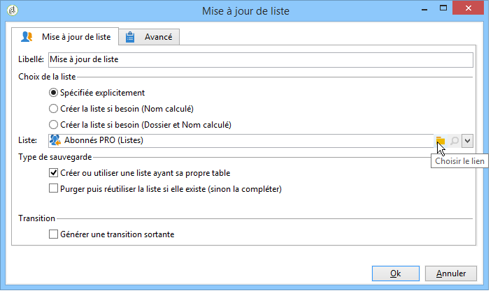
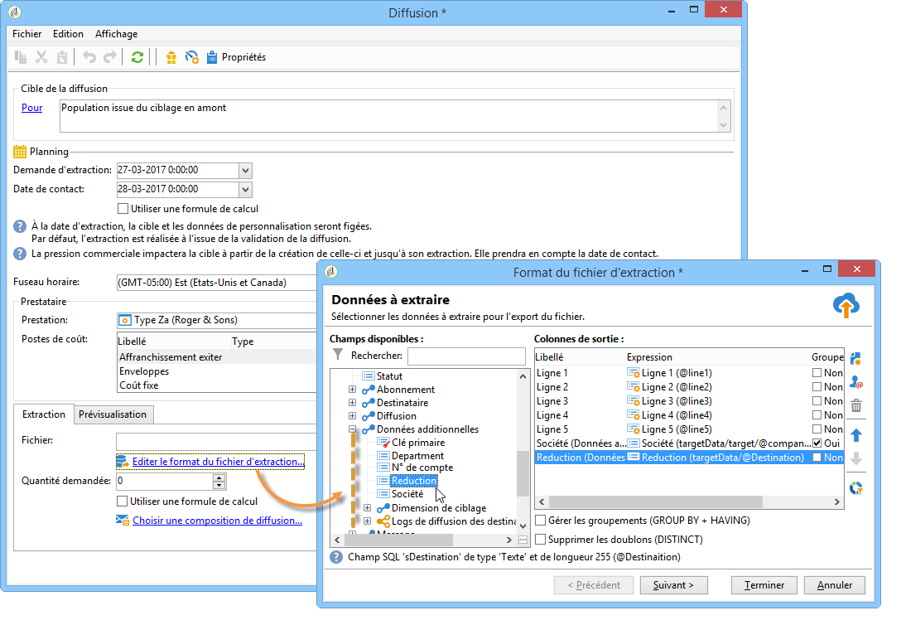
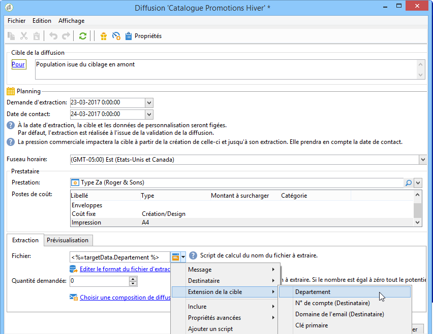
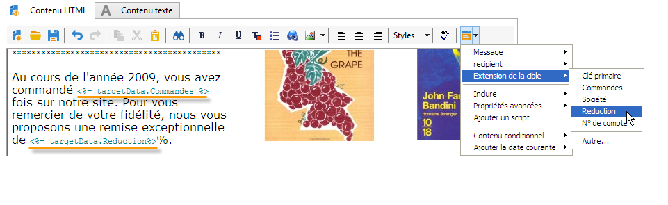

# Utiliser les données d&#39;un workflow{#how-to-use-workflow-data}

## Mettre à jour la base de données {#updating-the-database}

Toutes les données collectées peuvent être utilisées pour mettre à jour la base de données, ou dans des diffusions. Par exemple, vous pouvez enrichir les possibilités de personnalisation du contenu des messages (inclure le nombre de contrats dans le message, indiquer le panier moyen pour l&#39;année écoulée, etc) ou affiner le ciblage des populations (adresser un message aux co-titulaires d&#39;un contrat, cibler les 1000 meilleurs acheteurs abonnés aux services en ligne, etc.). Ces données peuvent également être exportées ou archivées dans une liste.

### Listes et mises à jour directes {#lists-and-direct-updates}

Les données de la base Adobe Campaign et les listes existantes peuvent être mises à jour via deux activités dédiées :

* L&#39;activité **[!UICONTROL Mise à jour de liste]** permet de stocker les tables de travail dans une liste de données.

  Vous pouvez sélectionner une liste existante ou la créer. Dans ce cas, le nom et éventuellement le dossier d&#39;enregistrement sont calculés.

  

  Pour plus d&#39;informations, consultez la section [Mise à jour de liste](list-update.md).

* L&#39;activité **[!UICONTROL Mise à jour de données]** permet de mettre à jour en masse les champs de la base de données.

  Pour plus d’informations, consultez la section [Mise à jour de données](update-data.md).

### Gérer les abonnements/désabonnements {#subscription-unsubscription-management}

Pour comprendre comment abonner et désabonner des destinataires à un service d&#39;information via un workflow, consultez la section [Services d’abonnement](subscription-services.md).

## Envoyer via un workflow {#sending-via-a-workflow}

### Activité Diffusion {#delivery-activity}

L’activité de diffusion est présentée dans la section [Diffusion](delivery.md).

### Enrichir et cibler les diffusions {#enriching-and-targeting-deliveries}

Les diffusions peuvent exploiter les données issues des workflows pour personnaliser le contenu ou dans le cadre de la sélection de la population cible.

Par exemple, dans le cadre d&#39;une diffusion courrier, vous pouvez inclure dans le fichier d&#39;extraction les données additionnelles issues des manipulations de données réalisées dans le workflow :

Outre les champs de personnalisation habituels, vous pouvez ajouter des champs de personnalisation des étapes de workflow au contenu de la diffusion. Les données additionnelles définies dans les activités du workflow peuvent être conservées et rendues accessibles dans l&#39;assistant de diffusion, comme dans l&#39;exemple ci-dessous, afin de définir le nom du fichier de sortie dans le cadre de la diffusion courrier :

Les données contenues dans la table du workflow sont identifiables par leur nom : il est toujours composé du lien **targetData**. Pour plus d’informations, consultez la section [Données de la cible](data-life-cycle.md#target-data).

Dans le cadre d&#39;une diffusion par email, les champs de personnalisation peuvent également utiliser les données issues de l&#39;extension de la cible réalisée dans les étapes du workflow de ciblage, comme dans l&#39;exemple ci-dessous :

Si un code segment est spécifié dans une activité de ciblage, il est ajouté dans une colonne spécifique de la table du workflow et il sera proposé avec les champs de personnalisation. Pour afficher tous les champs de personnalisation, cliquez sur le lien **[!UICONTROL Extension de la cible > Autre]** accessible au moyen du bouton de personnalisation.

