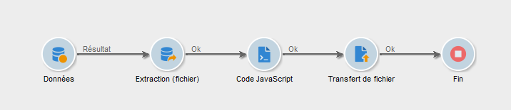
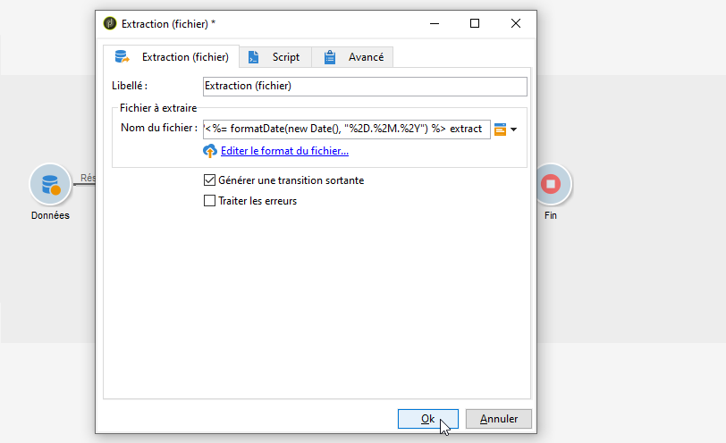
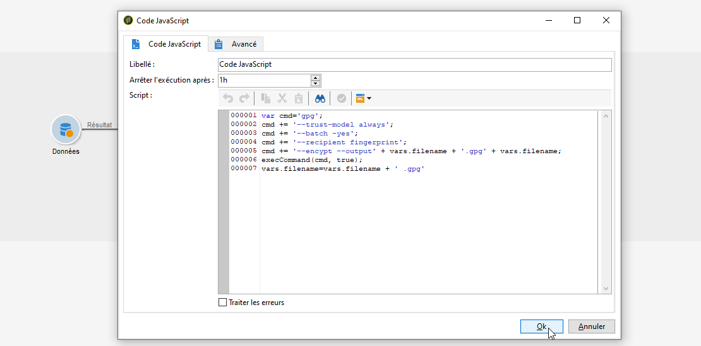
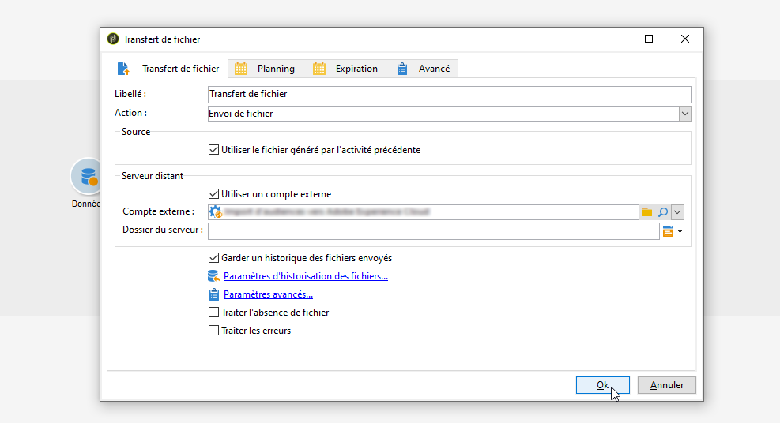

# Utiliser les données d&#39;un workflow{#how-to-use-workflow-data}

## Mettre à jour la base de données {#updating-the-database}

Toutes les données collectées peuvent être utilisées pour mettre à jour la base de données, ou dans des diffusions. Par exemple, vous pouvez enrichir les possibilités de personnalisation du contenu des messages (inclure le nombre de contrats dans le message, indiquer le panier moyen pour l&#39;année écoulée, etc) ou affiner le ciblage des populations (adresser un message aux co-titulaires d&#39;un contrat, cibler les 1000 meilleurs acheteurs abonnés aux services en ligne, etc.). Ces données peuvent également être exportées ou archivées dans une liste.

### Listes et mises à jour directes {#lists-and-direct-updates}

Les données de la base Adobe Campaign et les listes existantes peuvent être mises à jour via deux activités dédiées :

* L&#39;activité **[!UICONTROL Mise à jour de liste]** permet de stocker les tables de travail dans une liste de données.

   Vous pouvez sélectionner une liste existante ou la créer. Dans ce cas, le nom et éventuellement le dossier d&#39;enregistrement sont calculés.

   

   Consultez la section [Mise à jour de liste](../../workflow/using/list-update.md).

* L&#39;activité **[!UICONTROL Mise à jour de données]** permet de mettre à jour en masse les champs de la base de données.

   Pour plus d’informations, consultez la section [Mise à jour de données](../../workflow/using/update-data.md).

### Gérer les abonnements/désabonnements {#subscription-unsubscription-management}

Pour comprendre comment inscrire et désinscrire des destinataires à un service d&#39;information via un workflow, consultez la section [Services d’inscription](../../workflow/using/subscription-services.md).

## Envoyer via un workflow {#sending-via-a-workflow}

### Activité Diffusion {#delivery-activity}

L’activité de diffusion est présentée dans la section [Diffusion](../../workflow/using/delivery.md).

### Enrichir et cibler les diffusions {#enriching-and-targeting-deliveries}

Les diffusions peuvent exploiter les données issues des workflows pour personnaliser le contenu ou dans le cadre de la sélection de la population cible.

Par exemple, dans le cadre d&#39;une diffusion courrier, vous pouvez inclure dans le fichier d&#39;extraction les données additionnelles issues des manipulations de données réalisées dans le workflow :


En complément des champs de personnalisation habituels, vous pouvez ajouter dans le contenu des diffusions des champs de personnalisation issus des étapes du workflow. En effet, les données additionnelles définies dans les activités du workflow peuvent être conservées et sont ensuite rendues accessibles dans l&#39;assistant de diffusion, comme dans l&#39;exemple ci-dessous pour définir le nom du fichier de sortie dans le cadre d&#39;une diffusion courrier :


Les données contenues dans la table du workflow sont identifiables par leur nom : il est toujours composé du lien **targetData**. Pour plus d’informations, consultez la section [Données de la cible](../../workflow/using/data-life-cycle.md#target-data).

Dans le cadre d&#39;une diffusion par email, les champs de personnalisation peuvent également utiliser les données issues de l&#39;extension de la cible réalisée dans les étapes du workflow de ciblage, comme dans l&#39;exemple ci-dessous :


Si un code segment est indiqué dans une activité de ciblage, il est ajouté dans une colonne spécifique de la table du workflow et il sera proposé parmi les champs de personnalisation. Pour afficher tous les champs de personnalisation, cliquez sur le lien **[!UICONTROL Extension de la cible > Autre...]** accessible à partir du bouton de personnalisation.


## export des données {#exporting-data}

### Compresser ou chiffrer un fichier {#zipping-or-encrypting-a-file}

Adobe Campaign permet d&#39;exporter des fichiers compressés ou chiffrés. Lors de la définition d&#39;un export par le biais d&#39;une activité **[!UICONTROL Extraction (fichier)]**, vous pouvez définir une étape de post-traitement pour le compresser ou le chiffrer.

Pour ce faire :

1. Installez une paire de clés GPG pour votre instance à l’aide du [panneau de contrôle](https://docs.adobe.com/content/help/fr-FR/control-panel/using/instances-settings/gpg-keys-management.html#encrypting-data).

   >[!NOTE]
   >
   >Le panneau de contrôle est disponible pour tous les clients hébergés sur AWS (à l’exception de ceux qui hébergent leurs instances marketing on-premise).

1. Si votre installation d&#39;Adobe Campaign est hébergée par Adobe, contactez l’Assistance clientèle d’Adobe afin que les utilitaires nécessaires soient installés sur le serveur.
1. S&#39;il s&#39;agit d&#39;une installation on-premise, installez l&#39;utilitaire que vous souhaitez utiliser (GPG ou GZIP, par exemple) ainsi que les clés (clé de cryptage) nécessaires sur le serveur applicatif.

Vous pouvez ensuite utiliser des commandes ou du code dans l’onglet **[!UICONTROL Script]** de l’activité ou dans une activité **[!UICONTROL Code JavaScript]**. Le cas pratique ci-dessous présente un exemple.

**Rubriques connexes :**

* [Décompresser ou décrypter un fichier avant traitement](../../workflow/using/importing-data.md#unzipping-or-decrypting-a-file-before-processing)
* [Activité Extraction (fichier)](../../workflow/using/extraction--file-.md).

### Cas pratique : cryptage et export de données à l’aide d’une clé installée sur le panneau de contrôle {#use-case-gpg-encrypt}

Dans ce cas pratique, nous allons créer un workflow pour crypter et exporter des données à l’aide d’une clé installée sur le panneau de contrôle.

Un tutoriel vidéo montrant comment utiliser une clé GPG pour crypter des données est également disponible dans [cette section](https://docs.adobe.com/content/help/fr-FR/campaign-classic-learn/tutorials/administrating/control-panel-acc/gpg-key-management/using-a-gpg-key-to-encrypt-data.html).

Les étapes pour traiter ce cas pratique sont les suivantes :

1. Générez une paire de clés GPG (publique/privée) à l’aide d’un utilitaire GPG, puis installez la clé publique sur le panneau de contrôle. Les étapes détaillées sont disponibles dans la [documentation du panneau de contrôle](https://docs.adobe.com/content/help/fr-FR/control-panel/using/instances-settings/gpg-keys-management.html#encrypting-data).

1. Dans Campaign Classic, créez un workflow pour exporter les données à l’aide de la clé privée installée à l’aide du panneau de contrôle. Pour ce faire, nous allons créer un workflow comme suit :

   

   * Activité **[!UICONTROL Requête]** : dans cet exemple, nous voulons exécuter une requête pour cibler les données de la base de données que nous voulons exporter.
   * Activité **[!UICONTROL Extraction (fichier)]** : extrait les données dans un fichier.
   * Activité **[!UICONTROL Code JavaScript]** : crypte les données à extraire.
   * Activité **[!UICONTROL Transfert de fichier]** : envoie les données à une source externe (dans cet exemple, un serveur SFTP).

1. Configurez l’activité **[!UICONTROL Requête]** pour qu’elle cible les données de votre choix dans la base de données. Voir à ce propos [cette section](../../workflow/using/query.md).

1. Ouvrez l’activité **[!UICONTROL Extraction (fichier)]** puis configurez-la selon vos besoins. Les concepts généraux de configuration de l’activité sont présentés dans [cette section](../../workflow/using/extraction--file-.md).

   

1. Ouvrez l’activité **[!UICONTROL Code JavaScript]**, puis copiez-collez la commande ci-dessous pour crypter les données à extraire.

   >[!IMPORTANT]
   >
   >Veillez à remplacer la valeur d’**empreinte** de la commande par l&#39;empreinte de la clé publique installée sur le panneau de Contrôle.

   ```
   var cmd='gpg ';
   cmd += ' --trust-model always';
   cmd += ' --batch -yes';
   cmd += ' --recipient fingerprint';
   cmd += ' --encrypt --output ' + vars.filename + '.gpg ' + vars.filename;
   execCommand(cmd,true);
   vars.filename=vars.filename + '.gpg'
   ```

   

1. Ouvrez l’activité **[!UICONTROL Transfert de fichier]**, puis spécifiez le serveur SFTP auquel vous souhaitez envoyer le fichier. Les concepts généraux de configuration de l’activité sont présentés dans [cette section](../../workflow/using/file-transfer.md).

   

1. Vous pouvez maintenant exécuter le workflow. Une fois exécuté, les données ciblées par la requête sont exportées vers le serveur SFTP dans un fichier .gpg crypté.

   
