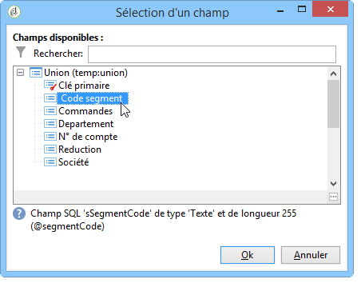

# Utiliser les données d&#39;un workflow{#how-to-use-workflow-data}

## Mettre à jour la base de données {#updating-the-database}

Toutes les données collectées peuvent être utilisées pour mettre à jour la base de données, ou dans des diffusions. Par exemple, vous pouvez enrichir les possibilités de personnalisation du contenu des messages (inclure le nombre de contrats dans le message, indiquer le panier moyen pour l&#39;année écoulée, etc) ou affiner le ciblage des populations (adresser un message aux co-titulaires d&#39;un contrat, cibler les 1000 meilleurs acheteurs abonnés aux services en ligne, etc.). Ces données peuvent également être exportées ou archivées dans une liste.

### Listes et mises à jour directes {#lists-and-direct-updates}

Les données de la base Adobe Campaign et les listes existantes peuvent être mises à jour via deux activités dédiées :

* L&#39;activité **[!UICONTROL Mise à jour de liste]** permet de stocker les tables de travail dans une liste de données.

   Vous pouvez sélectionner une liste existante ou la créer. Dans ce cas, le nom et éventuellement le dossier d&#39;enregistrement sont calculés.

   

   Consultez la section [Mise à jour de liste](../../workflow/using/list-update.md).

* L&#39;activité **[!UICONTROL Mise à jour de données]** permet de mettre à jour en masse les champs de la base de données.

   Pour plus d’informations, consultez la section [Mise à jour de données](../../workflow/using/update-data.md).

### Gérer les abonnements/désabonnements {#subscription-unsubscription-management}

Pour comprendre comment inscrire et désinscrire des destinataires à un service d&#39;information via un workflow, consultez la section [Services d’inscription](../../workflow/using/subscription-services.md).

## Envoyer via un workflow {#sending-via-a-workflow}

### Activité Diffusion {#delivery-activity}

L’activité de diffusion est présentée dans la section [Diffusion](../../workflow/using/delivery.md).

### Enrichir et cibler les diffusions {#enriching-and-targeting-deliveries}

Les diffusions peuvent exploiter les données issues des workflows pour personnaliser le contenu ou dans le cadre de la sélection de la population cible.

Par exemple, dans le cadre d&#39;une diffusion courrier, vous pouvez inclure dans le fichier d&#39;extraction les données additionnelles issues des manipulations de données réalisées dans le workflow :


En complément des champs de personnalisation habituels, vous pouvez ajouter dans le contenu des diffusions des champs de personnalisation issus des étapes du workflow. En effet, les données additionnelles définies dans les activités du workflow peuvent être conservées et sont ensuite rendues accessibles dans l&#39;assistant de diffusion, comme dans l&#39;exemple ci-dessous pour définir le nom du fichier de sortie dans le cadre d&#39;une diffusion courrier :


Les données contenues dans la table du workflow sont identifiables par leur nom : il est toujours composé du lien **targetData**. Pour plus d’informations, consultez la section [Données de la cible](../../workflow/using/data-life-cycle.md#target-data).

Dans le cadre d&#39;une diffusion par email, les champs de personnalisation peuvent également utiliser les données issues de l&#39;extension de la cible réalisée dans les étapes du workflow de ciblage, comme dans l&#39;exemple ci-dessous :


Si un code segment est indiqué dans une activité de ciblage, il est ajouté dans une colonne spécifique de la table du workflow et il sera proposé parmi les champs de personnalisation. Pour afficher tous les champs de personnalisation, cliquez sur le lien **[!UICONTROL Extension de la cible > Autre...]** accessible à partir du bouton de personnalisation.



## export des données {#exporting-data}

### Compresser ou chiffrer un fichier {#zipping-or-encrypting-a-file}

Adobe Campaign permet d&#39;exporter des fichiers compressés ou chiffrés. Lors de la définition d&#39;un export par le biais d&#39;une activité **[!UICONTROL Extraction (fichier)]**, vous pouvez définir une étape de post-traitement pour le compresser ou le chiffrer.

Pour ce faire :

1. Installez une paire de clés GPG pour votre instance à l’aide du panneau [de](https://docs.adobe.com/content/help/en/control-panel/using/instances-settings/gpg-keys-management.html#encrypting-data)configuration.

   >[!NOTE]
   >
   >Le Panneau de configuration est disponible pour tous les clients hébergés sur AWS (à l’exception des clients qui hébergent leurs instances marketing sur site).

1. Si votre installation d’Adobe Campaign est hébergée par Adobe, contactez le service à la clientèle de Adobe pour installer les utilitaires nécessaires sur le serveur.
1. Si votre installation d’Adobe Campaign est sur site, installez l’utilitaire que vous souhaitez utiliser (par exemple : GPG, GZIP) ainsi que les clés nécessaires (clé de chiffrement) sur le serveur d’applications.

Vous pouvez ensuite utiliser des commandes ou du code dans l’onglet **[!UICONTROL Script]** de l’activité ou dans une activité de code **** JavaScript. Un exemple est présenté dans le cas d’utilisation ci-dessous.

**Rubriques connexes :**

* [Décompresser ou décrypter un fichier avant traitement](../../workflow/using/importing-data.md#unzipping-or-decrypting-a-file-before-processing)
* [activité](../../workflow/using/extraction--file-.md)d’extraction de données (fichier).

### Cas d’utilisation : Chiffrement et exportation de données à l’aide d’une clé installée sur le Panneau de configuration {#use-case-gpg-encrypt}

Dans ce cas d’utilisation, nous allons créer un processus afin de chiffrer et d’exporter des données à l’aide d’une clé installée sur le Panneau de configuration.

Les étapes pour effectuer cette utilisation sont les suivantes :

1. GPG, générez une paire de clés (publique/privée) à l&#39;aide d&#39;un utilitaire GPG, puis installez la clé publique sur le Panneau de configuration. Les étapes détaillées sont disponibles dans la documentation [du Panneau de](https://docs.adobe.com/content/help/en/control-panel/using/instances-settings/gpg-keys-management.html#encrypting-data)configuration.

1. Dans Campaign Classic, créez un processus pour exporter les données et exportez-les à l’aide de la clé privée qui a été installée via le Panneau de configuration. Pour ce faire, nous allons créer un processus comme suit :

   

   * **[!UICONTROL Requête]** activité : Dans cet exemple, nous voulons exécuter une requête de cible des données de la base de données que nous voulons exporter.
   * **[!UICONTROL extraction de données (fichier)]** activité : Extrait les données dans un fichier.
   * **[!UICONTROL activité du code]** JavaScript : Chiffre les données à extraire.
   * **[!UICONTROL activité de transfert]** de fichier : Envoie les données à une source externe (dans cet exemple, un serveur SFTP).

1. Configurez l’activité de la **[!UICONTROL Requête]** pour qu’elle cible les données de votre choix à partir de la base de données. Voir à ce propos [cette section](../../workflow/using/query.md).

1. Ouvrez l’activité d’extraction de **[!UICONTROL données (fichier)]** , puis configurez-la selon vos besoins. Les concepts généraux de configuration de l’activité sont disponibles dans [cette section](../../workflow/using/extraction--file-.md).

   

1. Ouvrez l’activité de code **** JavaScript, puis copiez-collez la commande ci-dessous pour chiffrer les données à extraire.

   >[!IMPORTANT]
   >
   >Assurez-vous de remplacer la valeur d&#39; **empreinte** de la commande par l&#39;empreinte de la clé publique installée sur le Panneau de configuration.

   ```
   var cmd='gpg ';
   cmd += ' --trust-model always';
   cmd += ' --batch -yes';
   cmd += ' --recipient fingerprint';
   cmd += ' --encrypt --output ' + vars.filename + '.gpg ' + vars.filename;
   execCommand(cmd,true);
   vars.filename=vars.filename + '.gpg'
   ```

   

1. Ouvrez l’activité de transfert **[!UICONTROL de]** fichier, puis spécifiez le serveur SFTP vers lequel vous souhaitez envoyer le fichier. Les concepts généraux de configuration de l’activité sont disponibles dans [cette section](../../workflow/using/file-transfer.md).

   

1. Vous pouvez désormais exécuter le processus. Une fois exécuté, la cible de données par la requête est exportée vers le serveur SFTP dans un fichier .gpg chiffré.

   
