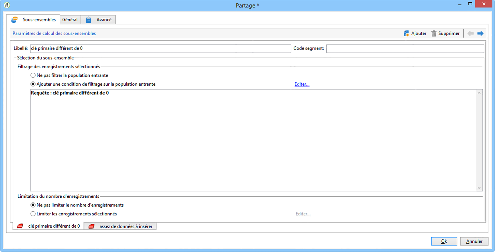

# Importer des données{#importing-data}

## Comment collecter des données {#how-to-collect-data}

### Utiliser les données d&#39;une liste : Lecture de Liste {#using-data-from-a-list--read-list}

Les données traitées dans un workflow peuvent provenir de listes dont les données ont été préparées et structurées au préalable.

This list may have been directly created in Adobe Campaign or imported by the **[!UICONTROL Import a list]** option. For more on this option, refer to this [page](../../platform/using/generic-imports-and-exports.md).

For more on using the read list activity in a workflow, refer to [Read list](../../workflow/using/read-list.md).

### Charger des données depuis un fichier {#loading-data-from-a-file}

Les données traitées dans un workflow peuvent êtes extraites d&#39;un fichier structuré pour qu&#39;il puisse être importé dans Adobe Campaign.

A description of the loading data activity can be found in the [Data loading (file)](../../workflow/using/data-loading--file-.md) section.

Voici un exemple de fichier structuré à importer :

```
lastname;firstname;birthdate;email;crmID
Smith;Hayden;23/05/1989;hayden.smith@example.com;124365
Mars;Daniel;17/11/1987;dannymars@example.com;123545
Smith;Clara;08/02/1989;hayden.smith@example.com;124567
Durance;Allison;15/12/1978;allison.durance@example.com;120987
```

### Décompresser ou déchiffrer un fichier avant traitement {#unzipping-or-decrypting-a-file-before-processing}

Adobe Campaign vous permet d’importer des fichiers compressés ou chiffrés. Avant de pouvoir les lire dans une **[!UICONTROL Data loading (file)]** activité, vous pouvez définir un prétraitement pour décompresser ou déchiffrer le fichier.

Pour ce faire :

* Si votre installation d&#39;Adobe Campaign est hébergée par Adobe : envoyez une demande à l&#39;[assistance technique](https://support.neolane.net) afin que les utilitaires nécessaires soient installés sur le serveur.
* S&#39;il s&#39;agit d&#39;une installation on-premise : installez l&#39;utilitaire que vous souhaitez utiliser (GPG ou GZIP, par exemple) ainsi que les clés (clé de chiffrement) nécessaires sur le serveur applicatif.

1. Add and configure a **[!UICONTROL File transfer]** activity in your workflow.
1. Ajoutez une **[!UICONTROL Data loading (file)]** activité et définissez le format de fichier.
1. Cochez l’ **[!UICONTROL Pre-process the file]** option.
1. Spécifiez la commande de prétraitement que vous souhaitez appliquer. Par exemple, pour déchiffrer un fichier à l&#39;aide de PGP :

   ```
   <path-to_pgp_if-not_global_or_server/>pgp.exe --decrypt --input nl6/var/vp/import/filename.pgp --passphrase "your password" --recipient recipient @email.com --verbose --output nl6/var/vp/import/filename
   ```

1. Ajoutez d&#39;autres activités pour gérer les données provenant du fichier.
1. Enregistrez et exécutez le workflow.

Lors de l’exportation d’un fichier, vous pouvez également le compresser ou le chiffrer. See [Zipping or encrypting a file](../../workflow/using/how-to-use-workflow-data.md#zipping-or-encrypting-a-file).

## Bonnes pratiques relatives à l’import de données {#best-practices-when-importing-data}

Pour garantir la cohérence des données au sein de la base de données et éviter les erreurs fréquentes lors de la mise à jour de la base de données ou de l&#39;export de données, faites preuve de précaution et suivez les quelques règles simples détaillées ci-dessous.

### Utiliser les modèles d&#39;import  {#using-import-templates}

La plupart des processus d’importation doivent contenir les activités suivantes : **[!UICONTROL Data loading (file)]**, **[!UICONTROL Enrichment]**, **[!UICONTROL Split]**, **[!UICONTROL Deduplication]**, **[!UICONTROL Update data]**.

L&#39;utilisation de modèles d&#39;import facilite la préparation d&#39;imports similaires et garantit la cohérence des données au sein de la base de données. Découvrez comment créer des modèles de processus dans la section Modèles [de](../../workflow/using/building-a-workflow.md#workflow-templates) processus.

In many projects, imports are built without **[!UICONTROL Deduplication]** activity because the files used in the project do not have duplicates. Des doublons apparaissent parfois suite à l&#39;import d&#39;autres fichiers. La déduplication est alors difficile. C&#39;est pourquoi l&#39;ajout d&#39;une étape de déduplication est une précaution utile pour tous les workflows d&#39;import.

Ne partez pas de l&#39;hypothèse selon laquelle les données entrantes sont cohérentes et justes ou que le département informatique ou le responsable Adobe Campaign s&#39;en occupera. Gardez la normalisation des données à l&#39;esprit tout au long du projet. Veillez à dédupliquer, à réconcilier et à maintenir la cohérence des données lors des imports.

Un exemple de modèle d’importation est disponible dans la section [Configuration d’une importation](#setting-up-a-recurring-import) périodique.

### Utiliser des formats de fichiers plats  {#using-flat-file-formats}

Le format le plus efficace pour les imports est le fichier plat. Les fichiers plats peuvent être importés en masse au niveau de la base de données.

Par exemple :

* Séparateur : onglet ou point virgule
* Première ligne avec en-têtes
* Pas de délimiteur de chaîne
* Format de date : AAAA/MM/JJ HH:mm:SS

Adobe Campaign ne peut pas importer de fichiers XML via les activités d&#39;import de fichier standard. Les fichiers XML peuvent être importés à l&#39;aide de JavaScript, mais uniquement en petits volumes : moins de 10K enregistrements par fichier.

### Utiliser la compression et le cryptage {#using-compression-and-encryption}

Lorsque cela est possible, utilisez des fichiers compressés pour les imports et les exports.

Sous Linux, il est possible de décompresser un fichier et de l&#39;importer en même temps à l&#39;aide d&#39;une ligne de commande. Par exemple :

```
zcat nl6/var/vp/import/filename.gz
```

Il est également de bonne pratique de crypter les fichiers envoyés via le réseau s&#39;il n&#39;est pas sécurisé. Pour cela, vous pouvez utiliser GPG.

### Charger des données en mode batch depuis des fichiers {#loading-data-in-batch-from-files}

Le chargement des données en mode batch depuis un fichier est plus efficace que le chargement ligne par ligne et en temps réel (via un service web, par exemple).

Les imports à l&#39;aide de Services web ne sont pas efficients. Il est recommandé d&#39;utiliser des fichiers dans la mesure du possible.

L&#39;appel aux services web externes pour enrichir des profils en temps réel engendre des problèmes de performance et des fuites mémoire, car il opère au niveau ligne.

Pour importer des données, il vaut mieux procéder en mode batch via un workflow plutôt qu&#39;en temps réel à l&#39;aide d&#39;une application web ou d&#39;un service web.

### Utiliser la gestion des données {#using-data-management}

Le chargement en mode itératif (ligne par ligne) à l&#39;aide de JavaScript doit être limité aux faibles volumes.

For better efficiency, always use the **[!UICONTROL Data Loading (File)]** activity in data management workflows.

### Importer en mode Delta {#importing-in-delta-mode}

Les imports standard doivent être effectués en mode delta. Cela signifie qu&#39;au lieu d&#39;envoyer le tableau entier à chaque fois, seules les données modifiées ou nouvelles sont envoyée à Adobe Campaign.

Les imports complets sont réservés au chargement initial.

Les données doivent être importées à l&#39;aide de la gestion des données et non de JavaScript.

### Maintenir la cohérence  {#maintaining-consistency}

Pour maintenir la cohérence des données dans la base de données Adobe Campaign, veuillez appliquer les principes suivants :

* Si les données importées correspondent à une table de référence dans Adobe Campaign, elles doivent être réconciliées avec ce tableau dans le workflow. Les enregistrements sans correspondance doivent être rejetés.
* Assurez-vous que les données importées soient toujours **« normalisées »** (email, numéro de téléphone, adresse postale) et que cette normalisation soit fiable et ne risque pas de changer pas au fil des années. Si ce n&#39;est pas le cas, des doublons risquent d&#39;apparaître dans la base de données, et dans la mesure où Adobe Campaign ne fournit pas d&#39;outils de « correspondance approximative », leur suppression sera très difficile.
* Les données transactionnelles doivent être dotées d&#39;une clé de réconciliation et être réconciliées avec les données existantes afin d&#39;éviter la création de doublons.
* **Les fichiers liés doivent être importés dans l&#39;ordre**.

   Si l&#39;import est composé de fichiers multiples et interdépendants, le workflow doit vérifier que les fichiers sont importés dans l&#39;ordre. Si un fichier échoue, les autres fichiers ne sont pas importés.

* **Dédupliquez**, réconciliez et maintenez la cohérence lorsque vous importez des données.

## Configurer un import récurrent {#setting-up-a-recurring-import}

L&#39;utilisation d&#39;un modèle d&#39;import est une bonne pratique si vous devez importer régulièrement des fichiers de structure identique.

Cet exemple montre comment pré-paramétrer un workflow qui pourra être réutilisé pour importer des profils en provenance d&#39;un CRM dans la base de données Adobe Campaign. Pour plus d&#39;informations sur tous les paramétrages possibles pour chaque activité, reportez-vous à cette [section](../../workflow/using/about-activities.md).

1. Créez un modèle de processus à partir de **[!UICONTROL Resources > Templates > Workflow templates]**.
1. Ajoutez les activités suivantes :

   * **[!UICONTROL Data loading (file)]**: Définissez la structure attendue du fichier contenant les données à importer.
   * **[!UICONTROL Enrichment]**: Rapprochez les données importées des données de base de données.
   * **[!UICONTROL Split]** : créez des filtres pour traiter les enregistrements différemment selon qu&#39;ils aient pu ou non être réconciliés.
   * **[!UICONTROL Deduplication]**: Dédupliquez les données du fichier entrant avant de les insérer dans la base de données.
   * **[!UICONTROL Update data]**: Mettez à jour la base de données avec les profils importés.
   

1. Configurez l’ **[!UICONTROL Data Loading (file)]** activité :

   * Définissez la structure attendue en téléchargeant un fichier exemple. Le fichier exemple ne doit contenir que quelques lignes mais toutes les colonnes nécessaires pour l&#39;import. Vérifiez et éditez le format du fichier pour vous assurer que le type de chaque colonne est paramétré correctement : texte, date, nombre entier, etc.
Par exemple :

      ```
      lastname;firstname;birthdate;email;crmID
      Smith;Hayden;23/05/1989;hayden.smith@mailtest.com;123456
      ```

   * Dans la **[!UICONTROL Name of the file to load]** section, sélectionnez **[!UICONTROL Upload a file from the local machine]** et laissez le champ vide. A chaque fois qu&#39;un nouveau workflow sera créé à partir de ce modèle, vous pourrez préciser ici le fichier souhaité (tant qu&#39;il correspond à la structure définie).

      Toutes les options sont utilisables, mais il faut modifier le modèle en conséquence. Par exemple, si vous sélectionnez **[!UICONTROL Specified in the transition]**, vous pouvez ajouter une **[!UICONTROL File Transfer]** activité avant de récupérer le fichier à importer à partir d’un serveur FTP/SFTP. Avec la connexion S3 ou SFTP, vous pouvez également importer des données de segments dans Adobe Campaign avec la plate-forme de données clientes en temps réel d’Adobe. For more on this, refer to this [documentation](https://docs.adobe.com/content/help/en/experience-platform/rtcdp/destinations/destinations-cat/adobe-destinations/adobe-campaign-destination.html).

      

1. Configurez l’ **[!UICONTROL Enrichment]** activité. Dans ce contexte, le but de cette activité est d&#39;identifier les données entrantes.

   * Dans l’ **[!UICONTROL Enrichment]** onglet, sélectionnez **[!UICONTROL Add data]** et définissez un lien entre les données importées et la dimension de ciblage des destinataires. Dans cet exemple, le champ personnalisé **Identifiant dans le CRM** permet de créer la condition de jointure. Utilisez le champ ou la combinaison de champs nécessaire tant que l&#39;identification des enregistrements uniques reste possible.
   * Dans l’ **[!UICONTROL Reconciliation]** onglet, laissez l’ **[!UICONTROL Identify the document from the working data]** option désactivée.
   

1. Configurez l&#39;activité **[!UICONTROL Split]** pour récupérer les destinataires réconciliés dans une transition, ainsi que les destinataires qui n&#39;ont pas pu être réconciliés mais qui disposent de suffisamment de données dans une autre transition.

   La transition des destinataires réconciliés peut alors être utilisée pour mettre à jour la base de données. La transition des destinataires inconnus peut servir à créer de nouvelles entrées de destinataires dans la base de données si un ensemble d&#39;informations minimum est disponible dans le fichier.

   Les destinataires ne pouvant pas être réconciliés et ne disposant pas de suffisamment de données sont sélectionnés dans une transition sortante complémentaire et peuvent être exportés dans un fichier séparé ou tout simplement ignorés.

   * Dans l’ **[!UICONTROL General]** onglet de l’activité, sélectionnez **[!UICONTROL Use the additional data only]** comme paramètre de filtrage et assurez-vous que la **[!UICONTROL Targeting dimension]** valeur est automatiquement définie sur **[!UICONTROL Enrichment]**.

      Cochez cette **[!UICONTROL Generate complement]** option pour savoir si un enregistrement ne peut pas être inséré dans la base de données. Le cas échéant, vous pourrez alors appliquer d&#39;autres traitements aux données complémentaires : export de fichier, mise à jour de liste, etc.

   * In the first subset of the **[!UICONTROL Subsets]** tab, add a filtering condition on the inbound population to select only records for which the recipient primary key is not equal to 0. Ainsi, les données du fichier qui sont rapprochées avec les destinataires de la base de données sont sélectionnées dans ce sous-ensemble.

      

   * Ajoutez un second sous-ensemble pour sélectionner les enregistrements non réconciliés disposant de suffisamment de données pour être intégrés dans la base de données. Par exemple : adresse email, prénom et nom de famille.

      Les sous-ensembles sont traités dans l&#39;ordre dans lequel ils ont été créés, ce qui veut dire que lorsque ce second sous-ensemble est traité, tous les enregistrements qui existent déjà dans la base de données sont déjà sélectionnés dans le premier sous-ensemble.

      

   * All records that are not selected in the first two subsets are selected in the **[!UICONTROL Complement]**.

1. Configure the **[!UICONTROL Update data]** activity located after the first outbound transition of the **[!UICONTROL Split]** activity configured previously.

   * Select **[!UICONTROL Update]** as **[!UICONTROL Operation type]** since the inbound transition only contains recipients already present in the database.
   * Dans la **[!UICONTROL Record identification]** section, sélectionnez **[!UICONTROL Using reconciliation keys]** et définissez une clé entre la dimension de ciblage et le lien créé dans le **[!UICONTROL Enrichment]**. Dans cet exemple, le champ personnalisé **Identifiant dans le CRM** est utilisé.
   * In the **[!UICONTROL Fields to update]** section, indicate the fields from the recipients dimension to update with the value of the corresponding column from the file. Si les noms des colonnes du fichier sont identiques ou presque identiques aux noms des champs de la dimension des destinataires, utilisez le bouton baguette magique pour réconcilier les différents champs automatiquement.

      

1. Configure the **[!UICONTROL Deduplication]** activity located after the transition containing unreconciled recipients:

   * Select **[!UICONTROL Edit configuration]** and set the targeting dimension to the temporary schema generated from the **[!UICONTROL Enrichment]** activity of the workflow.

      

   * Dans cet exemple, le champ email est utilisé pour trouver les profils uniques. Vous pouvez utiliser n&#39;importe quel champ dont vous êtes sûr qu&#39;il est rempli et qu&#39;il fait partie d&#39;une combinaison unique.
   * Dans l’ **[!UICONTROL Deduplication method]** écran, sélectionnez **[!UICONTROL Advanced parameters]** et cochez l’ **[!UICONTROL Disable automatic filtering of 0 ID records]** option pour vous assurer que les enregistrements dont la clé primaire est égale à 0 (ce qui doit être tous les enregistrements de cette transition) ne sont pas exclus.
   

1. Configurez l’ **[!UICONTROL Update data]** activité située après l’ **[!UICONTROL Deduplication]** activité configurée précédemment.

   * Select **[!UICONTROL Insert]** as **[!UICONTROL Operation type]** since the inbound transition only contains recipients not present in the database.
   * Dans la **[!UICONTROL Record identification]** section, sélectionnez **[!UICONTROL Directly using the targeting dimension]** et choisissez la **[!UICONTROL Recipients]** dimension.
   * In the **[!UICONTROL Fields to update]** section, indicate the fields from the recipients dimension to update with the value of the corresponding column from the file. Si les noms des colonnes du fichier sont identiques ou presque identiques aux noms des champs de la dimension des destinataires, utilisez le bouton baguette magique pour réconcilier les différents champs automatiquement.

      

1. After the third transition of the **[!UICONTROL Split]** activity, add a **[!UICONTROL Data extraction (file)]** activity and a **[!UICONTROL File transfer]** activity if you want to keep track of data not inserted in the database. Paramétrez ces activités afin d&#39;exporter la colonne dont vous avez besoin et de transférer le fichier sur un serveur FTP ou SFTP, où vous pourrez le récupérer.
1. Add an **[!UICONTROL End]** activity and save the workflow template.

Le modèle est à présent utilisable et disponible pour chaque nouveau workflow. All is needed is then to specify the file containing the data to import in the **[!UICONTROL Data loading (file)]** activity.


