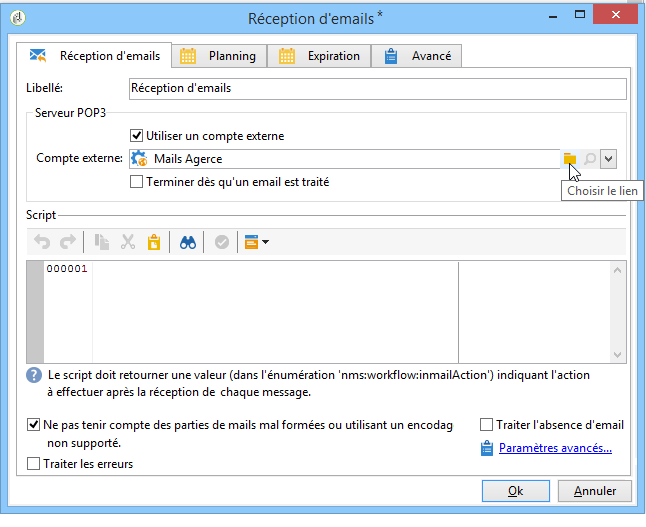
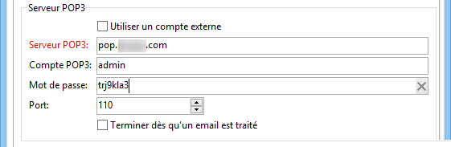
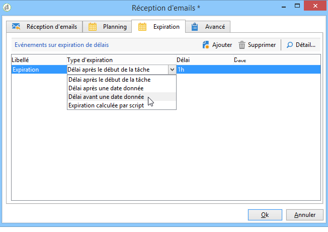

# Réception d&#39;emails{#inbound-emails}

L&#39;activité **Réception d&#39;emails** permet de récupérer et de traiter des emails depuis une messagerie accessible via le protocole POP3.

Le premier onglet de l’activité **Réception d’e-mails** vous permet de renseigner les paramètres du serveur POP3 et de saisir le script à exécuter à la réception de chaque message.Le deuxième onglet vous permet d’attribuer un planning à l’activité et le troisième onglet définit les conditions d’expiration de l’activité.

1. **[!UICONTROL Réception d&#39;emails]**

   * **[!UICONTROL Utiliser un compte externe]**

     Lorsque cette option est activée, vous pouvez sélectionner un compte externe de type POP3 plutôt que de saisir les paramètres de connexion. Le champ **[!UICONTROL Compte externe]** indique le compte externe de type POP3 à utiliser pour se connecter à la messagerie. Ce champ n&#39;est visible que si l&#39;option &#39;Utiliser un compte externe&#39; est activée.

     Si cette option n&#39;est pas sélectionnée, vous devez indiquer les paramètres suivants :

     

      * **[!UICONTROL Serveur POP3]**

        Nom du serveur POP3.

      * **[!UICONTROL Compte POP3]**

        Nom de l&#39;utilisateur.

      * **[!UICONTROL Mot de passe]**

        Mot de passe du compte d’utilisateur.

      * **[!UICONTROL Port]**

        Numéro de port de la connexion POP3.Le port par défaut est 110.

   * **[!UICONTROL Terminer dès qu&#39;un email est traité]**

     Cette option vous permet de traiter les e-mails un par un.L’activité n’active sa transition qu’une seule fois puis termine le traitement en laissant les messages non traités sur le serveur.

1. **[!UICONTROL Script]**

   Le script vous permet de traiter le message et d’effectuer différentes opérations dépendantes du contenu du message.Le script est exécuté pour chaque message et peut décider de l’opération à effectuer sur les messages (laisser ou supprimer le message) et de l’activation de la transition sortante.

   Le code retour doit être une des valeurs suivantes :

   * 1 - Supprime le message sur le serveur et active la transition sortante.
   * 2 - Laisse le message sur le serveur et active la transition sortante.
   * 3 - Supprime le message sur le serveur.
   * 4 - Laisse le message sur le serveur.

   Le contenu du message est accessible depuis la variable globale **[!UICONTROL mailMessage]**.

1. **[!UICONTROL Planning]**

   Pour définir un planning pour l&#39;activité, cliquez sur l&#39;onglet **[!UICONTROL Planning]** et cochez l&#39;option **[!UICONTROL Planifier l&#39;exécution]**. Cliquez ensuite sur le bouton **[!UICONTROL Changer]** pour configurer le planning.

   Le paramétrage du planning est le même que celui de l&#39;activité de planification. Pour plus d&#39;informations, consultez la section [Planificateur](scheduler.md).

1. **[!UICONTROL Expiration]**

   Vous pouvez définir des délais d&#39;expiration à partir de l&#39;onglet **[!UICONTROL Expiration]**.

   

   Le paramétrage est le même que celui de l&#39;activité de planification. Pour plus d&#39;informations, consultez la section [Expirations](defining-approvals.md).
