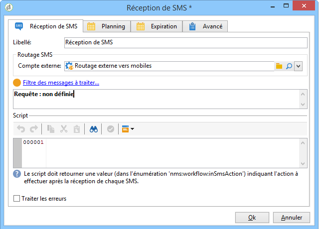
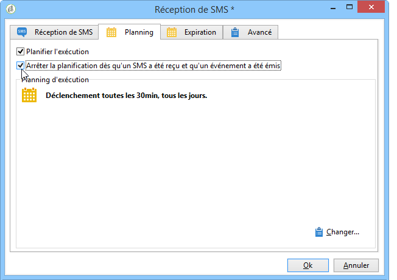

# Réception de SMS{#inbound-sms}

L&#39;activité **Réception de SMS** permet de récupérer et de traiter des SMS depuis un compte externe.

## Propriétés {#properties}

Le premier onglet de l&#39;activité **Réception de SMS** permet de renseigner les paramètres de routage des SMS et de saisir le script à exécuter à la réception de chaque message. Le deuxième onglet permet d&#39;affecter un planning à l&#39;activité et le troisième onglet définit les conditions d&#39;expiration de l&#39;activité.

1. **[!UICONTROL Routage SMS]** : Sélectionnez le compte externe à utiliser pour la réception des SMS. Les comptes externes sont paramétrés depuis le noeud **[!UICONTROL Administration > Plate-forme > Comptes externes]** de l&#39;arborescence.
1. **[!UICONTROL Script]**
1. **[!UICONTROL Planning]**

   

1. **[!UICONTROL Expiration]**

The **[!UICONTROL Script]**, **[!UICONTROL Schedule]** and **[!UICONTROL Expiry]** tabs are detailed in [Inbound Emails](../../workflow/using/inbound-emails.md).
