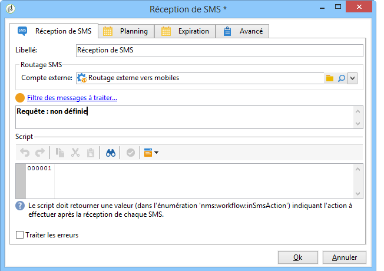
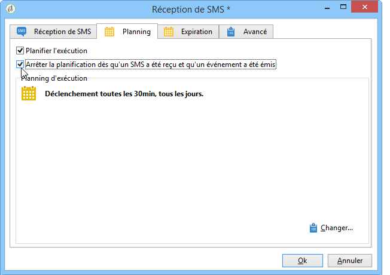

# Réception de SMS {#inbound-sms}

L’activité **Réception de SMS** permet de récupérer et de traiter des SMS depuis un compte externe.

## Propriétés {#properties}

Le premier onglet de l&#39;activité **Réception de SMS** permet de saisir les paramètres de routage des SMS et le script à exécuter à la réception de chaque message. Le deuxième onglet permet d&#39;attribuer un planning à l&#39;activité, le troisième définit les conditions d&#39;expiration de l&#39;activité.

1. **[!UICONTROL Routage SMS]** : sélectionnez le compte externe à utiliser pour la réception des SMS. Les comptes externes sont configurés via le nœud **[!UICONTROL Administration > Plateforme > Comptes externes]** de l&#39;arborescence.
1. **[!UICONTROL Script]**
1. **[!UICONTROL Planning]**

   

1. **[!UICONTROL Expiration]**

Les onglets **[!UICONTROL Script]**, **[!UICONTROL Planning]** et **[!UICONTROL Expiration]** sont décrits dans la section [Réception d’emails](inbound-emails.md).
