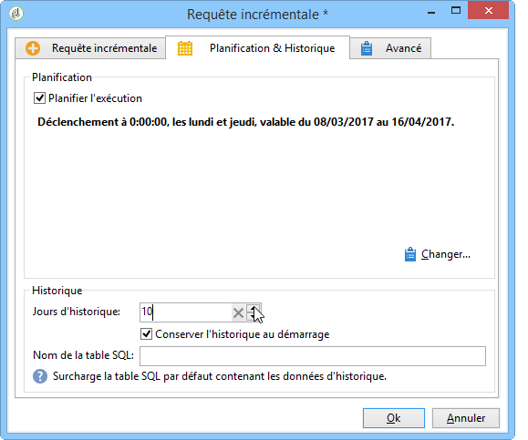

# Requête incrémentale{#incremental-query}

Une requête incrémentale permet de sélectionner périodiquement une cible selon un critère, mais d&#39;exclure les personnes qui ont déjà été ciblées sur ce critère les fois précédentes.

La population déjà ciblée est mémorisée par instance de workflow et par activité, c&#39;est-à-dire que deux workflows démarrés à partir du même modèle ne partagent pas le même historique. En revanche, deux tâches basées sur la même requête incrémentale pour la même instance de workflow utiliseront le même historique.

The query is defined in the same way as for standard queries (refer to [Creating a query](../../workflow/using/query.md#creating-a-query)), but its execution is scheduled.

>[!CAUTION]
>
>Si le résultat de la requête incrémentale est égal à **0** lors de l&#39;une de ses exécutions, le workflow est mis en pause jusqu&#39;à la prochaine exécution programmée de la requête. Les transitions et activités qui suivent la requête incrémentale ne sont alors pas traitée avant l&#39;exécution suivante.

Pour cela :

1. Dans l&#39;onglet **[!UICONTROL Planification &amp; Historique]**, sélectionnez l&#39;option **[!UICONTROL Planifier l&#39;exécution]**. La tâche reste active une fois créée et ne se déclenchera qu&#39;aux heures spécifiées par le planning pour exécuter la requête. En revanche, si l&#39;option est désactivée, la requête est exécutée immédiatement **et une seule fois**.
1. Cliquez sur le bouton **[!UICONTROL Changer]**.

   Dans la fenêtre **[!UICONTROL Assistant d&#39;édition d&#39;un planning]** qui s&#39;affiche, vous pouvez paramétrer le type de périodicité, les événements de la périodicité et la période de validité des événements.

   

1. Cliquez sur **[!UICONTROL Terminer]** pour enregistrer le planning.

   

1. La section inférieure de l&#39;onglet **[!UICONTROL Planification &amp; Historique]** permet de sélectionner le nombre de jours d&#39;historique à prendre en compte.

   

   * **[!UICONTROL Jours d&#39;historique]**

      Les destinataires déjà ciblés peuvent être historisés un nombre maximum de jours à partir du jour où ils sont ciblés. Si cette valeur vaut zéro, les destinataires ne sont jamais supprimés de l&#39;historique.

   * **[!UICONTROL Conserver l&#39;historique au démarrage]**

      Cette option permet de ne pas effacer l&#39;historique lors de l&#39;activation de l&#39;activité.

   * **[!UICONTROL Nom de la table SQL]**

      Ce champ permet de surcharger la table SQL par défaut contenant les données d&#39;historique.

## Exemple de requête incrémentale : mise à jour trimestrielle de listes {#example-of-an-incremental-query--quarterly-list-update}

Dans l&#39;exemple suivant, une requête incrémentale est utilisée afin de mettre à jour automatiquement une liste de destinataires. Ces derniers sont ciblés dans le cadre de campagnes marketing saisonnières.

Ces campagnes étant lancées à chaque début de saison afin de proposer des activités sportives pertinentes, les listes sont mises à jour une fois par trimestre. Cependant, un destinataire ne doit ici être ciblé qu&#39;une fois tous les 9 mois par cette campagne. Cela permet d&#39;espacer la fréquence d&#39;éligibilité d&#39;un destinataire et de lui proposer des activités pour différentes saisons au fil des ans.

1. Placez une activité de requête incrémentale ainsi qu&#39;une activité de mise à jour de liste dans un nouveau workflow.
1. Configure the **[!UICONTROL Incremental query]** tab of the activity as specified in [Creating a query](../../workflow/using/query.md#creating-a-query).
1. Sélectionnez l&#39;onglet **[!UICONTROL Planification &amp; Historique]** et indiquez un historique de 270 jours. Un destinataire déjà ciblé ne sera plus ciblé pour une période de 270 jours, soit environ 9 mois.

   Cliquez ensuite sur le bouton **[!UICONTROL Changer...]**.

1. Le but étant de mettre à jour la liste avant chaque début de saison, sélectionnez le type de périodicité **[!UICONTROL Mensuel]**.
1. À l&#39;écran suivant, sélectionnez les mois de mars, juin, septembre et décembre. Indiquez comme jour le 20 du mois et choisissez l&#39;heure à laquelle lancer l&#39;exécution du workflow.
1. Sélectionnez ensuite la période de validité de la requête. Par exemple, si vous souhaitez que cette dernière soit active en permanence, sélectionnez **[!UICONTROL Validité permanente]**.

   

1. After approving the incremental query, configure the list update activity as explained in [List update](../../workflow/using/list-update.md).

Le workflow sera ainsi lancé automatiquement juste avant chaque début de saison. La liste sera mise à jour avec les nouveaux destinataires éligibles pour recevoir les offres.

## Paramètres de sortie {#output-parameters}

* tableName
* schema
* recCount

Ce triplet de valeurs identifie la population ciblée par la requête. **[!UICONTROL tableName]** est le nom de la table qui mémorise les identifiants de la cible, **[!UICONTROL schema]** est le schéma de la population (habituellement nms:recipient) et **[!UICONTROL recCount]** est le nombre d&#39;éléments dans la table.
