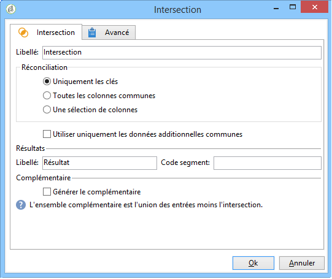
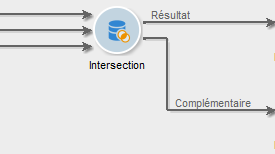
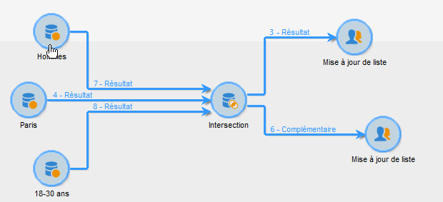

# Intersection{#intersection}

Une activité de type **Intersection** crée une cible à partir de l&#39;intersection des cibles reçues.

Une intersection permet de n&#39;extraire que la population commune à tous les résultats des activités entrantes. La cible est construite avec tous les résultats reçus : toutes les activités antérieures doivent donc être terminées avant que l&#39;intersection ne puisse être exécutée. Pour paramétrer cette activité, vous devez renseigner son libellé et les options relatives au résultat.

Pour plus d’informations sur la configuration et l’utilisation de l’activité d’intersection, voir [Extraction des données d’articulation (intersection)](../../workflow/using/targeting-data.md#extracting-joint-data--intersection-).

Cochez l’ **[!UICONTROL Generate complement]** option si vous souhaitez traiter la population restante. Le complément contiendra l&#39;union des résultats de toutes les activités entrantes moins l&#39;intersection. Une transition sortante supplémentaire sera alors ajoutée à l’activité, comme suit :

## Exemple d&#39;intersection {#intersection-example}

Dans l&#39;exemple suivant, l&#39;intersection a pour but de calculer les destinataires communs à trois requêtes simples afin de les associer à une liste.

1. Insérez une activité de type **[!UICONTROL Intersection]** à la suite de trois requêtes simples.

   Dans cet exemple, les requêtes ciblent respectivement les destinataires masculins, les destinataires vivant à Paris et les destinataires âgés de 18 à 30 ans.

1. Configurez l’intersection. To do this, select the **[!UICONTROL Keys only]** reconciliation method since the populations resulting from the queries contain consistent data.
1. Si vous avez ajouté des données additionnelles au niveau des requêtes, vous pouvez éventuellement choisir de ne conserver que celles qui sont communes en cochant la case correspondante.
1. If you wish to use the rest of the data (in regard to the queries but not their intersection), check the **[!UICONTROL Generate complement]** box.
1. Insérez une activité de mise à jour de liste après le résultat de l&#39;intersection. Insérez également une mise à jour de liste après le complémentaire dans le cas où vous souhaiteriez également l&#39;exploiter.
1. Exécutez le workflow. Ici, deux destinataires correspondent à la fois aux trois requêtes en entrée. Le complément est composé des cinq destinataires qui correspondent uniquement à une ou deux des trois requêtes.

   Le résultat de l&#39;intersection est envoyé vers la première mise à jour de liste. Si vous avez choisi d&#39;exploiter le complément, ce dernier est également envoyé vers la seconde mise à jour de liste.

   

## Paramètres d&#39;entrée {#input-parameters}

* tableName
* schema

Chacun des événements entrants doit spécifier une cible définie par ces paramètres.

## Paramètres de sortie {#output-parameters}

* tableName
* schema
* recCount

Cet ensemble de trois valeurs identifie la cible résultant de l’intersection. **[!UICONTROL tableName]** est le nom de la table qui enregistre les identificateurs de cible, **[!UICONTROL schema]** est le schéma de la population (habituellement **[!UICONTROL nms:recipient]**) et **[!UICONTROL recCount]** est le nombre d’éléments de la table.
