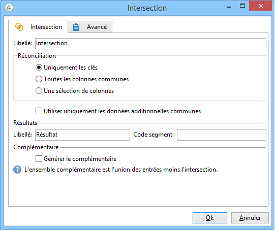
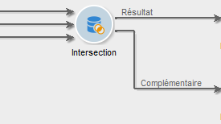
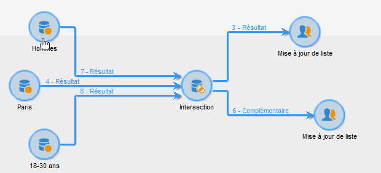

# Intersection{#intersection}

>[!CONTEXTUALHELP]
>id="ac_workflow_intersection"
>title="Activité Intersection"
>abstract="Une activité de type Intersection crée une cible à partir de l’intersection des cibles reçues. Une intersection permet d’extraire uniquement la population commune à tous les résultats de l’activité entrante."

Une activité de type **Intersection** crée une cible à partir de l&#39;intersection des cibles reçues.

Une intersection permet d’extraire uniquement la population commune à tous les résultats de l’activité entrante. La cible est créée avec tous les résultats reçus : toutes les activités antérieures doivent donc être terminées avant que l’intersection puisse être exécutée.Pour configurer cette activité, vous devez saisir son libellé ainsi que les options relatives au résultat.

Pour plus d&#39;informations sur la configuration et l&#39;utilisation de l&#39;activité Intersection, voir la section [Extraire les données communes (Intersection)](targeting-data.md#extracting-joint-data--intersection-).

Cochez l’option **[!UICONTROL Générer le complémentaire]** si vous souhaitez exploiter la population restante. Le complémentaire contiendra l’union des résultats de toutes les activités entrantes, moins l’intersection. Une seconde transition sortante sera alors ajoutée à l’activité, comme suit :

## Exemple d&#39;intersection {#intersection-example}

Dans l&#39;exemple suivant, l&#39;intersection a pour but de calculer les destinataires communs à trois requêtes simples afin de les associer à une liste.

1. Insérez une activité de type **[!UICONTROL Intersection]** à la suite de trois requêtes simples.

   Dans cet exemple, les requêtes ciblent respectivement les destinataires masculins, les destinataires vivant à Paris et les destinataires âgés de 18 à 30 ans.

1. Paramétrez l&#39;intersection. Pour cela, sélectionnez la méthode de réconciliation **[!UICONTROL Uniquement les clés]** dans la mesure où les populations issues des requêtes contiennent des données homogènes.
1. Si vous avez ajouté des données additionnelles au niveau des requêtes, vous pouvez éventuellement choisir de ne conserver que celles qui sont communes en cochant la case correspondante.
1. Si vous souhaitez utiliser le reste des données (correspondant aux requêtes, mais pas à leur intersection), cochez la case **[!UICONTROL Générer le complémentaire]**.
1. Ajoutez une activité de mise à jour de liste après le résultat de l’intersection.Vous pouvez aussi ajouter une mise à jour de liste après le complémentaire dans le cas où vous souhaiteriez également l’utiliser.
1. Exécutez le workflow.Ici, deux personnes destinataires correspondent aux trois requêtes en entrée.Le complémentaire est composé de cinq personnes destinataires qui correspondent uniquement à une ou deux des trois requêtes.

   Le résultat de l’intersection est envoyé vers la première mise à jour de liste.Si vous avez choisi d’utiliser le complémentaire, ce dernier est également envoyé vers la seconde mise à jour de liste.

   

## Paramètres d&#39;entrée {#input-parameters}

* tableName
* schéma

Chacun des événements entrants doit spécifier une cible définie par ces paramètres.

## Paramètres de sortie {#output-parameters}

* tableName
* schéma
* recCount

Ce triplet de valeurs identifie la cible résultant de l&#39;intersection. **[!UICONTROL tableName]** est le nom de la table qui mémorise les identifiants de la cible, **[!UICONTROL schema]** est le schéma de la population (habituellement **[!UICONTROL nms:recipient]**) et **[!UICONTROL recCount]** est le nombre d’éléments dans la table.

