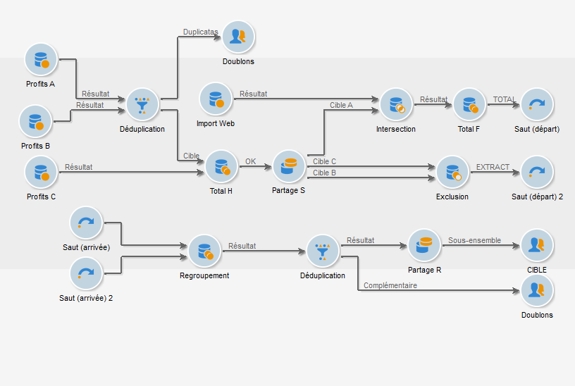
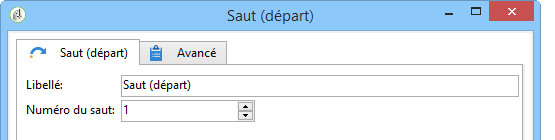

# Saut (départ et arrivée){#jump-start-point-and-end-point}

Les objets graphiques de type **[!UICONTROL Saut]** sont utilisés pour améliorer la lisibilité d&#39;un diagramme complexe, notamment dans le cas où des transitions se croisent.

Les sauts sont des transitions sans flèches : ils permettent de passer d&#39;une activité à une autre, comme dans l&#39;exemple ci-dessous.

Pour chaque saut de type &quot;départ&quot;, un saut de type &quot;arrivée&quot; doit être positionné.

Vous pouvez insérer plusieurs sauts de départ et d&#39;arrivée dans un même workflow. Ils sont identifiés par un numéro qui doit être saisi dans les paramètres :

Pour améliorer la lisibilité du diagramme, vous pouvez modifier l’image associée aux sauts afin d’afficher le numéro associé. Voir [Gestion des images](../../workflow/using/managing-activity-images.md)d’activité.
