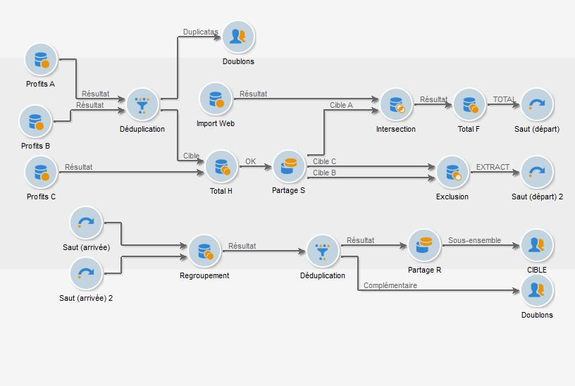
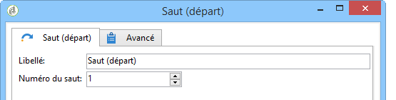

# Saut (départ et arrivée){#jump-start-point-and-end-point}

Les objets graphiques de type **[!UICONTROL Saut]** sont utilisés pour améliorer la lisibilité d&#39;un diagramme complexe, notamment dans le cas où des transitions se croisent.

Les sauts sont des transitions sans flèches.

Ils vont d’une activité à l’autre, comme dans l’exemple suivant :

Pour chaque saut de type &quot;départ&quot;, un saut de type &quot;arrivée&quot; doit être positionné.

Vous pouvez insérer plusieurs sauts de point de départ et d&#39;arrivée dans le même workflow. Ils sont identifiés par un numéro qui doit être saisi dans les paramètres :

Afin d&#39;améliorer la lisibilité du diagramme, vous pouvez changer l&#39;image associée aux sauts afin d&#39;afficher le chiffre correspondant. Pour plus dʼinformations, consultez la section [Modification des images dʼactivité](managing-activity-images.md).
