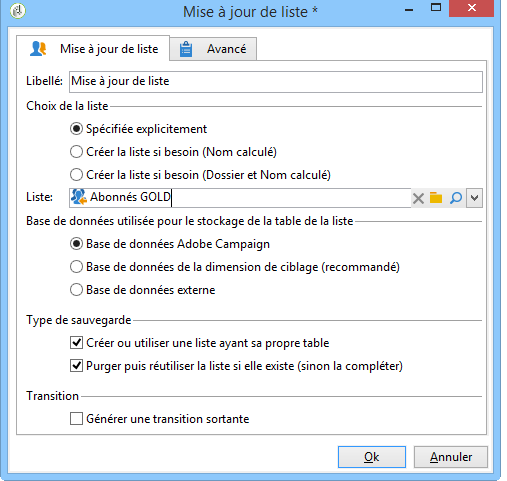
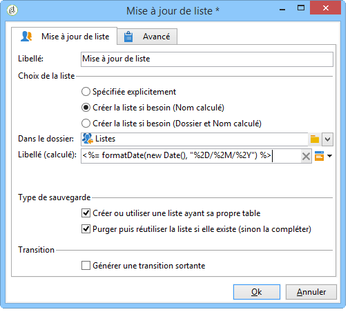
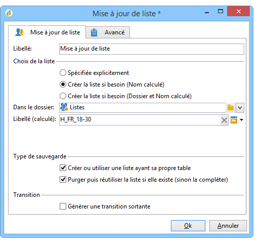

# Mise à jour de liste{#list-update}

Une activité de type **Mise à jour de liste** enregistre la population spécifiée par la transition dans une liste de destinataires.

La liste peut être sélectionnée parmi les listes existantes.

Il peut également être créé à l’aide des options **[!UICONTROL Create the list if necessary (Computed name)]** et **[!UICONTROL Create the list if necessary (Computed Folder and Name)]** . Ces options vous permettent de sélectionner l’étiquette de votre choix pour créer une liste, puis plus tard, le dossier dans lequel elle sera enregistrée. Le libellé peut également être généré automatiquement en insérant des champs dynamiques ou un script. Les différents champs dynamiques sont disponibles dans le menu contextuel à droite de l’étiquette.

Si la liste existe déjà, les destinataires sont ajoutés au contenu existant, sauf si vous cochez l’ **[!UICONTROL Purge the list if it exists (otherwise add to the list)]** option. Dans ce cas, le contenu de la liste est supprimé avant la mise à jour.

Si vous souhaitez que la liste créée ou mise à jour utilise un tableau autre que le tableau des destinataires, cochez l’ **[!UICONTROL Create or use a list with its own table]** option.

Pour utiliser cette option, les tables spécifiques concernées doivent avoir été configurées dans votre instance Adobe Campaign.

En règle générale, l’enregistrement d’une cible dans une liste marque la fin d’un processus. Par défaut, l’ **[!UICONTROL List update]** activité n’a donc pas de transition sortante. Cochez l’ **[!UICONTROL Generate an outbound transition]** option pour en ajouter une.

## Exemple : mise à jour de liste {#example--list-update}

Dans l&#39;exemple suivant, l&#39;activité de mise à jour de liste suit une requête permettant de cibler les hommes de plus de 30 ans vivant en France. Dans un premier temps, la liste sera créée à partir des résultats de la requête. Elle sera mise à jour à chaque lancement ultérieur du workflow. Elle pourra par exemple être utilisée régulièrement dans le cadre de campagnes d&#39;offres promotionnelles ciblées.

1. Add a **[!UICONTROL list update activity]** directly after a query then open it up to edit it.

   For more on creating a query in a workflow, refer to [Query](../../workflow/using/query.md).

1. Choisissez éventuellement un libellé pour l&#39;activité.
1. Select the **[!UICONTROL Create the list if necessary (Calculated name)]** option to show that the list will be created once the first workflow has been executed, then updated with the following executions.
1. Sélectionnez le dossier dans lequel vous souhaitez enregistrer la liste.
1. Saisissez le libellé de la liste. Insérez éventuellement des champs dynamiques afin de calculer automatiquement le nom de la liste. Dans cet exemple, la liste porte le même nom que la requête, afin d&#39;identifier plus simplement son contenu.
1. Laissez l’ **[!UICONTROL Purge the list if it exists (otherwise add to the list)]** option cochée pour supprimer les destinataires qui ne correspondent pas aux critères de ciblage et pour insérer les nouveaux destinataires dans la liste.
1. Laissez également l’ **[!UICONTROL Create or use a list with its own table]** option cochée.
1. Ne cochez pas l’ **[!UICONTROL Generate an outbound transition]** option.
1. Cliquez sur **[!UICONTROL Ok]** puis lancez l&#39;exécution du workflow.

   

   La liste de destinataires correspondante est alors créée ou mise à jour.

Voir à ce propos la vidéo sur la [création d&#39;une liste de destinataires](https://docs.campaign.adobe.com/doc/AC/en/Videos/Videos.html).

## Paramètres d&#39;entrée {#input-parameters}

* tableName
* schema

Identifie la population à sauvegarder dans le groupe.

## Paramètres de sortie {#output-parameters}

* groupId

Identifiant du groupe.
