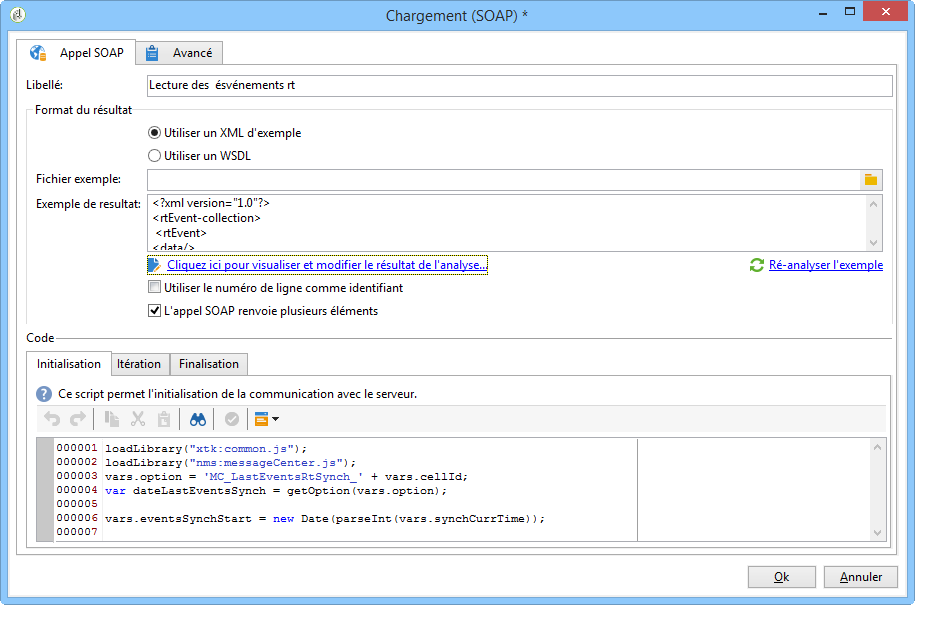
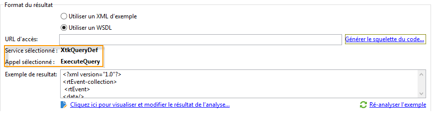
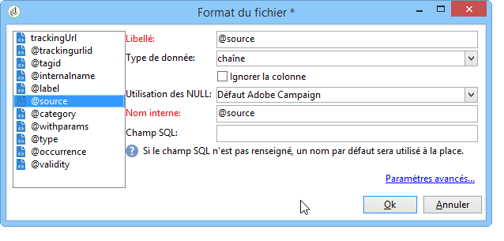

# Chargement (SOAP){#loading-soap}

>[!CAUTION]
>
>L&#39;activité **Chargement (SOAP)** nécessite l&#39;installation du module **FDA (Federated Data Access)**. Vérifiez votre contrat de licence.

L&#39;activité de **Chargement (SOAP)** est notamment utilisée en complément de l&#39;activité de **chargement (SGBD)** pour les cas où la collecte de données directement via le FDA dans une base externe n&#39;est pas possible.

Le principe de fonctionnement est le suivant :

1. Choisissez entre l&#39;utilisation d&#39;un XML d&#39;exemple ou d&#39;une WSDL.

   L&#39;exemple suivant est issu d&#39;un workflow technique du module Message Center.

   

1. Dans le cas d&#39;un XML d&#39;exemple, sélectionnez un fichier d&#39;exemple. Le fichier est analysé afin d&#39;établir un exemple de résultat.

   Dans le cas d&#39;une WSDL, entrez l&#39;URL d&#39;accès correspondante puis générez le squelette du code. Le service et l&#39;appel sélectionnés sont automatiquement mis à jour et s&#39;affichent.

   

1. Sélectionnez **[!UICONTROL Click here to view and edit analysis results]** pour spécifier chaque colonne identifiée.

   

   Si vous souhaitez mettre à jour l’exemple, sélectionnez **[!UICONTROL Re-analyze the example]**.

   Vous pouvez également personnaliser le format des données de colonne via le **[!UICONTROL Advanced parameters]** lien. For more on formatting imported data, refer to this [section](../../platform/using/importing-data.md#import-wizard).

1. Si vous le souhaitez, vous pouvez choisir d&#39;utiliser le numéro de ligne comme identifiant et/ou indiquer que l&#39;appel SOAP renvoie plusieurs éléments.
1. Saisissez les scripts des onglets suivants selon leur fonction :

   * **[!UICONTROL Initialization]**: établit une connexion SOAP.
   * **[!UICONTROL Iteration]**: effectue l’appel au service SOAP. Le retour de cette fonction doit être un objet XML compatible avec la description de l’exemple ou du fichier WSDL.

      Le code de cet onglet sera appelé en boucle par Adobe Campaign jusqu&#39;à ce qu&#39;un objet XML null soit retourné.

   * **[!UICONTROL Finalization]**: ferme la connexion et/ou libère d’autres ressources créées pendant le traitement.

