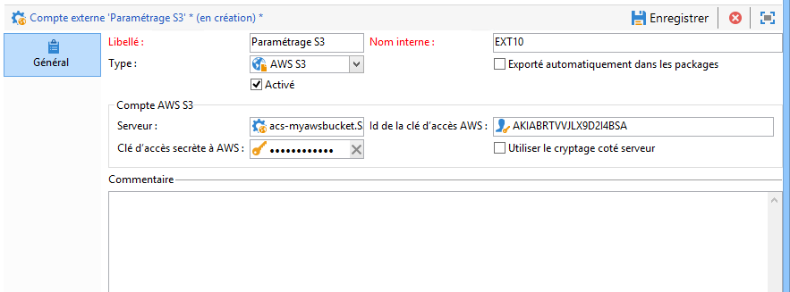
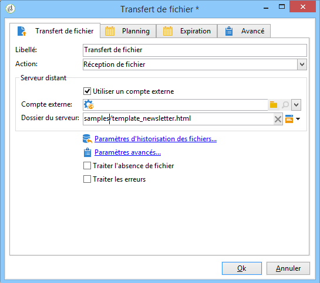
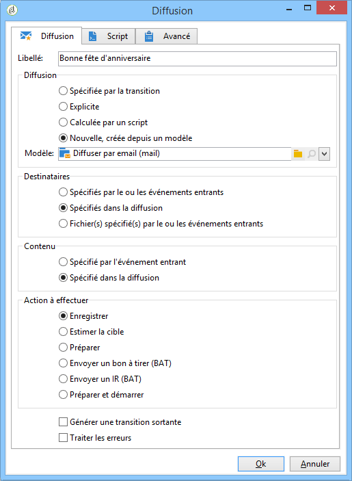
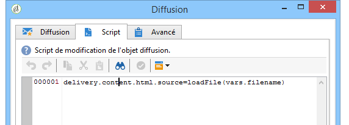

# Charger le contenu d&#39;une diffusion{#loading-delivery-content}

Si le contenu de votre diffusion figure dans un fichier HTML qui se trouve sur un serveur Amazon S3, FTP ou SFTP, vous pouvez facilement charger ce contenu dans les diffusions Adobe Campaign.

Pour cela :

1. If you haven&#39;t already defined a connection between Adobe Campaign and the (S)FTP server hosting the content files, create a new S3, FTP or SFTP external account in **[!UICONTROL Administration]** > **[!UICONTROL Platform]** > **[!UICONTROL External Accounts]**. Specify in this external account the address and credentials used to establish the connection to the S3 or (S)FTP server.

   Voici un exemple d&#39;un compte externe S3 :

   

1. Créez un flux de travail, par exemple à partir de **[!UICONTROL Profiles and Targets]** > **[!UICONTROL Jobs]** > **[!UICONTROL Targeting workflows]**.
1. Add a **[!UICONTROL File transfer]** activity into your workflow, and configure it by specifying

   * le compte externe à utiliser pour la connexion au serveur S3, FTP ou SFTP ;
   * le chemin d&#39;accès au fichier sur le serveur S3, FTP ou SFTP.
   

1. Ajoutez une **[!UICONTROL Delivery]** activité et connectez-la à la transition sortante de l’ **[!UICONTROL File transfer]** activité. Configurez-le comme suit :

   * Diffusion : selon vos besoins, il peut s&#39;agir d&#39;une diffusion spécifique qui a déjà été créée dans le système ou d&#39;une nouvelle diffusion reposant sur un modèle existant.
   * Destinataires : dans cet exemple, la cible est spécifiée dans la diffusion elle-même.
   * Content: Even if the content is imported in the previous activity, select **[!UICONTROL Specified in the delivery]**. As the content is imported directly from a file located on a remote server, it has no identifier when processed by the workflow and cannot be identified as coming from the inbound event.
   * Action to perform: Select **[!UICONTROL Save]** to save the delivery and be able to access it from **[!UICONTROL Campaign management]** > **[!UICONTROL Deliveries]** once the workflow is executed.
   

1. In the **[!UICONTROL Script]** tab of the **[!UICONTROL Delivery]** activity, add the following command to load the content of the imported file in the delivery:

   ```
   delivery.content.md.source=loadFile(vars.filename)
   ```

   

1. Enregistrez et exécutez le workflow. Une nouvelle diffusion avec le contenu chargé est créée sous **[!UICONTROL Campaign management]** > **[!UICONTROL Deliveries]**.

>[!NOTE]
>
>Les bonnes pratiques et la résolution des problèmes liées à l&#39;utilisation du serveur SFTP sont présentées [dans cette page](../../platform/using/sftp-server-usage.md).

