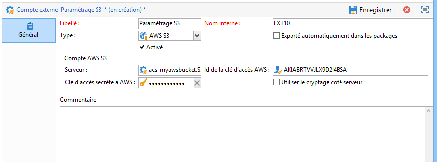
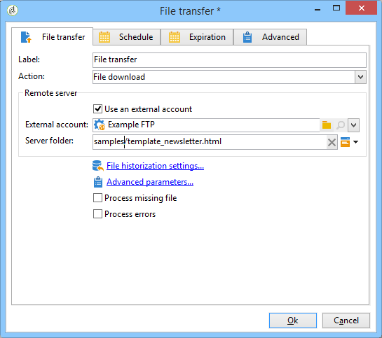
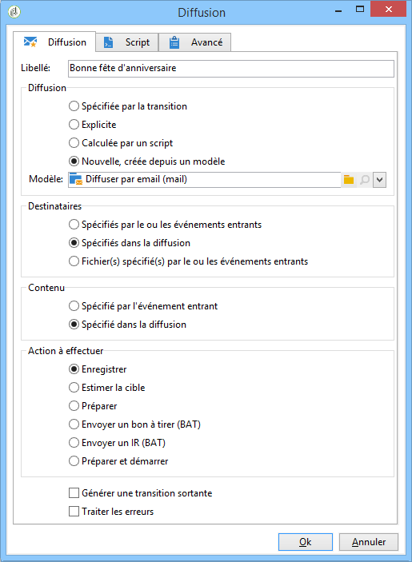
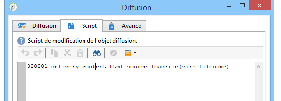

# Charger le contenu de la diffusion{#loading-delivery-content}


Si le contenu de votre diffusion figure dans un fichier HTML qui se trouve sur un serveur Amazon S3, FTP ou SFTP, vous pouvez facilement charger ce contenu dans les diffusions Adobe Campaign.

Pour cela :

1. Si vous n’avez pas encore défini de connexion entre Adobe Campaign et le serveur FTP ou SFTP hébergeant les fichiers de contenu, créez un compte externe S3, FTP ou SFTP dans **[!UICONTROL Administration]** > **[!UICONTROL Plateforme]** > **[!UICONTROL Comptes externes]**. Spécifiez dans ce compte externe l&#39;adresse et les informations d&#39;identification utilisées pour établir la connexion au serveur S3 ou (S)FTP.

   Voici un exemple d&#39;un compte externe S3 :

   

1. Créez un workflow depuis par exemple **[!UICONTROL Profils et Cibles]** > **[!UICONTROL Traitements]** > **[!UICONTROL Workflows de ciblage]**.
1. Ajoutez une activité **[!UICONTROL Transfert de fichier]** à votre workflow, puis configurez-la en indiquant les informations suivantes :

   * le compte externe à utiliser pour la connexion au serveur S3, FTP ou SFTP ;
   * le chemin d&#39;accès au fichier sur le serveur S3, FTP ou SFTP.

   

1. Ajoutez une activité **[!UICONTROL Diffusion]** et connectez-la à la transition sortante de l&#39;activité **[!UICONTROL Transfert de fichier]**. Configurez-le comme suit :

   * Diffusion : selon vos besoins, il peut s&#39;agir d&#39;une diffusion spécifique qui a déjà été créée dans le système ou d&#39;une nouvelle diffusion reposant sur un modèle existant.
   * Destinataires : dans cet exemple, la cible est spécifiée dans la diffusion elle-même.
   * Contenu : Même si le contenu est importé dans l&#39;activité précédente, sélectionnez **[!UICONTROL Spécifié dans la diffusion]**. Comme le contenu est importé directement à partir d&#39;un fichier situé sur un serveur distant, il n&#39;a pas d&#39;identifiant lorsqu&#39;il est traité par le workflow et ne peut pas être identifié comme provenant de l&#39;événement entrant.
   * Action à effectuer : sélectionnez **[!UICONTROL Enregistrer]** pour enregistrer la diffusion et y accéder depuis **[!UICONTROL Gestion de campagne]** > **[!UICONTROL Diffusions]** une fois le workflow exécuté.

   

1. Dans l&#39;onglet **[!UICONTROL Script]** de l&#39;activité **[!UICONTROL Diffusion]**, ajoutez la commande suivante pour charger le contenu du fichier importé dans la diffusion :

   ```
   delivery.content.html.source=loadFile(vars.filename)
   ```

   

1. Enregistrez et exécutez le workflow. Une diffusion avec le contenu chargé est créée dans **[!UICONTROL Gestion de campagne]** > **[!UICONTROL Diffusions]**.

>[!NOTE]
>
>Les bonnes pratiques et la résolution des problèmes liées à l&#39;utilisation du serveur SFTP sont présentées [dans cette page](../../platform/using/sftp-server-usage.md).
