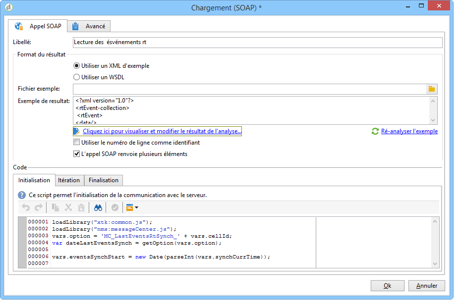
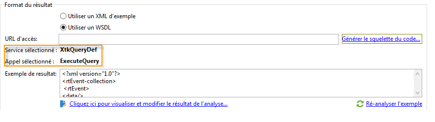
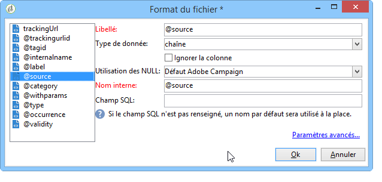

# Chargement (SOAP){#loading-soap}

>[!CAUTION]
>
>L’activité **Chargement (SOAP)** n’est disponible que si le module **FDA (Federated Data Access)** est installé. Veuillez vérifier votre contrat de licence.

L&#39;activité de **Chargement (SOAP)** est notamment utilisée en complément de l&#39;activité de **chargement (SGBD)** pour les cas où la collecte de données directement via le FDA dans une base externe n&#39;est pas possible.

Le principe de fonctionnement est le suivant :

1. Choisissez entre l&#39;utilisation d&#39;un XML d&#39;exemple ou d&#39;une WSDL.

   L&#39;exemple suivant est issu d&#39;un workflow technique du module Message Center.

   

1. Pour obtenir un exemple XML, sélectionnez un fichier d’exemple. Le fichier est analysé pour établir un exemple de résultat.

   Pour un fichier WSDL, saisissez l’URL d’accès correspondante, puis générez le squelette du code. Le service et l&#39;appel sélectionnés sont automatiquement mis à jour et affichés.

   

1. Sélectionnez **[!UICONTROL Cliquez ici pour visualiser et modifier le résultat de l&#39;analyse]** afin de définir chaque colonne identifiée.

   

   Si vous souhaitez mettre à jour l&#39;exemple, sélectionnez **[!UICONTROL Ré-analyser l&#39;exemple]**.

   Vous pouvez également personnaliser les mises en forme des données des colonnes via le lien **[!UICONTROL Paramètres avancés]**. Pour plus d&#39;informations à propos de la mise en forme de données importées, consultez cette [section](../../platform/using/executing-import-jobs.md).

1. Si vous le souhaitez, vous pouvez choisir d&#39;utiliser le numéro de ligne comme identifiant et/ou indiquer que l&#39;appel SOAP renvoie plusieurs éléments.
1. Saisissez les scripts des onglets suivants selon leur fonction :

   * **[!UICONTROL Initialisation]** : établissement de la connexion SOAP.
   * **[!UICONTROL Itération]** : effectue l’appel au service SOAP. Le retour de cette fonction doit être un objet XML compatible avec la description de l’exemple ou du WSDL.

     Le code de cet onglet sera appelé en boucle par Adobe Campaign jusqu&#39;à ce qu&#39;un objet XML null soit retourné.

   * **[!UICONTROL Finalisation]** : fermeture de la connexion et/ou libération des autres ressources créées lors du traitement.
