# Validation en local{#local-approval}

Intégrée à un workflow de ciblage, l&#39;activité **[!UICONTROL Validation en local]** permet de mettre en place un processus de validation des destinataires avant l&#39;envoi d&#39;une diffusion.

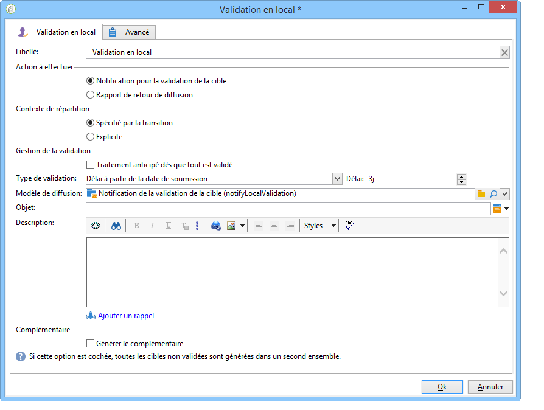

>[!CAUTION]
>
>Pour utiliser cette activité, vous devez acquérir le module Distributed Marketing, qui est une option de Campaign. Vérifiez votre contrat de licence.

Pour un exemple de l’activité d’approbation **** locale avec un modèle de distribution, reportez-vous à [Utilisation de l’activité](../../workflow/using/using-the-local-approval-activity.md)d’approbation locale.

Renseignez tout d&#39;abord libellé de l&#39;activité et le champ **[!UICONTROL Action à effectuer]** :

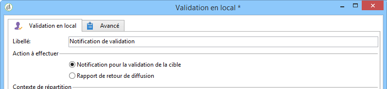

* Sélectionnez l&#39;option **[!UICONTROL Notification pour la validation de la cible]** pour envoyer un email de notification aux responsables locaux, avant la diffusion, afin qu&#39;ils valident les destinataires qui leur sont assignés.

   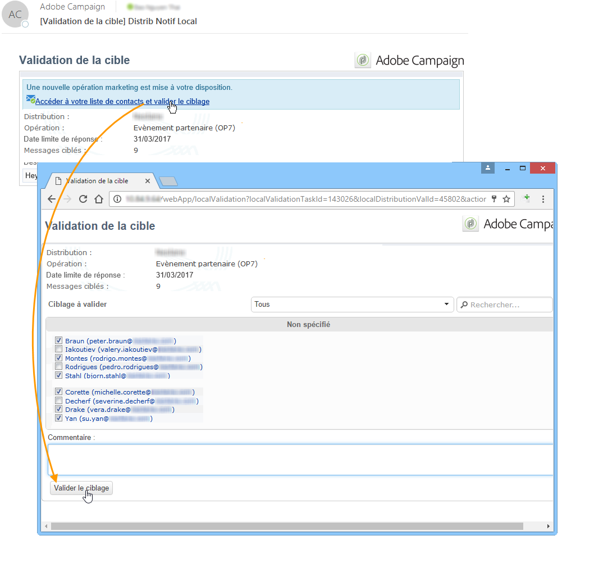

* **Requête** incrémentielle : vous permet d’exécuter une requête et de planifier son exécution. Refer to the [Incremental query](../../workflow/using/incremental-query.md) section.

   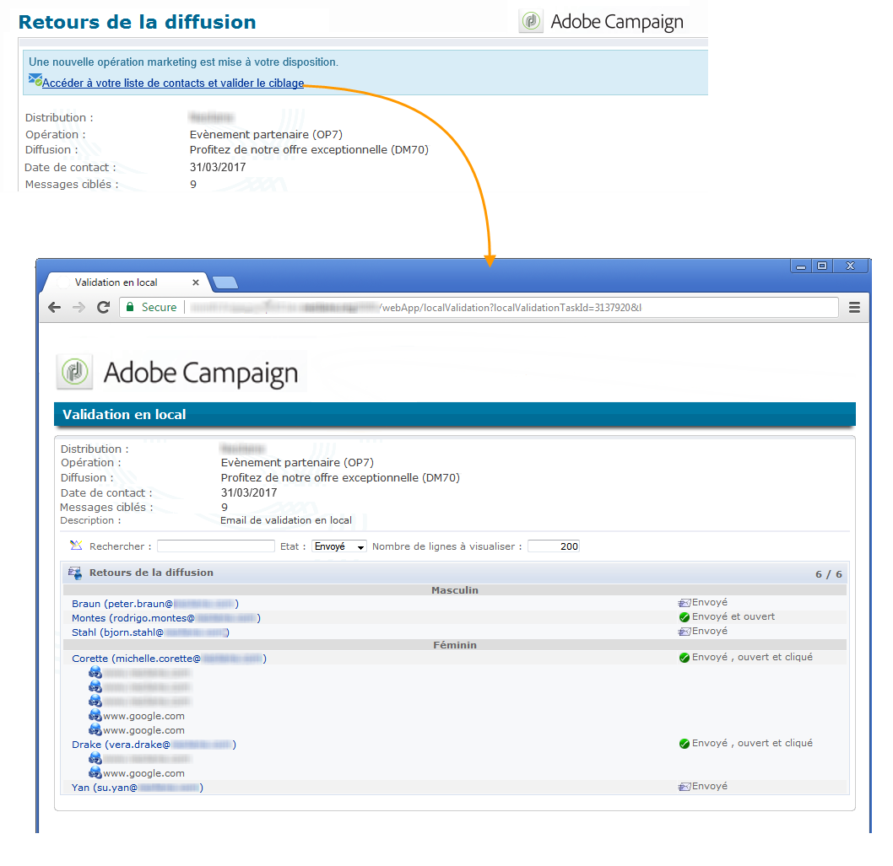

## Notification pour la validation de la cible {#target-approval-notification}

Dans ce cas, l&#39;activité **[!UICONTROL Validation en local]** se place entre le ciblage en amont et la diffusion :

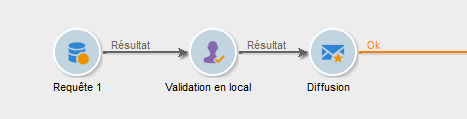

Les champs à renseigner dans le cas d&#39;une notification pour la validation de la cible sont les suivants :

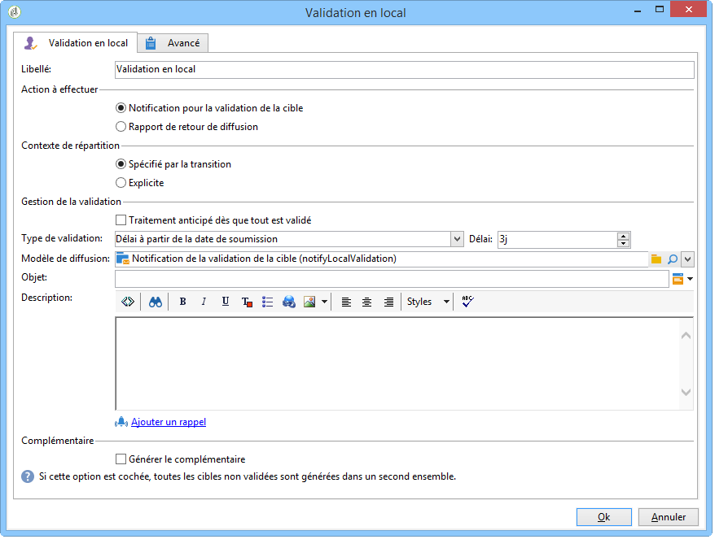

* **[!UICONTROL Contexte de répartition]** : sélectionnez l&#39;option **[!UICONTROL Spécifié par la transition]** si vous utilisez une activité de type **[!UICONTROL Partage]** pour limiter la population ciblée. Dans ce cas, le modèle de répartition est renseigné dans l&#39;activité de partage. Si vous ne limitez pas la population ciblée, sélectionnez ici l&#39;option **[!UICONTROL Explicite]** et renseignez le modèle de répartition dans le champ **[!UICONTROL Répartition des données]**.

   Pour plus d’informations sur la création d’un modèle de distribution de données, voir [Limitation du nombre d’enregistrements de sous-ensembles par distribution](../../workflow/using/split.md#limiting-the-number-of-subset-records-per-data-distribution)de données.

* **[!UICONTROL Gestion de la validation :]**

   * Sélectionnez le modèle de diffusion ainsi que l&#39;objet qui seront utilisés pour l&#39;email de notification. Un modèle par défaut est disponible : **[!UICONTROL Notification de la validation en local]**. Vous pouvez également ajouter une description qui apparaîtra au-dessus des listes de destinataires dans les notifications de validation et de retour.
   * Définissez le **[!UICONTROL Type de validation]**, qui correspond à la date limite de validation (date ou délai à partir du début de la validation). A cette date, le workflow reprend et les destinataires qui n&#39;ont pas été validés ne sont pas pris en compte dans le ciblage. Lorsque les notifications sont envoyées, l&#39;activité est mise en attente afin que les responsables locaux puissent valider leurs contacts.

      >[!NOTE]
      >
      >Par défaut, lorsque la validation débute, l&#39;activité est mise en attente pendant trois jours.

      Vous avez également la possibilité d&#39;ajouter un ou plusieurs rappels afin d&#39;informer les responsables locaux que la date limite de validation approche. Pour cela, cliquez sur le lien **[!UICONTROL Ajouter un rappel]**.

* **[!UICONTROL Complémentaire]** : L&#39;option **[!UICONTROL Générer le complémentaire]** permet de générer un second ensemble contenant toutes les cibles non validées.

   >[!NOTE]
   >
   >Par défaut, cette option est désactivée.

## Rapport de retour de diffusion {#delivery-feedback-report}

Dans ce cas, l&#39;activité **[!UICONTROL Validation en local]** se place après la diffusion :

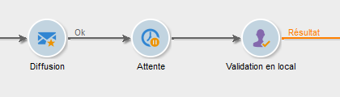

Les champs à renseigner dans le cas d&#39;un rapport de retour de diffusion sont les suivants :

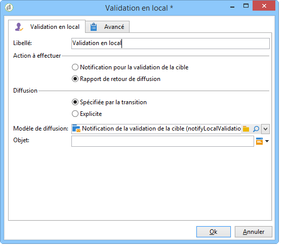

* Sélectionnez l&#39;option **[!UICONTROL Spécifiée par la transition]** si la diffusion a été renseignée dans une activité précédente. Sélectionnez **[!UICONTROL Explicite]** pour spécifier la diffusion dans l&#39;activité de validation en local.
* Sélectionnez le modèle de diffusion ainsi que l&#39;objet qui seront utilisés pour l&#39;email de notification. Un modèle par défaut est disponible : **[!UICONTROL Notification de la validation en local]**.

## Exemple : validation de la diffusion d&#39;un workflow {#example--approving-a-workflow-delivery}

Cet exemple montre comment configurer un processus d&#39;approbation pour une diffusion de processus. Pour plus d’informations sur la création de processus de remise, voir [Exemple : section du processus](../../workflow/using/delivery.md#example--delivery-workflow) de remise.

Pour valider un envoi, un opérateur dispose de deux modes : il peut utiliser la page Web dont l&#39;URL est fournie dans l&#39;email envoyé, ou valider directement depuis la console.

* Validation Web

   L&#39;email adressé aux opérateurs du groupe Administrateur permet de valider la cible de l&#39;envoi. Le message reprend le texte défini en remplaçant l&#39;expression JavaScript par la valeur calculée (ici &#39;574&#39;).

   Pour valider l&#39;envoi, cliquez sur le lien correspondant et connectez-vous à la console Adobe Campaign.

   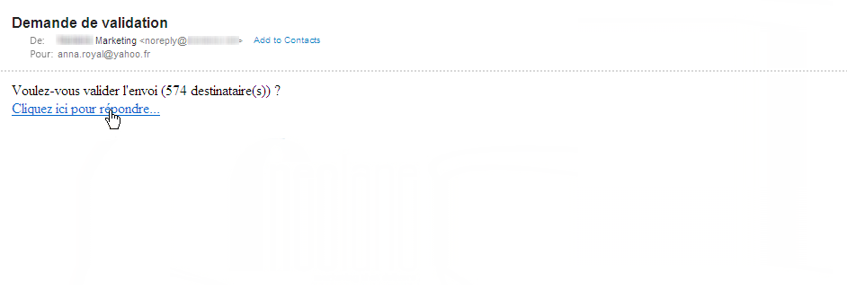

   Sélectionnez votre choix et cliquez sur le bouton **[!UICONTROL Soumettre]**.

   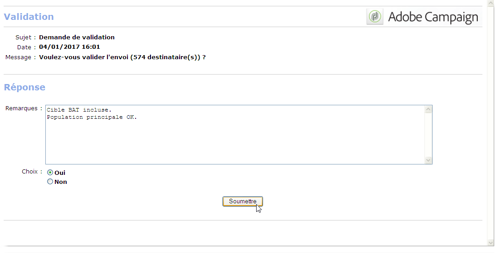

* Validation depuis la console

   Dans l&#39;arborescence, le noeud **[!UICONTROL Administration > Exploitation > Objets créés automatiquement > Validations en attente]** contient la liste des tâches à valider par l&#39;opérateur actuellement connecté. La liste doit afficher une ligne. Double-cliquez sur la ligne pour répondre. La fenêtre suivante s&#39;affiche :

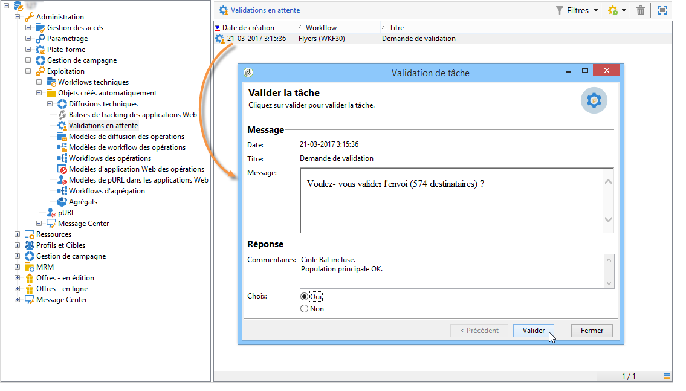

Sélectionnez l&#39;option **Oui**, puis cliquez sur le bouton **[!UICONTROL Valider]**. Un message vous informe que la réponse est enregistrée.

Revenez sur l&#39;écran des workflows : au bout de quelques dizaines de secondes, le diagramme se présente comme suit:

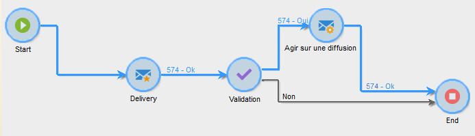

Le workflow a exécuté la tâche **[!UICONTROL Agir sur une diffusion]**, qui consiste ici à démarrer la diffusion précédemment créée, puis est arrivé jusqu&#39;à la fin. Le workflow s&#39;est terminé avec succès.
