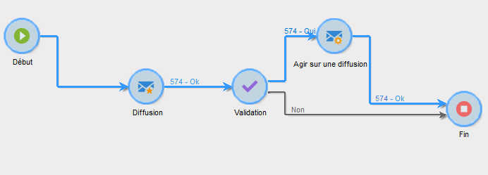

# Validation en local{#local-approval}

When integrated into a targeting workflow, the **[!UICONTROL Local approval]** activity lets you set up a recipient approval process before the delivery is sent.

>[!CAUTION]
>
>Pour utiliser cette activité, vous devez acquérir le module Distributed Marketing, qui est une option de Campaign. Vérifiez votre contrat de licence.

Pour un exemple de l’ **[!UICONTROL Local approval]** activité avec un modèle de distribution, reportez-vous à [Utilisation de l’activité](../../workflow/using/using-the-local-approval-activity.md)d’approbation locale.

Start by entering a label for the activity and the **[!UICONTROL Action to execute]** field:

* Select the **[!UICONTROL Target approval notification]** option to send a notification email to local supervisors before the delivery, asking them to approve the recipients assigned to them.

   

* **Requête** incrémentielle : vous permet d’exécuter une requête et de planifier son exécution. Refer to the [Incremental query](../../workflow/using/incremental-query.md) section.

   

## Notification pour la validation de la cible {#target-approval-notification}

In this case, the **[!UICONTROL Local approval]** activity is placed between upstream targeting and the delivery:

Les champs à renseigner dans le cas d&#39;une notification pour la validation de la cible sont les suivants :

* **[!UICONTROL Distribution context]**: sélectionnez l’ **[!UICONTROL Specified in the transition]** option si vous utilisez une activité de **[!UICONTROL Split]** type pour limiter la population ciblée. Dans ce cas, le modèle de distribution est entré dans l’activité de division. Si vous ne limitez pas la population ciblée, sélectionnez l’ **[!UICONTROL Explicit]** option ici et entrez le modèle de distribution dans le **[!UICONTROL Data distribution]** champ.

   Pour plus d’informations sur la création d’un modèle de distribution de données, voir [Limitation du nombre d’enregistrements de sous-ensembles par distribution](../../workflow/using/split.md#limiting-the-number-of-subset-records-per-data-distribution)de données.

* **[!UICONTROL Approval management]**

   * Select the delivery template and the subject that will be used for the email notification. A default template is available: **[!UICONTROL Local approval notification]**. You can also add a description that will appear above the recipient lists in the approval and feedback notifications.
   * Indiquez le **[!UICONTROL Approval type]** qui correspond à la date limite d’approbation (date ou date limite à partir du début de l’approbation). À cette date, le processus recommence et les destinataires qui n’ont pas été approuvés ne sont pas pris en compte dans le ciblage. Une fois les notifications envoyées, l’activité est mise en file d’attente afin que les superviseurs locaux puissent approuver leurs contacts.

      >[!NOTE]
      >
      >Par défaut, lorsque la validation débute, l&#39;activité est mise en attente pendant trois jours.

      Vous pouvez également ajouter un ou plusieurs rappels pour informer les superviseurs locaux que la date limite approche. To do this, click the **[!UICONTROL Add a reminder]** link.

* **[!UICONTROL Complementary set]**: l’ **[!UICONTROL Generate complement]** option vous permet de générer un second jeu qui inclut toutes les cibles non approuvées.

   >[!NOTE]
   >
   >Par défaut, cette option est désactivée.

## Rapport de retour de diffusion {#delivery-feedback-report}

In this case, the **[!UICONTROL Local approval]** activity is placed after the delivery:

Les champs à renseigner dans le cas d&#39;un rapport de retour de diffusion sont les suivants :

* Sélectionnez l’ **[!UICONTROL Specified in the transition]** option si la remise a été saisie au cours d’une activité précédente. Sélectionnez **[!UICONTROL Explicit]** pour spécifier la diffusion dans l’activité d’approbation locale.
* Select the delivery template and the object of the notification email. There is a default template: **[!UICONTROL Local approval notification]**.

## Exemple : validation de la diffusion d&#39;un workflow {#example--approving-a-workflow-delivery}

Cet exemple montre comment configurer un processus d&#39;approbation pour une diffusion de processus. Pour plus d’informations sur la création de processus de remise, voir [Exemple : section du processus](../../workflow/using/delivery.md#example--delivery-workflow) de remise.

Pour valider un envoi, un opérateur dispose de deux modes : il peut utiliser la page Web dont l&#39;URL est fournie dans l&#39;email envoyé, ou valider directement depuis la console.

* Validation Web

   L&#39;email adressé aux opérateurs du groupe Administrateur permet de valider la cible de l&#39;envoi. Le message reprend le texte défini en remplaçant l&#39;expression JavaScript par la valeur calculée (ici &#39;574&#39;).

   Pour valider l&#39;envoi, cliquez sur le lien correspondant et connectez-vous à la console Adobe Campaign.

   

   Make a choice and click the **[!UICONTROL Submit]** button.

   

* Validation depuis la console

   Dans l’arborescence, le **[!UICONTROL Administration > Production > Objects created automatically > Approvals pending]** noeud contient la liste des tâches à approuver par l’opérateur actuellement connecté. La liste doit afficher une ligne. Cliquez deux fois sur cette ligne pour répondre. La fenêtre suivante s’affiche :

Select **Yes**, then click **[!UICONTROL Approve]**. A message will inform you that the response has been recorded.

Revenez sur l&#39;écran des workflows : au bout de quelques dizaines de secondes, le diagramme se présente comme suit:

Le flux de travaux a exécuté la **[!UICONTROL Delivery control]** tâche, ce qui signifie, dans ce cas, démarrer la livraison précédemment créée. Le flux de travaux s’est terminé sans erreurs.
