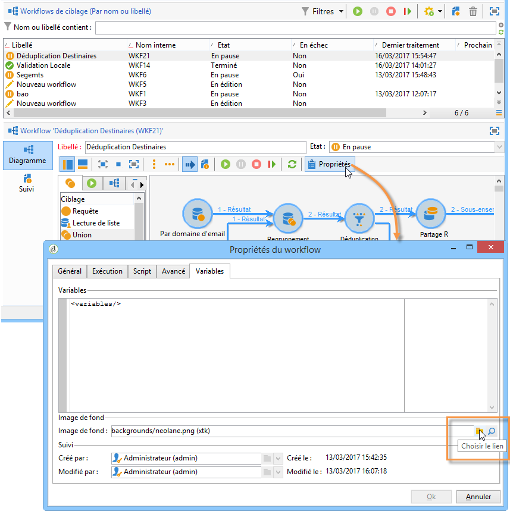
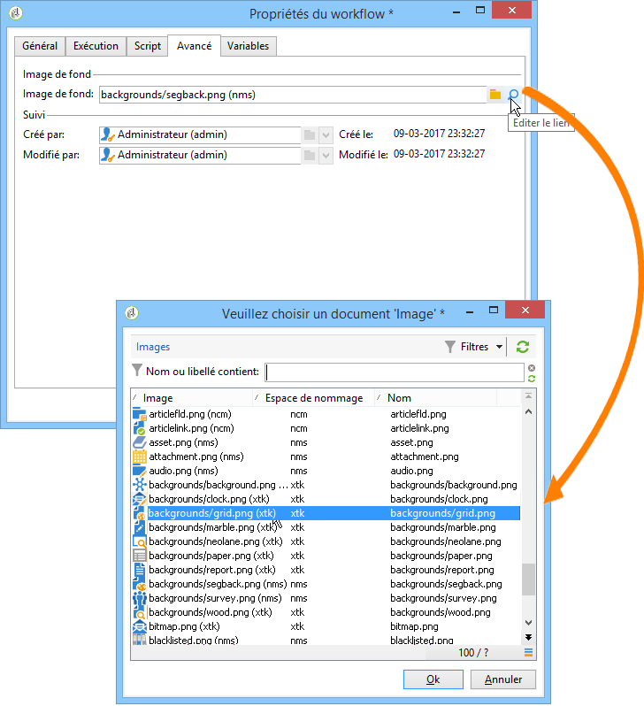
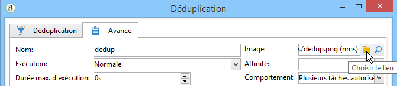
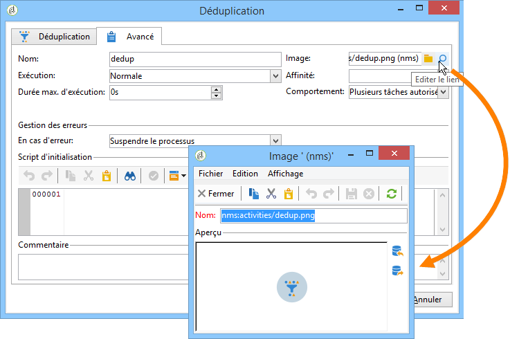

# Modification des images d’activité{#change-activity-images}

Les images utilisées dans les diagrammes des différents workflows peuvent être modifiées. Elles doivent toutefois respecter certaines contraintes. Les étapes de mise en oeuvre sont les suivantes :

* Pour changer l’image d’arrière-plan, sélectionnez le workflow de ciblage visé et cliquez sur **[!UICONTROL Propriétés]**.

  

  Cliquez sur l’icône **[!UICONTROL Choisir le lien]** situé à droite du champ **[!UICONTROL Image d’arrière-plan]** pour sélectionner l’image à utiliser.

  >[!NOTE]
  >
  >La largeur en pixels de l’image d’arrière-plan doit être un multiple de 4.

  

  L&#39;icône **[!UICONTROL Editer le lien]** permet de visualiser l&#39;image sélectionnée.

* Pour changer l&#39;image associée à une activité, double-cliquez sur l&#39;objet et cliquez sur l&#39;onglet **[!UICONTROL Avancé]**.

  Cliquez sur l&#39;icône **[!UICONTROL Choisir le lien]** situé à droite du champ **[!UICONTROL Image]** pour sélectionner l&#39;image à utiliser.

  

  L&#39;icône **[!UICONTROL Editer le lien]** permet de visualiser l&#39;image sélectionnée.

  

>[!NOTE]
>
>Les images proposées sont celles qui sont enregistrées dans le noeud **[!UICONTROL Administration > Paramétrage > Images]** de l&#39;arborescence.
>  
>Les images doivent être au format PNG, 48x48 pixels, 16 millions de couleurs et avec un arrière-plan transparent.
