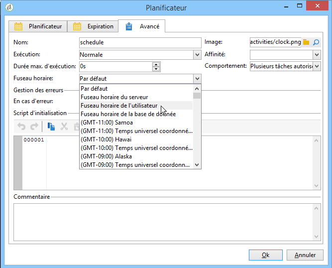

# Gestion des fuseaux horaires{#managing-time-zones}

Adobe Campaign permet de gérer les décalages horaires entre plusieurs pays concernés par la même instance. La configuration appliquée est paramétrée lors de la création de l&#39;instance.

Pour plus d&#39;informations sur la configuration des fuseaux horaires dans Adobe Campaign, consultez cette [section](../../installation/using/time-zone-management.md).

Dans un workflow, vous pouvez adapter les plannings d&#39;exécution des activités, mais aussi associer un fuseau horaire spécifique à une activité ou à tout le workflow. Ce paramétrage peut être utile par exemple lors de l&#39;import de fichier ou dans le cadre de la planification des diffusions.

## Planifier l&#39;exécution {#execution-scheduling}

Vous pouvez planifier l’exécution des tâches à l’aide du planificateur (voir [Planificateur](../../workflow/using/scheduler.md)). Vous pouvez également utiliser les options de planification disponibles dans les activités qui offrent cette fonctionnalité. Ces activités offrent un onglet **[!UICONTROL Planification]** : Collecteur **[!UICONTROL de]** fichiers, transfert **[!UICONTROL de]** fichiers, téléchargement **** Web, réception de **[!UICONTROL courriels et SMS, etc.]******

Dans toute tâche planifiée, c&#39;est-à-dire dans toute activité qui propose des options de planification, vous pouvez choisir le fuseau horaire à appliquer. Le fuseau horaire est sélectionné à partir de l&#39;onglet **[!UICONTROL Avancé]** de l&#39;activité concernée :

Les valeurs possibles sont les suivantes :

* Fuseau horaire du serveur

   Utilise le fuseau horaire du serveur applicatif d&#39;Adobe Campaign.

* Fuseau horaire de l&#39;utilisateur

   Utilise le fuseau horaire de l&#39;opérateur Adobe Campaign qui lance l&#39;exécution du workflow.

* Fuseau horaire de la base de données

   Utilise le fuseau horaire du serveur de base de données utilisé.

* Fuseaux horaire spécifiques

   Utilise le fuseau horaire sélectionné.

Si la valeur **[!UICONTROL Par défaut]** est sélectionnée, le fuseau horaire du workflow est appliqué, ou, à défaut, celui du serveur applicatif.

## Associer un fuseau horaire à une activité {#linking-a-time-zone-to-an-activity}

L&#39;onglet **[!UICONTROL Avancé]** des activités de workflow permet de sélectionner le fuseau horaire de l&#39;activité. Si, la plupart du temps, le fuseau horaire du workflow est suffisant, il peut être utile de le surcharger ponctuellement pour telle ou telle activité, par exemple dans le cadre d&#39;un import de données, afin d&#39;associer aux dates le bon fuseau horaire.
